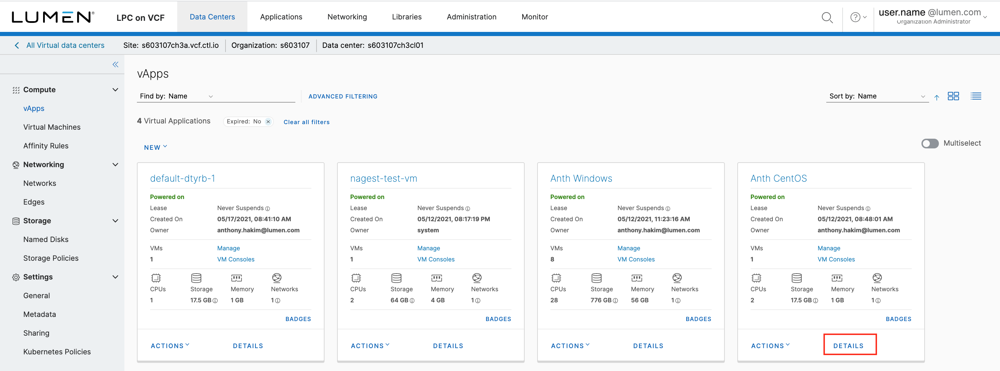
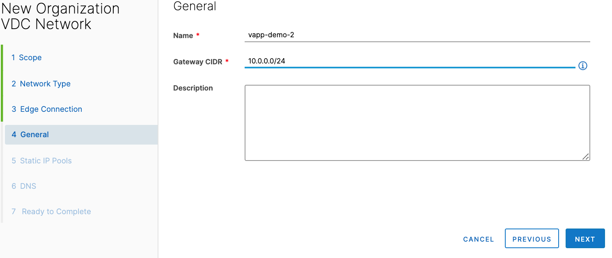
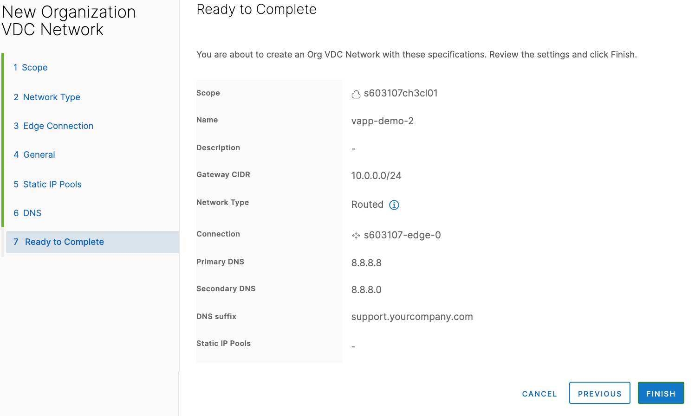
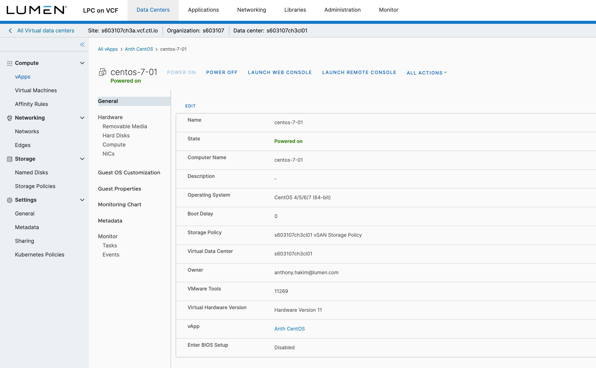

{{{
  "title": "Creating a Server",
  "date": "7-12-2021",
  "author": "John Grant",
  "keywords": ["cpc", "cloud", "vm", "server", "ssl", "vapp", "vpn", "vcf"],
  "attachments": [],
  "related-products" : [],
  "contentIsHTML": false,
  "sticky": false
}}}

### Description
In this KB article, we demonstrate how to provision a new virtual server in Lumen Private Cloud on VMware Cloud Foundation™.

Once you've gone through this KB article and created a new virtual server, you can follow the  [Configure SSL VPN-Plus](../Security/configuring-sslvpn-plus.md) guide to configure the Lumen Private Cloud on VMware Cloud Foundation environment.

Note: This KB assumes you have followed the KB article on [Adding to your Catalog](../Catalog/add-to-catalog.md) in Lumen Private Cloud on VMware Cloud Foundation.

### Steps
* Log in to your Lumen Private Cloud on VMware Cloud Foundation (LPC on VCF) environment.

  

* Once logged in, select __Data Centers__ from the menu at the top of the screen, and then click the Data Centers summary box. 

* You will then land on a page showing all your VMs. In the left side panel, select __vApps__ below Compute. 

* Select __NEW VAPP__. A popup window will appear. Enter a name for the new vApp you are creating — in the context of VMware Cloud Director, a vApp is simply a container for the objects you create. Once you enter a Name, click __ADD VIRTUAL MACHINE__. 

  

* In the New VM popup window, type a name for your Virtual Machine &mdash; this is the friendly name that will be displayed inside of VMware Cloud Director. Enter your __Computer Name__ &mdash; the Computer Name will default to the same as the Name but can be edited as needed. For __Type__ of VM, select __New__ or __From Template__. If choosing __From Template__, the Compute details can be updated in later steps. Click __OK__.

  

* On the New vApp window, you can add additional Virtual Machines to your vApp, or you can click __CREATE__.

  

* After clicking __CREATE__ you will be navigated back to the vApps screen. If you would like to update details within your vApp or VM, and add a Network, locate your vApp and click __DETAILS__.

  

### Configure a Network

* Select __Data Centers__ in the top menu.

* Click __Networks__. Then click __NEW__.

  

* In the New Organization VDC Network wizard, click Scope, and then select Current Organization Virtual Data Center.

* Click __NEXT__. 

  

* Select the Network Type (__Isolated__ or __Routed__). Click __NEXT__.

  

* Select the Edge Connection (for Routed networks). Click __NEXT__.

  

* For General, type the Name and Gateway CIDR (Classless Inter-Domain Routing). Click __NEXT__.

  

* For Static IP Pools, type the Gateway CIDR and the Static IP Pools range. Click __NEXT__.

  

* For DNS, type the Primary and Secondary DNS, and the DNS suffix. Click __NEXT__.

  

* For Ready to Complete, review the settings and click __FINISH__.

  

* If you would like to update the Compute details on your VM, click __Data Centers__ in the top menu, click the Data Centers summary box, and then click the __Name__ of your VM. You will then be able to edit General fields, Hardware, Guest OS Customization, Guest Properties, Monitoring, and Metadata. 

  

* To navigate back to your vApps page, click __Data Centers__ at the top of the screen, then click the Data Centers summary box, and then click __DETAILS__ for your vAPP.

  

* Click __POWER ON__.

  
