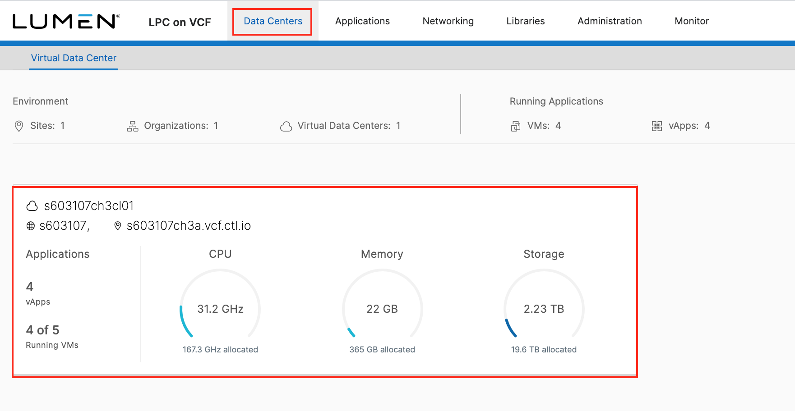
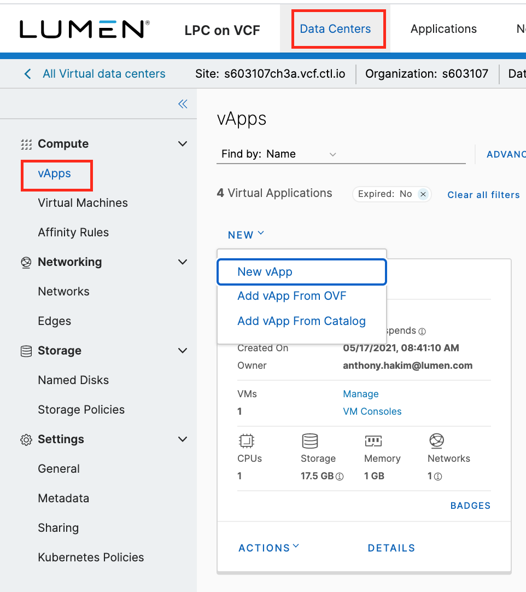
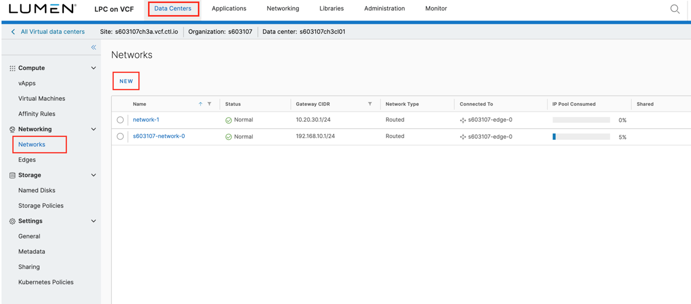
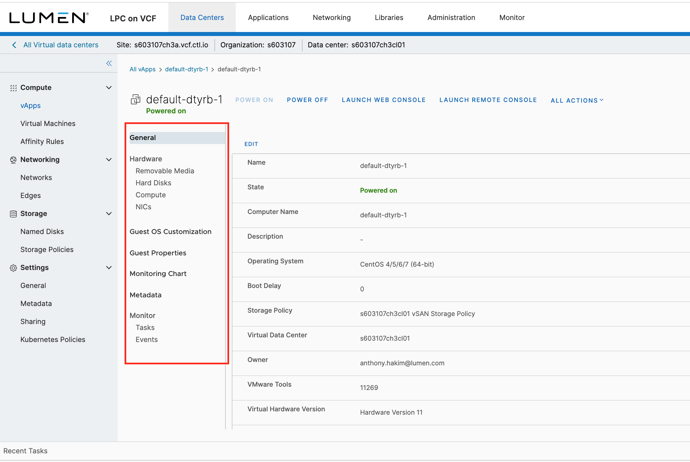
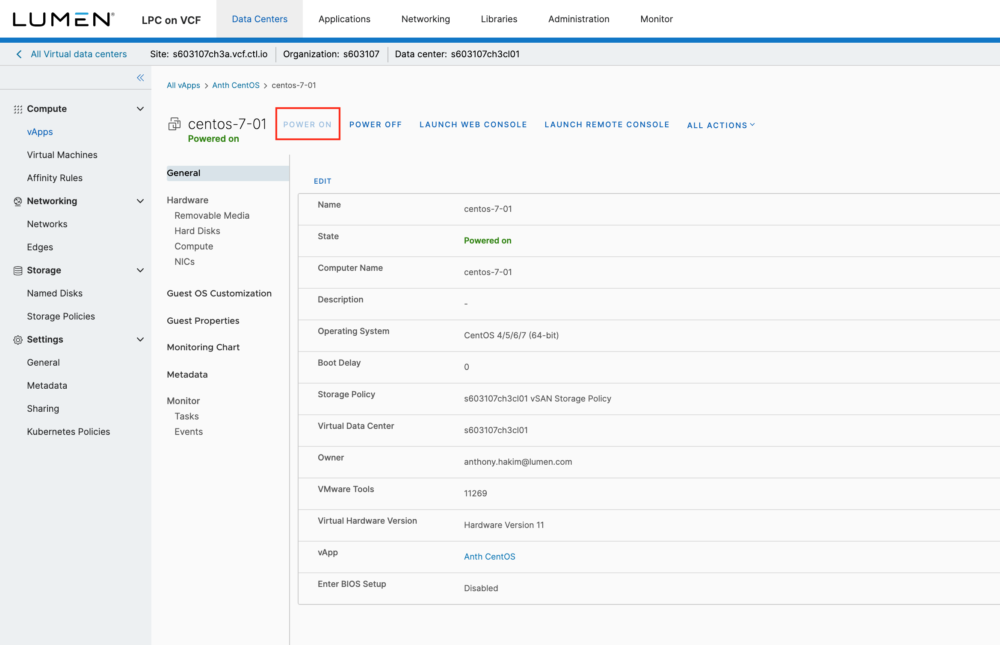

{{{
  "title": "Creating a Server",
  "date": "06-09-2021",
  "author": "Hannah Melvin",
  "keywords": ["cpc", "cloud", "vm", "server", "ssl", "vapp", "vpn", "vcf"],
  "attachments": [],
  "related-products" : [],
  "contentIsHTML": false,
  "sticky": false
}}}

### Description
In this KB article, we demonstrate how to provision a new virtual server in Lumen Private Cloud on VMware Cloud Foundation™.

Once you've gone through this KB article and created a new virtual server, you can follow these guides to learn how to [Configure SSL VPN-Plus](../Security/configuring-sslvpn-plus.md) and [How to Securely Connect](../Security/how-to-securely-connect.md) to your Lumen Private Cloud on VMware Cloud Foundation environment.

Note: This KB assumes you have followed the KB article on [Adding to your Catalog](../Catalog/add-to-catalog.md) in Lumen Private Cloud on VMware Cloud Foundation (LPC on VCF).

### Steps
* Login to your Lumen Private Cloud on VMware Cloud Foundation environment.

  

* Once logged in, select __Datacenters__ from the menu at the top of the screen. Then select the datacenter for the server.

  

* You will then land on a page showing all your VMs. In the left side panel, select __vApps__ below __Compute__.

  

* Click __NEW__, and select __New vAPP__. A popup window will appear. Enter a name for the new vApp you are creating &mdash; in the context of LPC on VCF, a vApp is simply a container for the objects you create. Once you enter a Name, click __Add Virtual Machine__.

  

* In the New VM popup window, enter a name for your Virtual Machine &mdash; this is the friendly name that will be displayed inside of LPC on VCF. Enter your __Computer Name__ &mdash; the Computer Name will default to the same as the Name but can be edited as needed. For __Type__ of VM, select New or From Template. If choosing __From Template__, the Compute details can be updated in later steps. Click __OK__.

  

* On the New vApp window, you can add additional Virtual Machines to your vApp, or you can click __CREATE__.

  

* After clicking __CREATE__ you will be navigated back to the vApps screen. If you would like to update details within your vApp or VM and to add a Network, locate your vApp and click __Details__.

  

* Click the __Networks__ tab to configure a network. Then click __New__.

  

* Select the Network Type. If choosing __OrgVDC Network__ select the network and click __Add__. If choosing __vApp Network__ complete the fields that appear, then click __Add__.

  

* If you would like to update the Compute details on your VM, select the Details link in your VM. You will then be able to edit General fields, Hardware, Guest OS Customization, Guest Properties, Monitoring, and Metadata. Click __Save__ when finished.

  

  

* Navigate back to your vApps page by clicking __vApps__ in the sidebar on the left of the navigation at the top of the screen.

  

* To power on your vApp, click __Actions__, then __Power On__.

  
