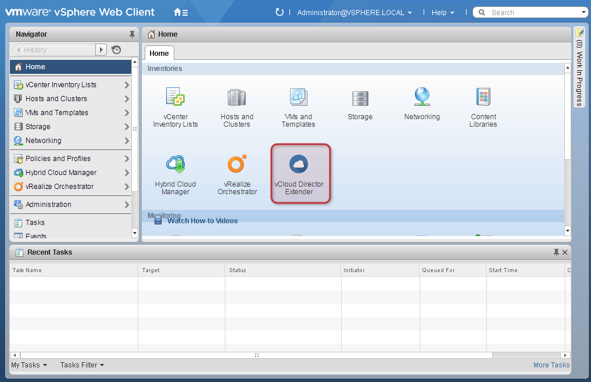
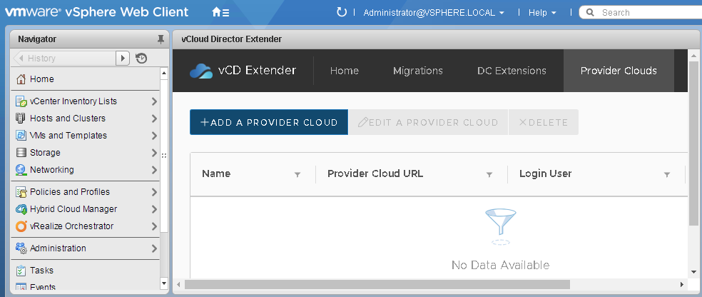
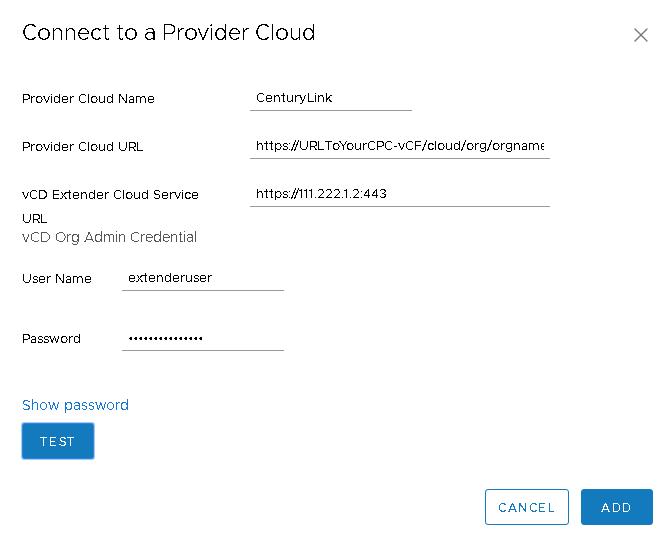

{{{
  "title": "Preparing Your Environment for Migration",
  "date": "06-03-2021",
  "author": "Anthony Hakim",
  "attachments": [],
  "related-products" : [],
  "contentIsHTML": false,
  "sticky": false
}}}

### Description
In this KB article, we outline the process involved in preparing your VMware (source) environment in readiness for migration into Lumen Private Cloud on VMware Cloud Foundation (LPC on VCF).

This process involves multiple components that you must install and configure in a specific order.

### Prerequisites
* VMware ESXi 5.5 and newer.
* The following NAT and Firewall rules.

You can configure NAT and Firewall rules, either prior to or after installation, but you must have the required Management IP's, Translated Public IP, and necessary port information prior to installation.

During the deployment of the various appliances, it is necessary to input the public (NAT) IP address along with the port (PAT) that will be used in the NAT/PAT configuration.

**Important Note:** You must obtain the public IPs for the Service Provider Extender and vCloud Director for your Lumen Private Cloud on VMware Cloud Foundation environment. Refer to the following example for what you need.

**Example:**  
`Tenant Replicator: <Translated Public IP>:443`

The following examples have 2 Management IPs and 1 Public IP for the Tenant (Customer), and 2 Public IPs on the Service Provider (Lumen Private Cloud on VMware Cloud Foundation) side:

| Tenant Function | Service Provider Function | IP Address |
| :-----: | :-----: | :-----: |
| Extender1 |  - | 10.12.19.12 |
| Extender2 | - | 10.12.19.19 |
| Public IP | - | 40.2.1.137 |
| - | Extender IP | 206.1.2.34 |
| - | vCloud Director IP | 206.1.2.44 |

Your Extender and vCloud Director IP Addresses will be provided once your Lumen Private Cloud on VMware Cloud Foundation environment is built out.

#### NAT Requirements - Tenant (source)
The following NAT rules are required on the Tenant (source) side of the connection:

| NAT Type |	Interface | Original IP |	Original Port	| Translated IP |	Translated Port |	Role |
| --------- | --------- | --------- | --------- | --------- | --------- | --------- |
| DNAT |	Public Uplink |	40.2.1.137 |	443	| 10.12.19.12 |	8043	| Replicator - Tenant Side |
| SNAT	| Public Uplink |	10.12.19.19 |	any |	40.2.1.137 |	any |	Extender - Tenant Side |
| SNAT	| Public Uplink |	10.12.19.12 |	any	| 40.2.1.137 |	any |	Replicator - Tenant Side |

#### Firewall Requirements - Tenant (source)
| Name |	Type | Source |	Destination |	Service |	Action |
| --------- | --------- | --------- | --------- | --------- | --------- |
| VCDX-Rule-001 |	User |	10.12.19.12 10.12.19.19 40.2.1.137 | 206.1.2.34 | 443/8043/8044/44045 |	Accept |
| VCDX-Rule-002 |	User |	10.12.19.19	| 206.1.2.44 |	443 |	Accept |
| VCDX-Rule-003 |	User |	206.1.2.34 |	40.2.1.137 |	443/8043/8044/44045 |	Accept |

### Installation Process
* [Download the vCloud Director Extender OVA file](https://my.vmware.com/group/vmware/details?downloadGroup=CX100&productId=693#product_downloads).
* Log in to the vSphere Web Client, using the FQDN, as an administrator.
* In the vSphere Web Client, right-click on the vCenter Server, and select Deploy OVF Template...

  

  Note: You can also use the File menu to select Deploy OVF Template...

* On the Select template page, click **Browse...**, select the downloaded vCloud Extender OVA file.
* Click **Next**.

  

* On the Review details page, review your selections.
* Click **Next**.

  

* On the Accept license agreement page, click **Accept**.
* Click **Next**.

  

* On the Select name and folder page, type the VM Name, and select the Datacenter.
* Click **Next**.

  

* On the Select a resource page, make the appropriate selection.
* Click **Next**.

  

* On the Select storage page, choose the following:
  * Select virtual disk format: Thin provision.
  * VM storage policy: Select your appropriate storage policy.
* Select your appropriate datastore.
* Click **Next**.

  

* On the Setup networks page, choose the following:
  * Select your appropriate destination network.
  * (IP Allocation Settings) IP protocol: IPv4.
* Click **Next**.

  

* On the Customize template page, choose the following (Application):
  * Deployment Type: cx-connector.
  * Enable SSH: Checked.
  * Initial root password: Set and confirm a password.
  * NTP Server: Type the IP address of your NTP server.

    

* On the Customize template page, choose the following (Networking Properties):
  * Default Gateway: Type the IP address of your default gateway.
  * Domain Name: Type your domain name.
  * Domain Name Servers: Type the IP address(es) of your DNS server(s).
  * Domain Search Path: Type your domain search path.
  * Network 1 IP Address: Type the IP address for this interface.
  * Network 1 Netmask: Type the network mask address for this interface.
* Click **Next**.

      

* Review your settings.
* Select the **Power on after deployment** (checkbox).
* Click **Finish**.

  

### VCD Extender Configuration
After completing the Installation Process, you must perform the following steps to configure vCD Extender to enable it for migration.

**Prerequisites**
Verify that the vCloud Director Extender On-Premise Appliance VM is powered on.

**Process**
* In a Web browser, open the OnPrem Setup UI at `https://<Your-vCD-Extender-OnPrem-Appliance-IP>/ui/mgmt`.
* Log in as administrator.

  **Note:** Use the password that you set during the vCloud Director Extender On-Premise Appliance installation.

  

* Click **SETUP WIZARD**.

  **Note:** Run the Setup Wizard for your first-time configuration to install Replicator.

  

* On the On-Prem vCenter page, type the following:
  * Name: Type the on-premise vCenter Server Name.
  * IP Address or URL: Type the IP address or URL of the vCenter Server.
  * Lookup Service URL (optional): Type the Lookup Service URL.

    **Important:** If you are using an external Platform Services Controller (PSC), type the address to the external Lookup service in the suggested syntax. If you are using an embedded PSC, you can skip this step.
  * Username: administrator@vsphere.local.
  * Password: Type the administrator password.
  * Click **NEXT**.

    

    

* On the Register Plugin with vCenter Server page, register with a valid version number.

  **Note:** This process registers vCloud Director Extender as a plug-in to the on-premise vCenter Server.
* Click **NEXT**.

  

  

* On the Replicator page, type the following:
  * Name: Type a name for the replicator.
  * Folder/Datacenter: Type the target Folder/Datacenter Name.

    **Note:** You must provide the full multilevel schema path.
  * Hosts Or Cluster: Type the target Hosts or Cluster Name.
  * Datastore: Type the target Datastore Name.
  * Network: Type the target Network Name.
  * Do not select the DHCP check box.
  * IP Address: Type your desired IP Address.
  * Gateway Address: Type your Gateway Address.
  * DNS: Type your DNS.
  * Netmask: Type your Netmask.
  * Click **NEXT**.

    

    

  * After the Replicator is created, click **NEXT**.

    

* On the Activate Replicator page, type the following:
  * Root Password: Set and confirm a password.
  * Management vCenter Lookup Service URL: Type the Lookup Service URL.
  * Management vCenter SSO User: administrator@vsphere.local.

    **Note:** The user you enter must be an administrator or part of the administrators group.
  * Management vCenter SSO Password: Type the administrator password.
  * Public Endpoint URL (optional): Type the Public Endpoint URL and Port.

    

  * After the Replicator is Activated, click **NEXT**.

    

* To complete the setup wizard, click **NEXT** and **FINISH**.
  **Note:** In the Management vCenter tab, the on-premise vCenter Server details appear. In the Replicator tab, you can see the details for the deployed Replicator appliance.

  

### Connect to a Provider Cloud (Lumen Private Cloud on VMware Cloud Foundation)
Before you can initiate migration jobs with vCloud Director Extender, you must set up a connection to a Provider Cloud.

**Prerequisites**
If you haven't configured the pre-requisite NAT firewall rules as indicated at the top of this knowledge base article, please complete before proceeding with the next step.

**Procedure**
* In the vSphere Web Client, navigate to Home > Inventories > vCloud Director Extender.

  **Note:** You must logout of the vSphere Web Client to see the vCloud Director Extender plug-in in the vCenter UI.

  

* In the Provider Clouds tab, click **ADD A PROVIDER CLOUD**.

  

* Type a Provider Cloud Name.
* Type your Provider Cloud URL.
* Type a vCD Extender Cloud Service URL and port.
* Type vCD Org Admin user name and password.
* (Optional) You can test the connection to the Provider Cloud by clicking **Test**.
* A Certificates information pop-up window appears.
* Review the hosts certificates information and click **Trust Certificates**.
* Click Add.

  

Now that you're done setting up your environment, you are ready to proceed to the next step - [Migrating VMs into Lumen Private Cloud on VMware Cloud Foundation](using-migration-tool.md).
