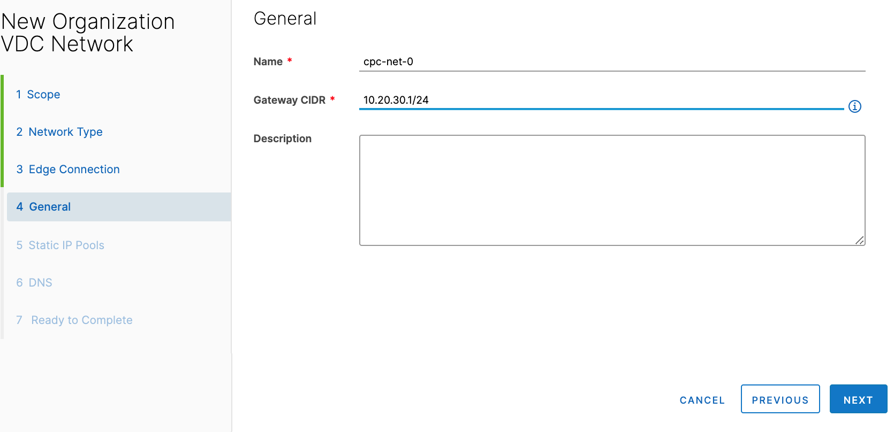
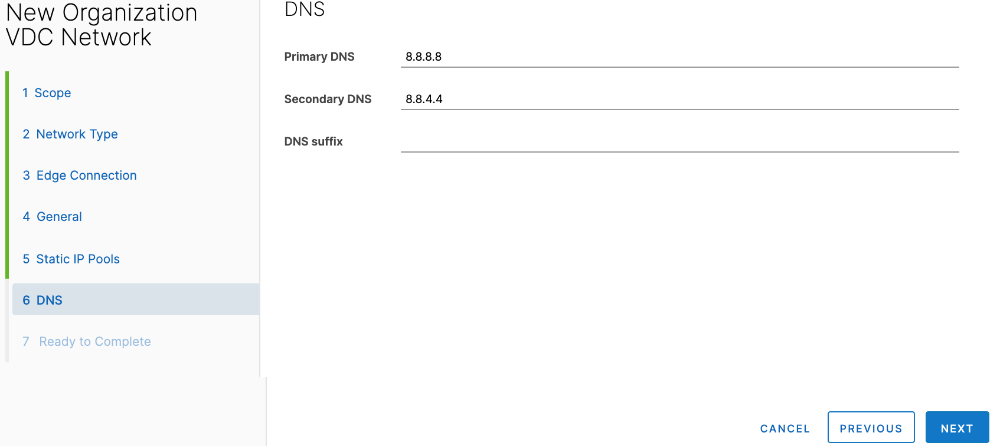
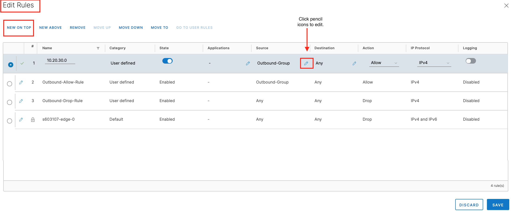

{{{
  "title": "Create Internet Accessible Network",
  "date": "7-4-2021",
  "author": "Anthony Hakim",
  "attachments": [],
  "related-products" : [],
  "contentIsHTML": false,
  "sticky": false
}}}

### Description
In this KB article, we walk through how to create a new software-defined network in Lumen Private Cloud on VMware Cloud Foundation (LPC on VCF). In this particular use case, we would like to allow this network to have Outbound Internet, and will do the following:

1. Create the Network.
2. Create a Firewall Rule to allow Outbound Internet Access for the Network.
3. Create a Source NAT Rule to allow Outbound Internet Access for the Network.

### Steps

#### Create the Network

Log in to your LPC on VCF environment.

  

Click __Data Centers__ in the top menu. Then, click the Virtual Data Center summary box.

  

Select your Data Center. Select __Networks__ in the left side-panel. On the Networks page, click __NEW__.

  

In the __New Organization VDC Network__ wizard, type or select the following:

__Scope:__ Default setting.

  

__Network Type:__ Select __Routed__ and click __NEXT__.

  

__Edge Connection:__
  * Select your Edge.
  * Click __NEXT__.

  

__General:__
  * __Name:__ Type your network name.
  * __Gateway CIDR:__ (i.e. 10.20.30.1/24)
  * __Description:__ Optional.
  * Click __NEXT__.

  

__Static IP Pools:__
  * Enter an IP range (i.e. 10.20.30.50-10.20.30.200).
  * Click __ADD__.
  * Click __NEXT__.

  

__DNS:__
  * __Primary DNS:__ (i.e., 8.8.8.8)
  * __Secondary DNS:__ (i.e., 8.8.4.4)
  * __DNS suffix:__ As needed.
  * Click __NEXT__.

  

__Ready to Complete:__
  * Review your selections and click __FINISH__.

  

##### Create the Firewall Rule to allow Outbound Internet Access for the Network

In LPC on VCF, under __Networking__, click __Edges__. Click your Edge (siteID-edge-0).

  

In the Edge Gateway - siteID-edge-0 page, select __Firewall__, and then click __EDIT RULES__.

  

Click __NEW ON TOP__. Type or select the following for the New Rule (click the pencil icons to edit):

  * __Name:__ Outbound 10.20.30.0 network.
  * __Category:__ User defined (by default).
  * __Source:__ Click __Any Source__.

  

  * __Destination:__ Any (by default) - varies by requirements.
  * __Action:__ Allow.
  * __Enable logging:__ Unchecked (by default) - varies by requirements.
  * Click __SAVE__.

##### Create a Source NAT Rule to allow Outbound Internet Access for the Network

In the Edge Gateway - siteID-edge-0 page, click __NAT__, and then click __NEW__.

  __Note:__ You will need to make a note of the Public IP that is listed under __External IP__ in order to create this SNAT rule.

  

Enter the following for the New Rule:

  * __Applied On:__ Public-1
  * __Original Source IP/Range:__ 10.20.30.0/24
  * __Translated Source IP/Range:__ This is the External IP that you recorded from the note above.
  * Click __KEEP__.

  
