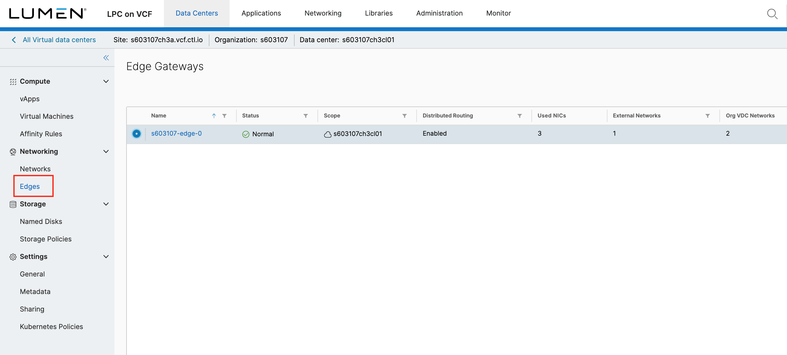

{{{
  "title": "Enable IPSec VPN on Edge Gateway Services",
  "date": "6-29-2018",
  "author": "Anthony Hakim",
  "attachments": [],
  "related-products" : [],
  "contentIsHTML": false,
  "sticky": false
}}}

### Description
In this KB article, we walk through how to enable an IPSec VPN on Edge Gateway Services within the VMware Cloud Director (VCD) Web Console environment for Lumen Private Cloud on VMware Cloud Foundation™.

### Prerequisites
You must configure at least one IPSec VPN site on the NSX Edge before enabling the IPSec VPN service.

* Login to your Lumen Private Cloud on VMware Cloud Foundation (LPC on VCF) environment with an Org Admin Account.

  

* Once logged in, click __Data Centers__ in the menu at the top, and then click the Virtual Data Center summary box.

  

* Click on __Edges__ in the panel on the left side.

  

* Select your Edge Gateway. Under __Services__, select __IPSec VPN__.
* Click __NEW__.

  

* A new window will pop up. Follow the steps below:   

*	Add IPsec VPN:
    * Enabled: Click slider to enable
    * Enable perfect forward secrecy (PFS): default
    * Name: Name your IPSec VPN
    * Local Id: Your Local Id
    * Local Endpoint: IP address of Edge Gateway
    * Local Subnets: Your Local Subnets
    * Peer Id: Your Peer Id
    * Peer Endpoint: IP address of Peer
    * Peer Subnets: Your Peer Subnets
    * Encryption Algorithm: Must match with peer
    * Authentication: Must match with peer
    * Change Shared Key:
    * Pre-Shared Key: Shared Key
    * Display Shared Key:
    * Diffie-Hellman Group: Must match with peer
    * Extension:

  

*	Click __KEEP__.
*	In the __IPSec VPN Configuration__ page, select the __Activation Status__ tab, and enable __IPsec VPN Service Status__

  

*	Configure the Peer/Remote Site.
