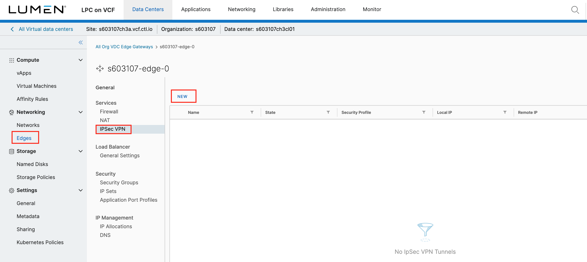
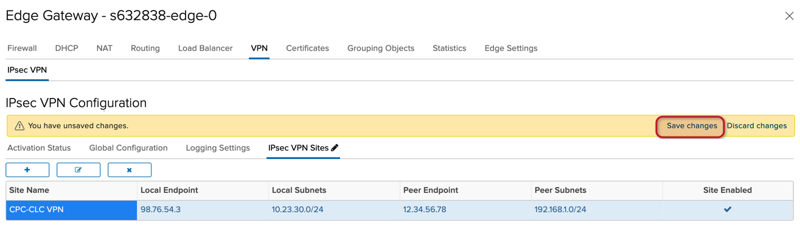
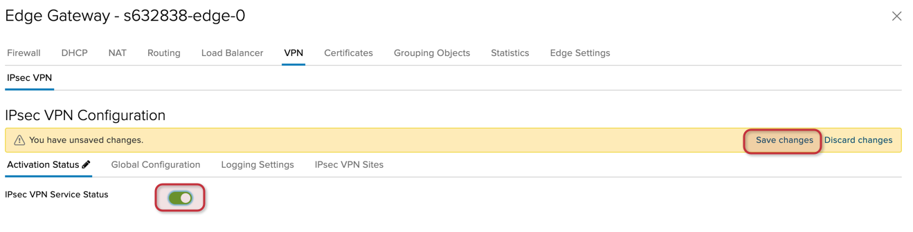
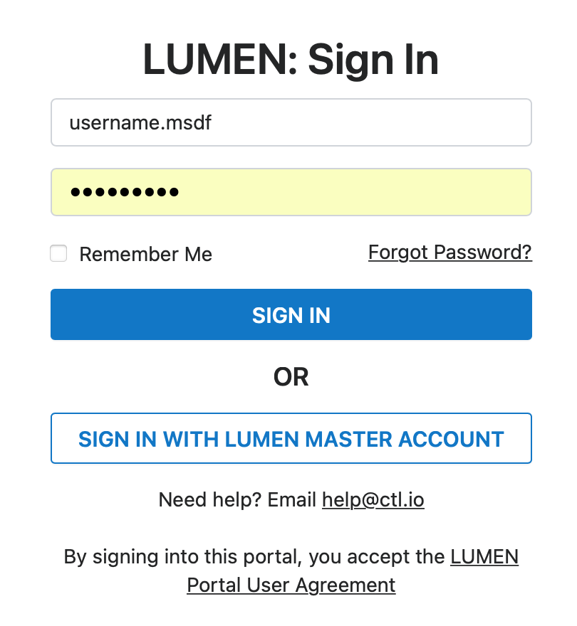
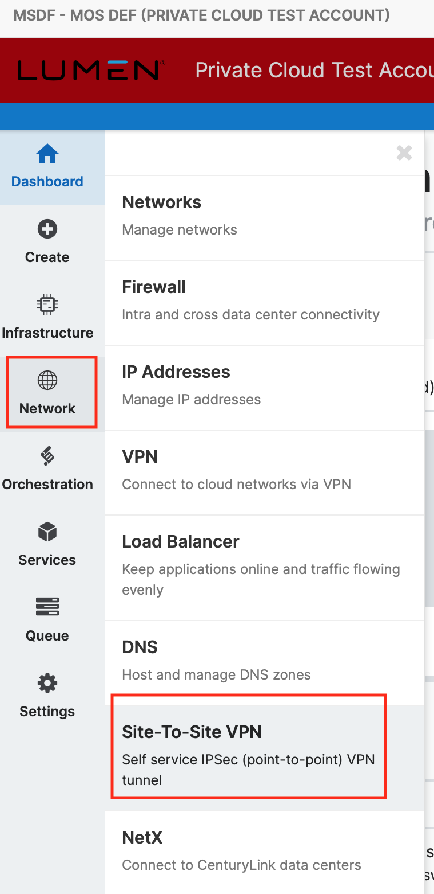
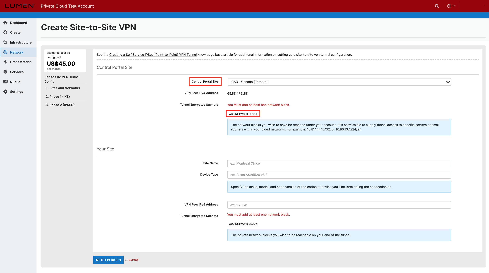
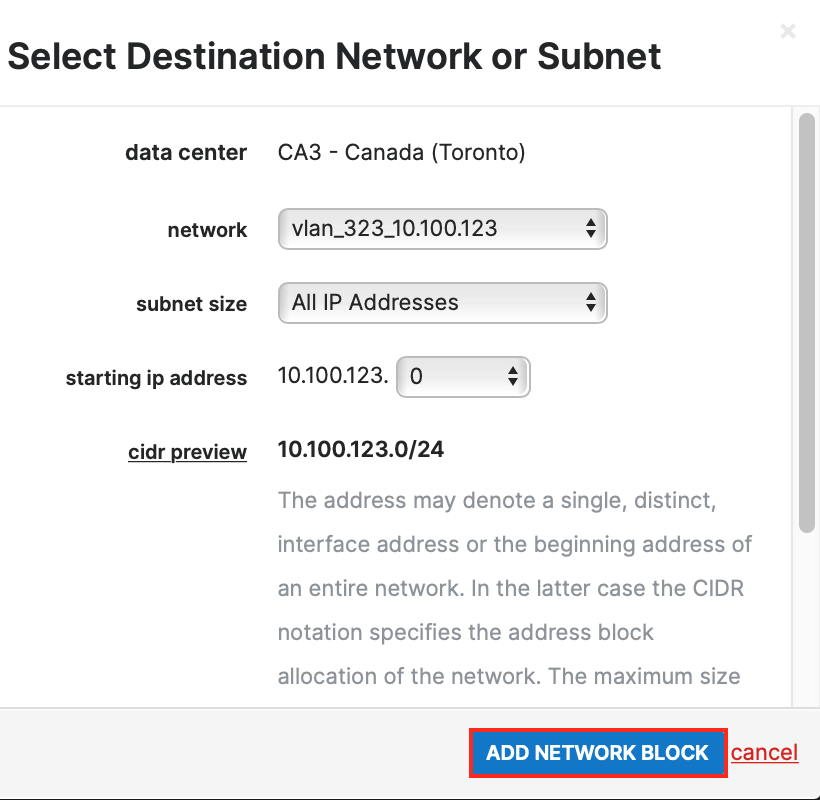
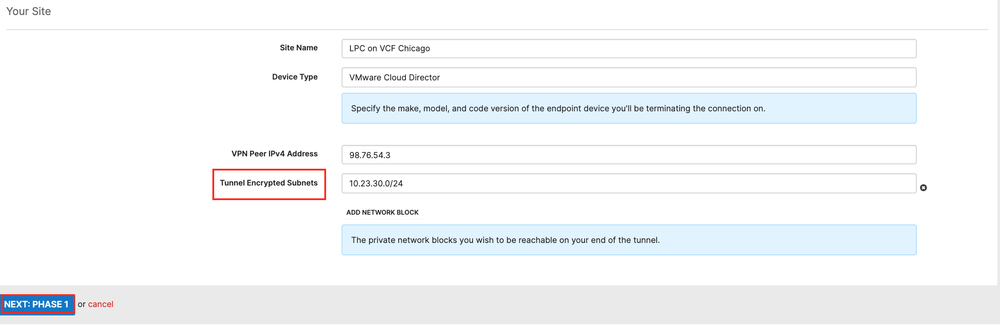
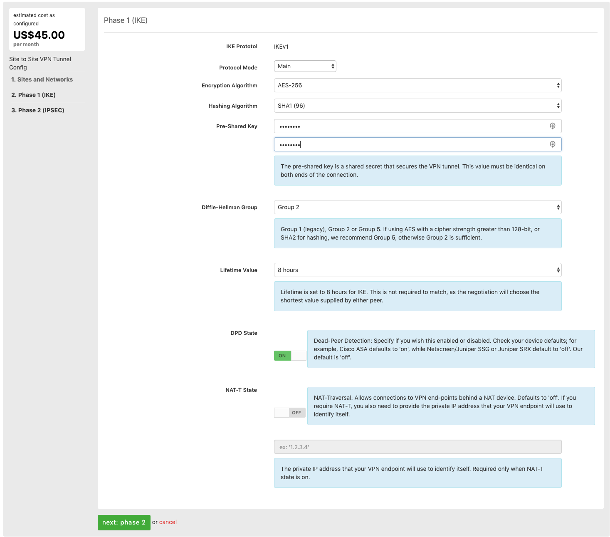

{{{
  "title": "Configuring Site-to-Site (IPsec VPN Sites) VPN",
  "date": "07-09-2021",
  "author": "Anthony Hakim",
  "attachments": [],
  "related-products" : [],
  "contentIsHTML": false,
  "sticky": false
}}}

### Description
This KB article steps through the process to stand up a Site-to-Site VPN between Lumen Private Cloud on VMware Cloud Foundation™ (LPC on VCF) and Lumen Cloud (CLC).

### Prerequisites
* LPC on VCF account.
* CLC account.
* Local Endpoint (Public IP for IPsec VPN on the LPC on VCF side).
* Local Subnets in CIDR format (local networks to be accessible to IPsec VPN on the LPC on VCF side).
* Peer Endpoint (Public IP for IPsec VPN on the CLC side).
* Peer subnets in CIDR format (local networks to be accessible to IPsec VPN on the CLC side).
* Firewall ports IP Protocol ID 50 (ESP), UDP Port 500 (IKE), and UDP Port 4500 are configured on both ends.

### Steps
Log in to your Lumen Private Cloud on VMware Cloud Foundation environment.

  

Once logged in, click the Virtual Data Center summary box.

* Click __Edges__ in the menu on the left side of the screen, 
* Select your Edge Gateway.
* Click __IPSec VPN__. 
* Click __NEW__. 

  

 On the __Add IPSec VPN Tunnel__ popup, add your new configuration.

 - __Name:__ (Preferred name)
 - __Description:__ (Preferred description)
 - __Enabled:__ (Checked)
 - __Enabled:__ (Your Pre-Shared Key)
 - __Security Profile:__ (Default)

 For __Local Endpoint__:
 - __IP Address:__ (Available IP Address)
 - __Networks:__ (Available Networks)

 For __Remote Endpoint__:
- __IP Address:__ (Available IP Address)
 - __Networks:__ (Available Networks)
 - __Logging:__ (Default)
 
Click __SAVE__.

  

In the __IPsec VPN Configuration__ page, click __Save changes__.

  

On the __IPsec VPN Configuration__ page, click the __Activation Status__ tab, and then click the slider to enable the __IPsec VPN Service Status__. Click __Save changes__.

  

Log in to your Lumen Cloud environment.

  

In the left pane, click __Network__, and then select __Site-To-Site VPN__.

  

In the __Site-to-Site VPN__ page, click the __+ SITE TO SITE VPN__ button.

  

In the __Create Site-to-Site VPN__ page, select your __Control Portal Site__ (CLC data center), and then click on the __ADD NETWORK BLOCK__ button.

  

In the __Select Destination Network or Subnet__ page, select your __network, subnet size__ and __starting ip address__, and then click __ADD NETWORK BLOCK__.

  

In __Create Site-to-Site VPN__ page, in the __Your Site__ section, enter your __Site Name, Device Type and VPN Peer IPv4 Address__, and then click the __ADD NETWORK BLOCK__ button.

  

Upon clicking the __ADD NETWORK BLOCK__ button above, a new field appears named __Tunnel Encrypted Subnets__. Enter your local network subnet block (on the LPC on VCF side). Click __next: phase 1__.

  

In the __Phase 1 (IKE)__ page, type or select the following:
  - __IKE Protocol:__ IKEv1
  - __Protocol Mode:__ Main
  - __Encryption Algorithm:__ AES-256
  - __Hashing Algorithm:__ SHA1 (96)
  - __Pre-Shared Key:__ Same pre-shared key you used previously
  - __Diffie-Hellman Group:__ Group 2
  - __Lifetime Value:__ 8 hours
  - __DPD State:__ On
  - __NAT-T State:__ Default

Click __next: phase 2__

  

In the __Phase 2 (IPSEC)__ page, type or select the following:
  - __IPSEC Protocol:__ ESP
  - __Encryption Algorithm:__ AES-256
  - __Hashing Algorithm:__ SHA1 (96)
  - __PFS Enabled:__ On, Group 2
  - __Lifetime Value:__ 1 hour

Click __finish__

  

Once completed, you will be presented with the summary page.

  

To test the Site-To-Site VPN, try pinging the gateway of a tunneled subnet of the other side, i.e., ping from a VM in CLC on the 10.100.67.0/24 network to the gateway on the LPC on VCF side - 10.23.30.1.
