{{{
  "title": "Object Tier New User Guide",
  "date": "5-25-2021",
  "author": "Brad Lewis",
  "attachments": [],
  "contentIsHTML": false,
  "sticky": true
}}}
#### Description
This article outlines how customers can access and set up their Lumen Network Storage account. Instructions are provided for provisioning services. 
### Accessing the Lumen Network Storage Portal

**Creating Tenants and Users**

The Lumen Network Storage Portal is a self-service interface into the most commonly used storage provisioning and configuration tasks. To access the portal, open https://storage.lumen.com in any web browser.
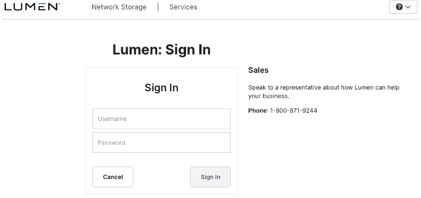
Enter your username and the temporary password provided in your welcome email. 
_**NOTE**_: Your temporary password is a single-use credential that is only valid for one initial login. After login, you will be prompted to change your password. If you close the browser window before completing the password change process, you will not be able to log in again with your temporary password and will need to open a service request to have a new temporary password generated.
On initial login, you will see the **Network Storage Dashboard**:
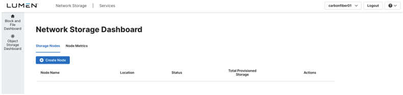
To navigate to the **Object Storage Dashboard**, click the link in the left navigation bar.
You will now be viewing the Lumen Network Storage **Object Storage Dashboard**. Observe that there is a prompt button to create a tenant:
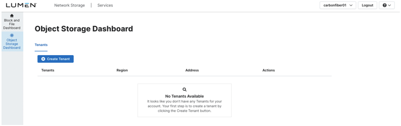
A **Tenant** is a group of users to which a common set of access rules can be applied. All users under a tenant will have access to the same set of object storage buckets. Configuring access controls at the object level is not supported at this time. There is no limit to the number of tenants you can create. Each tenant must have at least one user defined. 
Create a new tenant by clicking the **Create Tenant** button. You will be prompted to enter a Tenant Name and to select a Lumen Network Storage Region. 
_**NOTE**_: A tenant can only exist in a single region. Give your tenant a unique name (e.g., FASTBIKES-BACKUPS). Avoid common names, as a new tenant cannot be created that duplicates an existing name in a given region.
Tenant creation back-office actions take about five seconds, after which you will see a success message and tenant details on the **Object Storage Dashboard**:
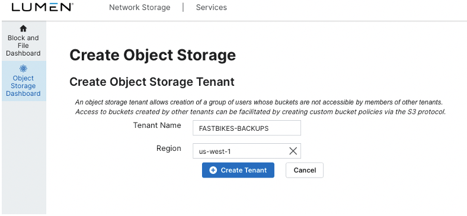
Note the Address (URL) as you will need this to configure your S3 client. This address can be viewed any time you navigate back to the **Tenant Details** page, and there is a button to copy the address to your clipboard.
#### CREATING USERS
Once a minimum of one tenant has been created, you are now ready to create a user. Every S3 user has a unique pair of access and private keys – both are required to provision buckets and read/write data to buckets. 
_**NOTE**_: Lumen does not store private access keys. These keys will only be provided a single time when the user is created. Store them in text format somewhere on your local system. If you lose your private key, a new set of keys must be created before you can access your data.
To create a user, navigate to the **Users** tab on the **Object Storage Dashboard**:
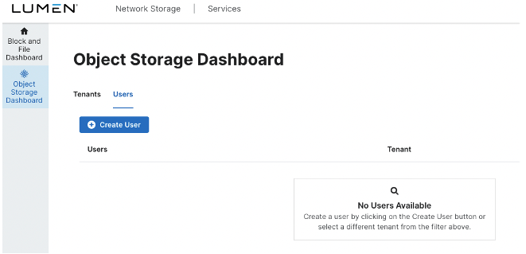
From the **Users** tab, you can create a new Object Storage user which is associated to a single tenant. Users cannot be members of multiple tenants and must be unique within the associated tenant. However, the same username can be created across multiple tenants, with each user provided with a unique set of access keys:
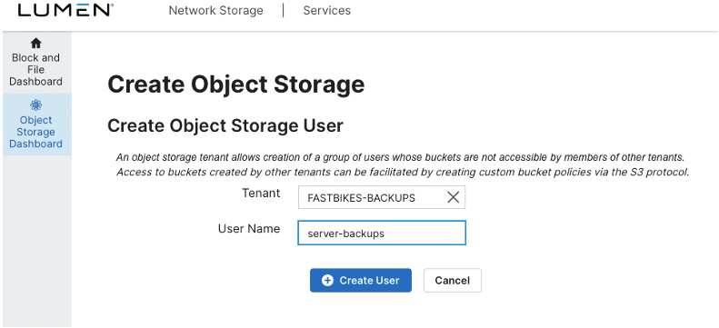
Once User creation completes, the user **Access Key** and **Secret Key** will display. 
_**Important**_ **: Capture and save these keys in text format. You will not be able to reference them within the portal again after this dialog box is dismissed. The user is advised to capture and duplicate these keys in multiple ways to provide a backup reference.**
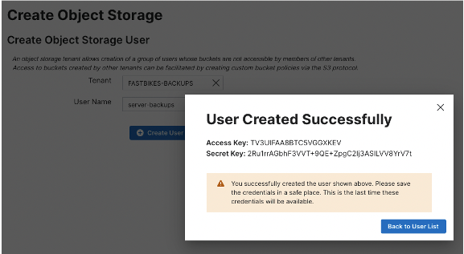
_**Warning**_ **: This is the only time that these credentials will be available.**
Once a User is created, that user will be listed in the User Details page of the **Users** tab. The **Buckets** navigation tab is also available on this page.
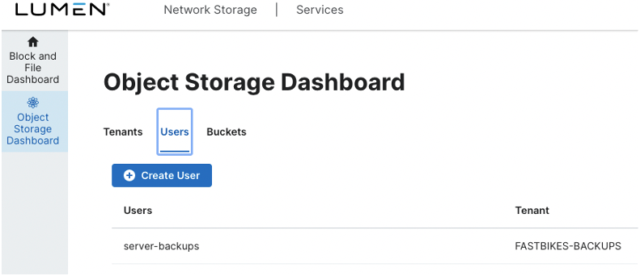
The final step before access to object storage is to create a bucket via a compatible S3 browser.
#### Creating Object Storage Buckets Via an S3 Browser
As Lumen Network Storage Object Tier is S3 compliant, any S3 compatible browser/client may be used to configure buckets, write or retrieve data, and delete buckets or individual objects (files). Examples include Cyberduck, Cloudberry Browser, S3cmd, and others. Additionally, most enterprise backup software has the ability to write directly to an S3 target. 
For this example, we will show configuration of Cyberduck for bucket configuration.
S3 terminology typically references “buckets” as the storage containers, with “objects” being stored in those containers. While technically inaccurate, Cyberduck presents this as a more familiar construct of directories and files. The first step is to configure our S3 client for accessing the Lumen Network Storage regional endpoint. As seen in our example, our chosen region is US-west-1 (PHX).
 
1. Launch Cyberduck.
2. Click the **Open Connection** icon. 
3. Click on the FTP line.
4. Select the **Amazon S3** transfer protocol. 
5. Edit the Server name so that it will point to your Lumen Network Storage Region endpoint URL.
6. Enter the user **Access Key** and **Secret Key**.
7. Click the **Connect** button. 
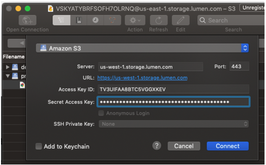
8. After a connection is created, you will be in the ‘root’ directory, where you can create a new bucket.
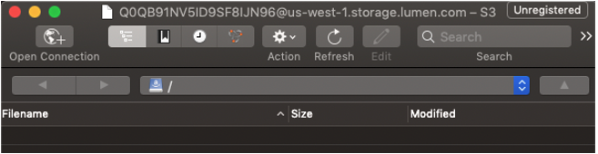
9. Right-click on the list or choose **File > New Folder** from the menu. 
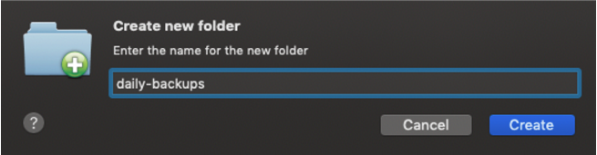
Your folder is created and is now available to write data through: 
* Your S3 browser via drag-drop functionality.
* Your backup software.
* Directly via the S3 API.

Returning to the Lumen Network Storage Object Dashboard, your new bucket is listed.
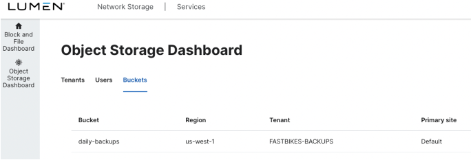
Further Information on S3 protocol APIs can be found [here](https://docs.aws.amazon.com/AmazonS3/latest/API/Welcome.html).
To open a support ticket, click on the help icon at the top right of the portal window to send an email request, or call the Lumen support desk.

United States: 1-888-638-6771
Canada: 1-866-296-5335
EMEA: 0800 496 5000 (UK) / +800 5336 3273 (EU) 
Asia Pacific: +65 6768 8099
