{{{
  "title": "Using Lumen Object Storage for Backup as a Service / S3CMD - Object Storage Management for Linux Machines",
  "date": "6-10-2021",
  "authors": " Evgeny Rudinsky / Brian Button, updated by Randy Roten",
  "attachments": [],
  "contentIsHTML": false,
  "sticky": true
}}}
### Description
This article outlines how customers can set up their Lumen Object Storage for Backup as a Service, along with S3CMD Object Storage Management for Linux Machines. 

### Overview

Lumen Object Storage Cloud customers may wish to leverage our S3 compatible Object Storage for backup and recovery of file systems or applications. As Object Storage is consumable by any customer in a public fashion, applications or servers can be located within the Lumen Cloud or on premise. There are various industry backup tools that support object storage as a repository for data. In this Knowledge Base article, we will focus on [Cloudberry Lab](http://www.cloudberrylab.com/).

[Cloudberry Ultimate Edition](http://www.cloudberrylab.com/enterprise-cloud-backup-software.aspx) permits backup of Microsoft Windows Server File Systems (backup files, folders, **network shares**, and **system image**), Microsoft SQL and Microsoft Exchange data.

[Cloudberry Backup for Mac](http://www.cloudberrylab.com/backupmac.aspx) permits backup of Mac OS X File Systems (backup files and folders).

[Cloudberry Backup for Linux](http://www.cloudberrylab.com/backuplinux.aspx) permits backup of Linux File Systems (backup files and folders).

[Cloudberry Backup for QNAP NAS](http://www.cloudberrylab.com/backup-qnap.aspx) offers QNAP NAS data backup directly to Lumen Object storage.

[Cloudberry Backup for Synology NAS](http://www.cloudberrylab.com/backup-synology.aspx) offers Synology NAS data backup directly to Lumen Object storage.

### Supporting Information

* Information and details around the Lumen Cloud Object Storage services can be found in our [Knowledge Base](https://development.ctl.io/knowledge-base/storage/object-storage/).
* It is also important to note that Lumen Cloud provides no support for any 3rd party backup software tools. We are simply providing cloud based storage onto which backup software can store data.

### Prerequisites

* A Lumen Cloud Account
* Cloudberry Backup software licenses and installation
* [An object storage user and bucket for backups is created in the Lumen Cloud Control Portal](https://development.ctl.io/knowledge-base/storage/object-storage/using-object-storage-from-the-control-portal/).
* The source VM or Server has internet access

### Cloudberry Ultimate Edition Capabilities

* File level backup (files, folders, network shares)
* System image backup
* System state backup
* Microsoft SQL backup
* Microsoft Exchange backup

### Configuring Lumen Object Storage

1. Open Cloudberry Backup Ultimate Edition, select file, in the main menu select Add New Account and click the **Lumen** icon.
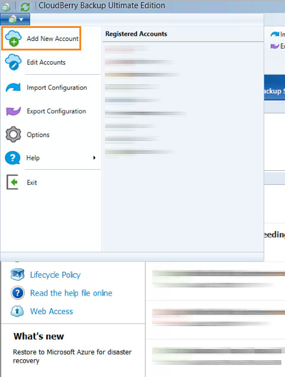
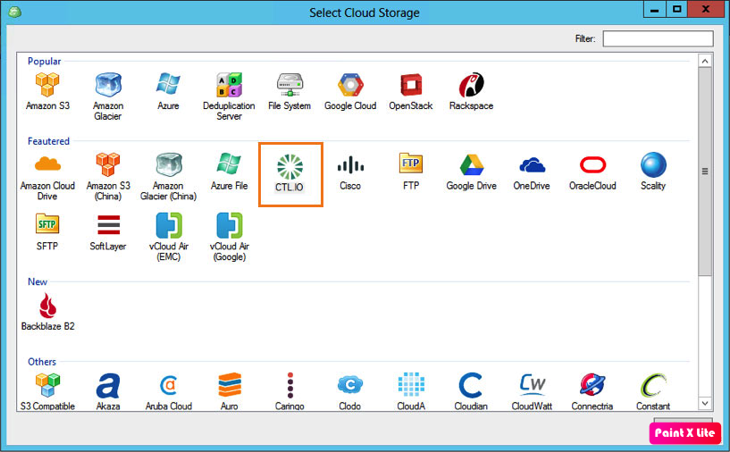

2. Populate the S3 Compatible Account information with your Lumen Cloud [Object Storage Access Key, Secret Key, Service Point and bucket name](https://development.ctl.io/knowledge-base/storage/object-storage/using-object-storage-from-the-control-portal/). [All service points are listed here](https://development.ctl.io/knowledge-base/storage/object-storage/object-storage-regions-and-service-points/).
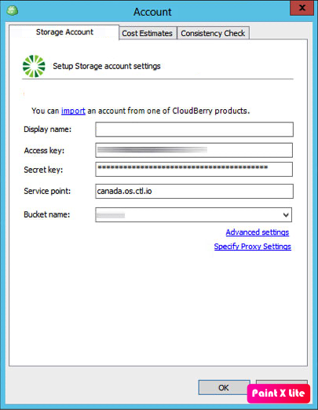

3. Optionally, you may input cost estimate parameters as part of the storage account setup. By using this component, the Cloudberry Lab backup software is able to estimate your costs for storage. **This is an estimate on storage (excluding bandwidth charges) and does not necessarily reflect actual Lumen Cloud Object Storage fees.**
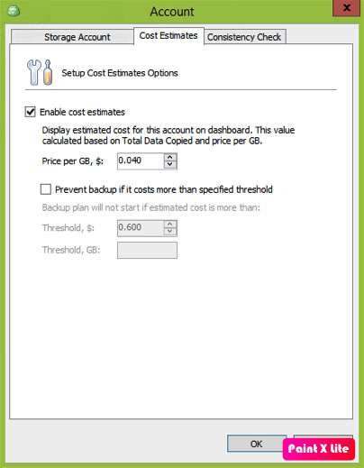

4. Your Lumen object storage account should now be created successfully.

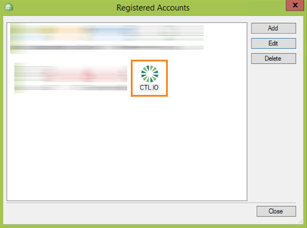

### Configuring file level backup for Windows

1. Confirm that you are viewing the **Home** tab and click the **Files** icon.

2. Select the Lumen Object Storage account you created recently (as described above).

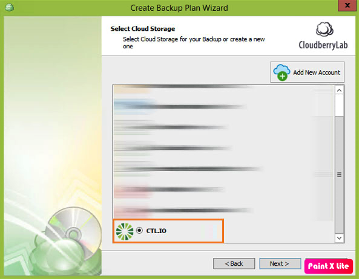

3. Specify a name for the backup plan. We recommend a name that lists and includes the server name, backup type (file, SQL etc.) as a minimum. Additionally, it is advised that backup plan configurations are saved to the backup storage (default).

4. Choose an appropriate backup mode based on the features you require. Typical enterprise customers will want to leverage the Advanced Mode approach as it provides for Data Encryption and complex retention policies.

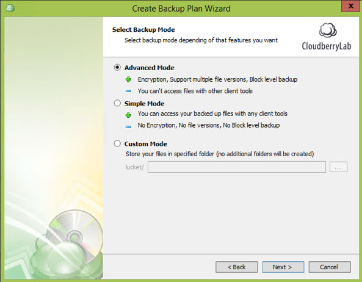

5. It is recommended to mark the checkbox for **Force using VSS (Volume Shadow Copy Service)** for file level backup in order to access files that could be active in the third-party application when the backup is in progress. Others - optionally, based on backup / restore requirements.

6. Select the backup source. Entire Windows volumes, specific directories, UNC Shares (**network shares**) or user profiles can be added to the backup plan.

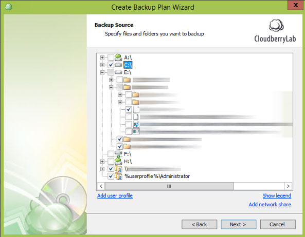

7. The Advanced Filter allows administrators to include or exclude specific file types, folders, and large files. Select the appropriate settings based on IT Department or business policies.

8. In order to secure backup data and reduce cost, customers can enable encryption and compression. **AES 128bit or higher is recommended.** Use encryption keys that are long and complex. Additionally, file name encryption adds another layer of security. Mark the Encrypt filenames checkbox.

9. Specify the appropriate retention policy for backup files. Defaults can be viewed by selecting the 'options' hyperlink. Clients may wish to keep file system backups based on number of versions or based on data set age.

10. Choose a backup schedule that meets IT or business requirements. Generally, its best practice to perform a backup at least once per day during off hours. The Cloudberry Backup software supports recurring scheduled backups and even real-time backup of data.

11. For this example, we selected **Recurring** and set the schedule for Daily at 8 PM.

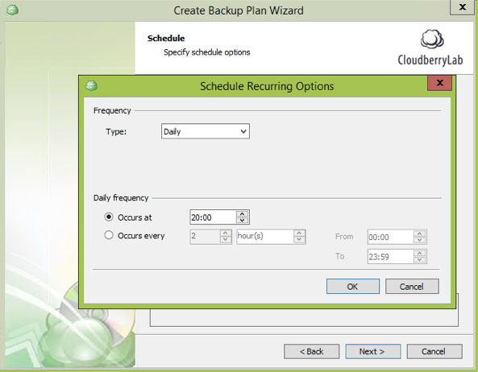

12. Support is provided for Pre / Post Actions, if required.

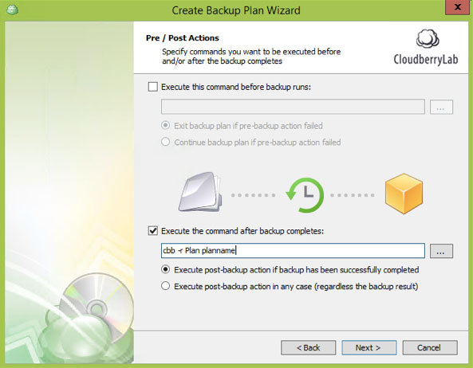

13. Notification Options provide backup administrators with success or failure alerts for each backup plan. Clients can leverage the Cloudberry backup messaging service or specify an SMTP server.

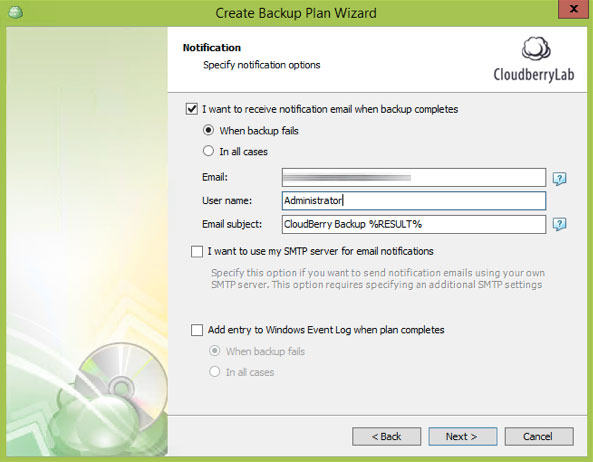

14. A summary of the backup plan will display after configurations have been completed.

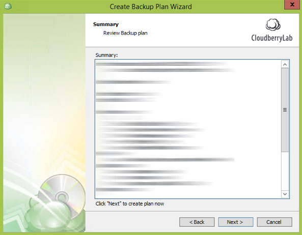

15. You have now configured a file system backup plan.

### Configuring System Image Backup for Windows

1. Confirm that you are viewing the **Home** tab and click the **Image Based** icon

2. After the backup wizard launches, enter a backup name. 

3. Mark the Image Based Backup radio button to select the backup type.

4. Select the partitions that you want to back up.

5. Set **Advanced Options** as needed. Mark the **Use block level backup** checkbox to use that feature. Follow the dialog instructions to exclude files and folders or leave that checkbox clear.

6. In the same way as in file level backup, it is possible to:
* Enable/disable compression and encryption, 
* Set required retention policy.
* Schedule the backup plan.
* Set the full backup plan time.
* Work with pre/post scripts and notifications. 

All these options have been described in the File Level backup above.

### Configuring System State Backup for Windows

1. Confirm that you are viewing the **Home** tab and click the **Image Based** icon.

2. After the backup wizard launches, give it a name. 

3. Mark the **System State** radio button to select the backup type.

4. Select items you wish to back up in system state.

5. There are other steps similar to either File Level or Imaged Based backups (e.g. compression and encryption options, retention policy, backup schedule, pre / post scripts and notifications). Continue on through these selections to configure your backup and complete the process.

### Configuring Microsoft SQL Database backup

1. Confirm that you are viewing the **Home** tab and click the **MS SQL Server** icon.

2. Select the SQL Server instance to back up.

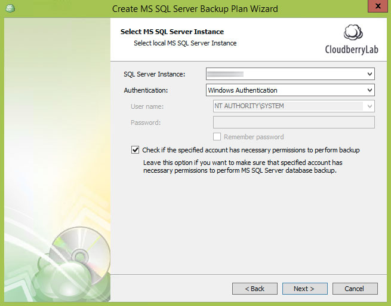

3. Mark the radio button for the desired backup method and enter backup data as needed. 

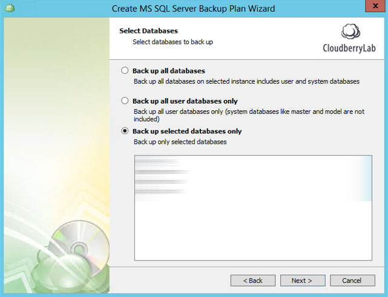

4. Schedule your backup using the default template or set times on your own.

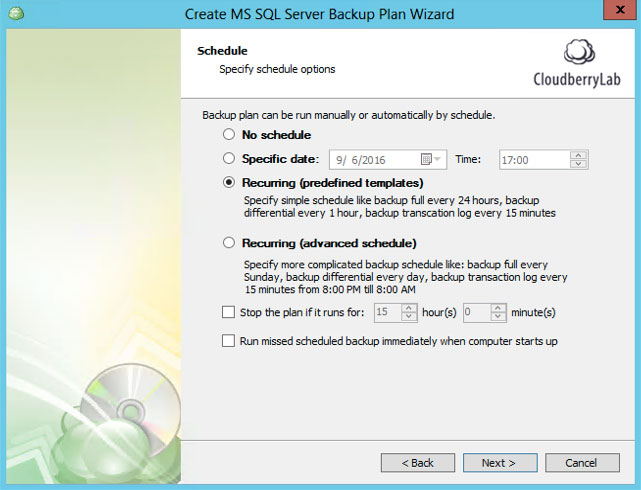

5. Set the remaining backup options based on your requirements. The steps are similar to File Level requirements (e.g. compression and encryption options, retention policy, backup schedule, pre / post scripts and notifications). Continue on through these selections to configure your backup and complete the process.

### Configuring a Microsoft Exchange Backup

1. Confirm that you are viewing the **Home** tab and click the **MS Exchange** icon.

2. Select backup storage.

3. Enter your plan name.

4. Select the Exchange databases to archive.

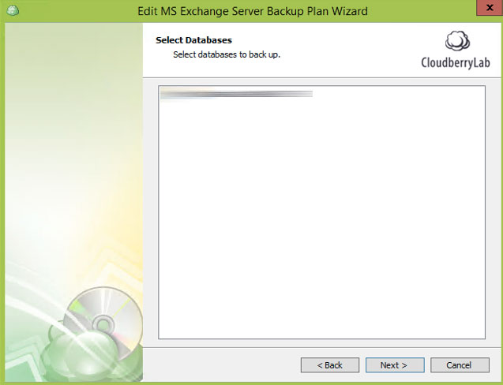

5. Set compression and encryption parameters. Schedule recurrence and define full backup accordingly.

6. Set the remaining backup options based on your requirements. The steps are similar to File Level requirements (e.g. compression and encryption options, retention policy, backup schedule, pre / post scripts and notifications). Continue on through these selections to configure your backup and complete the process.

### Troubleshooting

In case of product issues:

1. Check the [Knowledge Base](http://kb.cloudberrylab.com/).

2. Support email - support@cloudberrylab.com.

3. Solutions Architect group email - sa-team@cloudberrylab.com.

### S3CMD - Object Storage Management for Linux Machines

S3CMD is a Linux command line utility that can be used to interact with and manage your Lumen Cloud [Object Storage](https://development.ctl.io/object-storage/) buckets and data, Access Control Lists (ACLs), and associated metadata. S3CMD is an advanced tool to be used for accessing object storage, so care should be taken. This article covers the following topics:

* Installing S3CMD
* Configuring S3CMD for Lumen Object Storage
* Using S3CMD
* Special Note About S3CMD Versions
* Ways to Improve Transfer Speed

#### Installing S3CMD

Before you can use S3CMD, make sure that it is installed. At the command line, enter `which s3cmd`. If the command gives no output, then you do not have S3CMD installed and need to add it.

The simplest way to add it is to use the package manager for your version of Linux, probably either `yum` or `apt`. While S3CMD is included in many package managers, it is best to manually configure the official repository to ensure that you are using the latest version.

##### Adding the Repository to a CentOS or RHEL Machine

_**Note:**_ Both instructions assume you are running as root. You will need to add “sudo” where appropriate if not logged in as root).

1. Install wget, if not already installed by entering the command: `yum install wget –y`.

2. Enter the command: `cd /etc/yum.repos.d`.

3. Download the appropriate file for your distribution:
   * For CentOS/RHEL 5 enter the command `wget http://s3tools.org/repo/RHEL_5/s3tools.repo`.
   * For CentOS/RHEL 6 enter the command `wget http://s3tools.org/repo/RHEL_6/s3tools.repo`.

4. Enter the command: `yum install s3cmd -y`.

#### Adding the Repository to an Ubuntu/Debian Machine

1. Install wget, if not already installed by entering the command: `apt-get install wget –y`.

2. Import the signing key by entering the command: `wget -O - -q http://s3tools.org/repo/deb-all/stable/s3tools.key | apt-key add -`.

3. Add the repository by entering the command: `wget -O /etc/apt/sources.list.d/s3tools.list http://s3tools.org/repo/deb-all/stable/s3tools.list`.

4. Refresh your packages and install by entering the command: `apt-get update && apt-get install s3cmd`.

#### Configuring S3CMD

Once S3CMD has been installed, it must be configured to use Lumen Cloud’s Object Storage.

1. S3CMD stores its settings in a configuration file. You can either run `s3cmd –configure` to launch an interactive configuration generation tool, or specify a pre-existing file.

2. You need both your **Access Key ID** and your **Secret Access Key**. You can find them by clicking **Services > Object Storage**.

3. On the Object Storage page, click the **Users** tab and then the appropriate username.

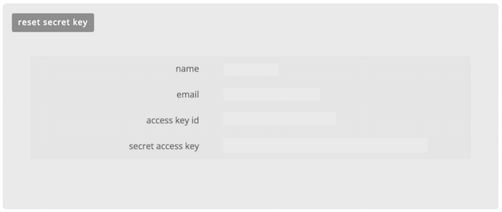

4. Enter your encryption password.

5. Press enter as the default path to gpg should be correct.

6. Select *Yes* for HTTPS, unless explicitly directed otherwise.

7. You are then asked to test your settings. Select *NO* as it will fail.

8. Select *Yes* when prompted to save your configuration file. The *.s3cfg* file will be created in your users home directory.

9. Open it with a text editor. In this example we use `vi`. Enter the command: `vi ~/.s3cfg`.

10. In the configuration file, change the following fields with the appropriate Lumen Cloud data center.
`host_base = canada.os.ctl.io`
`host_bucket = %(bucket)s.canada.os.ctl.io`

Alternatively, you can modify and save the following file and then specify s3cmd to use it by entering the command: `s3cmd –c /path/to/config file`.

#### Sample Configuration File

_**Note:**_ The following configuration line items must be edited.

* access_key = YOUR_ACCESS_KEY_HERE
* gpg_passphrase = password
* host_base = [canada.os.ctl.io](http://canada.os.ctl.io/)
* host_bucket = %(bucket)[s.canada.os.ctl.io](http://s.canada.os.ctl.io/)
* secret_key = YOUR_SECRET_KEY_HERE
* use_https = False

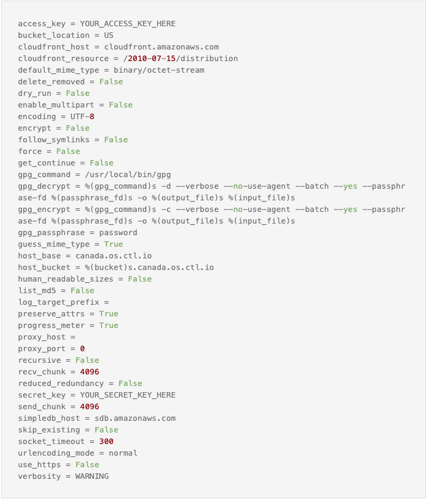

#### Creating the Object Storage Bucket

Before using S3CMD, you’ll need to create an Object Storage user and a bucket, which you can create through the [Lumen Cloud Control Portal](https://control.ctl.io/).

1. From the Navigation Menu, click **Services > Object Storage**.

2. Click the **User** tab and then **create user**.

3. Enter the requested data into the required fields.

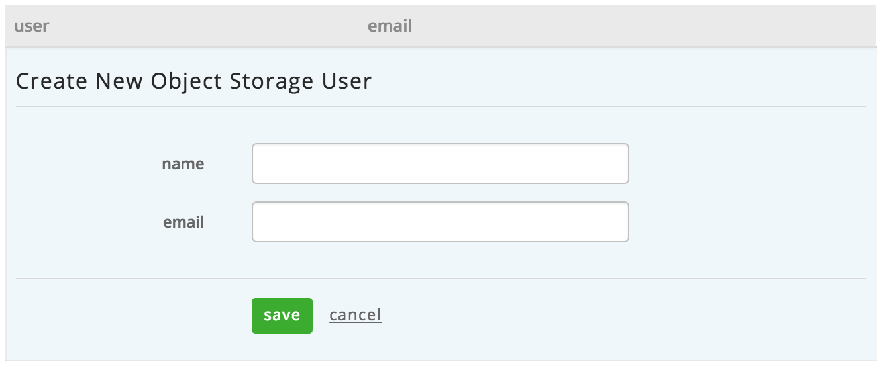

4. Click the **save** button.

5. Click the **Buckets** tab to launch the **create bucket** dialog.

6. Enter the **bucket name**. 

7. Select the **owner** from the drop-down menu. 

8. Select a **region**.
   * You can add additional users or modify the permissions after creating the bucket. Click the bucket name to access those options.

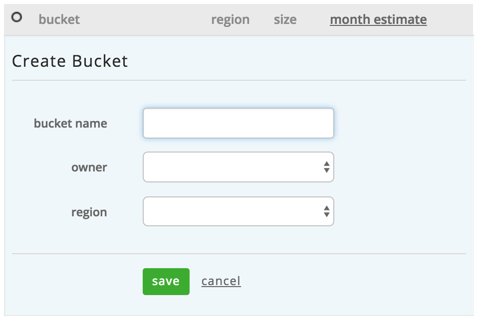

9. Click the **save** button.

#### Using S3CMD

Now that S3cmd has been configured, you can issue normal commands and interact with your storage. Run `S3cmd –-man` for a full list of commands.

1. Make a bucket using the command: `s3cmd mb s3://my-new-bucket-name`.

2. List the contents of a bucket with the command: `s3cmd ls s3://my-new-bucket-name`.

3. Upload a file using the command: `s3cmd put testfile.xml s3://my-new-bucket-name/testfile.xml`.

4. Download/Retrieve a file with the command: `s3cmd get s3://my-new-bucket-name/testfile.xml testfile_modified.xml`.

#### Special Note About S3CMD Versions

S3CMD is an active open-source project, and as such is frequently updated. Depending on the version of S3CMD you installed, the default authentication strategy may have changed. Using the incorrect authentication strategy will result in **403 Not Authorized** or **S3 error: Access Denied** errors for some requests to object storage. You can tell which version of S3CMD you have by running the `s3cmd –version` command and inspecting the output. If the active version is earlier **1.5.0**, s3cmd will operate correctly.

If your version is **1.5.0** or newer, then there are two ways to make this work correctly again.

* The first is to provide the **--signature-v2** argument to S3CMD, for example `s3cmd --signature-v2 ls`. The argument tells S3CMD to revert to the original authentication strategy.
* The more permanent change is to add `signature_v2 = True` to the bottom of the .s3cfg file. That forces S3CMD to use the original authentication strategy every time the command is run.

W#### Ways to Improve Transfer Speed
When uploading or downloading a large file, consider to put s3cmd in quiet mode (`no-progress` option) to minimize the output to console (stdout), as stdout could potentially slow down the transfer process.

Look for the next article in this series which will discuss using advanced S3cmd features such as rsync and encryption!

### Related Topics

[Request Rate and Performance Considerations](https://development.ctl.io/knowledge-base/storage/object-storage/request-rate-and-performance-considerations/)

[Object Storage User Management](https://development.ctl.io/knowledge-base/storage/object-storage/object-storage-user-management/)

[Object Storage Error Code: 503 Slow Down](https://development.ctl.io/knowledge-base/storage/object-storage/object-storage-error-code-503-slow-down/)

[Object Storage 3rd Party Compatibility](https://development.ctl.io/knowledge-base/storage/object-storage/object-storage-3rd-party-compatibility/)

[Object Storage Regions and Service Points](https://development.ctl.io/knowledge-base/storage/object-storage/object-storage-regions-and-service-points/)