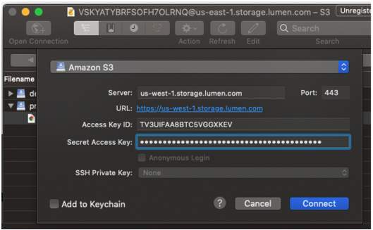
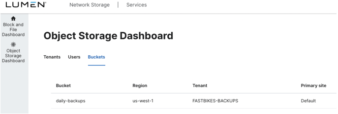

{{{
  "title": "Using Object Storage From 3rd Party Tools",
  "date": "6-16-2021",
  "author": "Brad Lewis, updates from Randy Roten",
  "attachments": [],
  "contentIsHTML": false,
  "sticky": true
}}}
#### Description
A variety of freeware and shareware FTP clients are available for FTP processes. Examples include Cyberduck, Cloudberry Browser, S3cmd, and others. Additionally, most enterprise backup software has the ability to write directly to an S3 target. For this example, we will show configuration of Cyberduck for bucket configuration. 
### Accessing the Lumen Network Storage Portal
#### Creating Object Storage Buckets Via an S3 Browser
For this example, we will show configuration of Cyberduck for bucket configuration.
S3 terminology typically references “buckets” as the storage containers, with “objects” being stored in those containers. While technically inaccurate, Cyberduck presents this as a more familiar construct of directories and files. The first step is to configure our S3 client for accessing the Lumen Network Storage regional endpoint. As seen in our example, our chosen region is US-west-1 (PHX).
1. Launch Cyberduck.
2. Click the **Open Connection** icon. 
3. Click on the FTP line.
4. Select the **Amazon S3** transfer protocol. 
5. Edit the Server name so that it will point to your Lumen Network Storage Region endpoint URL.
6. Enter the user **Access Key** and **Secret Key**.
7. Click the **Connect** button. 

8. After a connection is created, you will be in the ‘root’ directory, where you can create a new bucket.

9. Right-click on the list or choose **File > New Folder** from the menu. 

Your folder is created and is now available to write data through: 
* Your S3 browser via drag-drop functionality.
* Your backup software.
* Directly via the S3 API.

Returning to the Lumen Network Storage Object Dashboard, your new bucket is listed.

Further Information on S3 protocol APIs can be found [here](https://docs.aws.amazon.com/AmazonS3/latest/API/Welcome.html).
To open a support ticket, click on the help icon at the top right of the portal window to send an email request, or call the Lumen support desk.

United States: 1-888-638-6771
Canada: 1-866-296-5335
EMEA: 0800 496 5000 (UK) / +800 5336 3273 (EU) 
Asia Pacific: +65 6768 8099

Related Topics
[Lumen and Customer Responsibilities for Lumen Network Storage]( https://www.ctl.io/knowledge-base/lumen-network-storage/getting-started/lumen-customer-responsibilities/)
[Getting Started: Creating LNS Nodes and Volumes]( https://www.ctl.io/knowledge-base/lumen-network-storage/getting-started/getting-started-creating-cns-nodes-volumes/)
[Lumen Network Storage Glossary of Terms]( https://www.ctl.io/knowledge-base/lumen-network-storage/getting-started/glossary-of-terms/)
