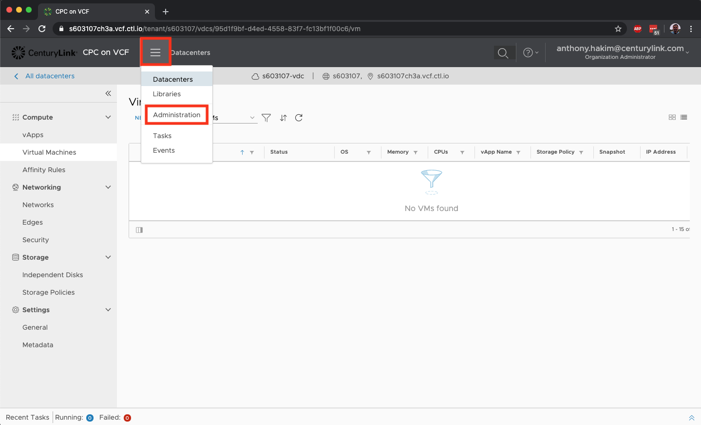
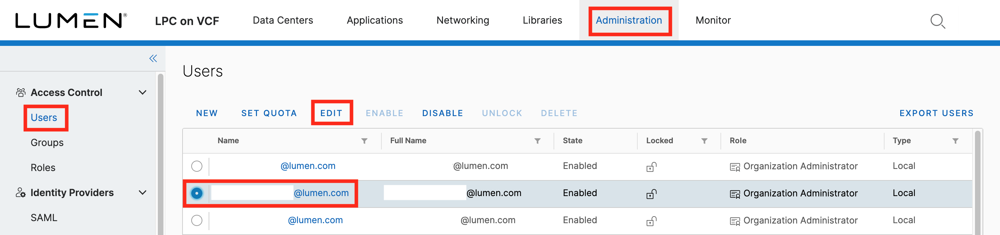
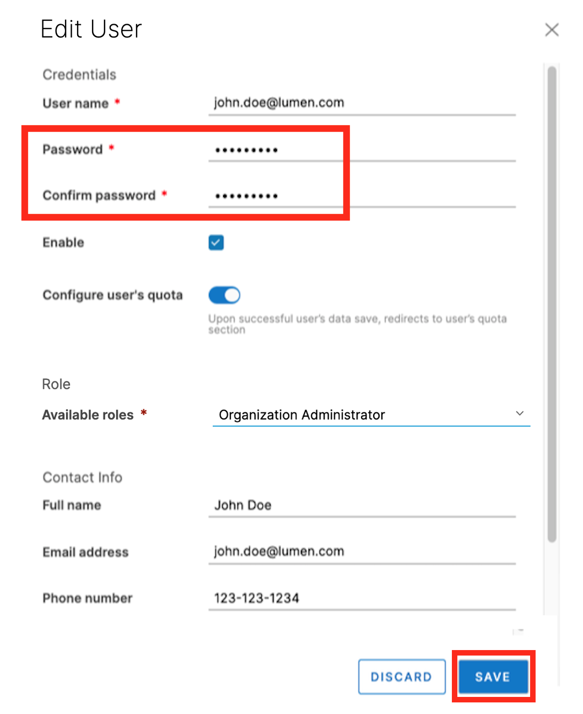

{{{
  "title": "Change User Password",
  "date": "06-16-2020",
  "author": "Anthony Hakim",
  "keywords": ["cpc", "cloud", "vmware", "admin", "password"],
  "attachments": [],
  "related-products" : [],
  "contentIsHTML": false,
  "sticky": false
}}}

### Description
In this KB article, we describe how to change a user password in Lumen Private Cloud on VMware Cloud Foundation™ (CPC on VCF).

### Steps
Login to your Lumen Private Cloud on VMware Cloud Foundation environment.

  

Once logged in, click the "hamburger" menu in the upper left of the screen, then select __Administration__.

  

In the Administration page, ensure that __Users__ is selected, select the user account that you wish to change passwords, then select __EDIT__.

  

In the __Edit User__ page, enter a new password in the __Password__ field, then re-enter your new password in the __Confirm password__ field, then click __SAVE__.

  
