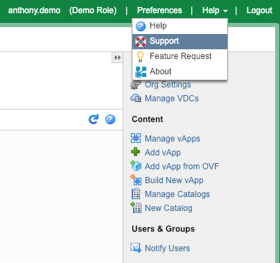

{{{
  "title": "Enabling the Distributed Firewall (Flex UI)",
  "date": "12-13-2018",
  "author": "Anthony Hakim",
  "keywords": ["cpc", "cloud", "vmware", "firewall", "support", "vcf"],
  "attachments": [],
  "related-products" : [],
  "contentIsHTML": false,
  "sticky": false
}}}

### Description
In this KB article, we walk through how to enable Distributed Firewall for Lumen Private Cloud on VMware Cloud Foundation.

### Prerequisites
* Your base URL, and user credentials for Lumen Private Cloud on VMware Cloud Foundation.

### Steps

1. Log In to your CPC on vCF environment.

2. Click on **Help** in the upper right corner, then click **Support**.

  

3. You will be taken to the **Managed Support Portal**. Click **Create** and select the following options:

  * What Product is this for? **Cloud**
  * Which Cloud Product? **Lumen Private Cloud on VMware Cloud Foundation (Formerly DCC Foundation)**
  * What is the status? **Requesting a Change**
  * When should this change be performed? **Prioritized (Any time in the next X hours)**
  * Change Subject: **Lumen Private Cloud on VMware Cloud Foundation Prioritized**
  * Change Details: **Please enable Distributed Firewall in my CPC on vCF environment - `<yourURL>`**.
  * Priority: Select the appropriate priority (**P2 Standard or P3 Standard**).
  * Click on the **submit** button.

4. You will be contacted by Lumen to coordinate the change request.
