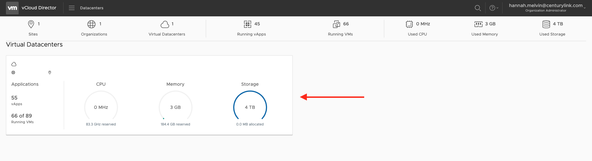
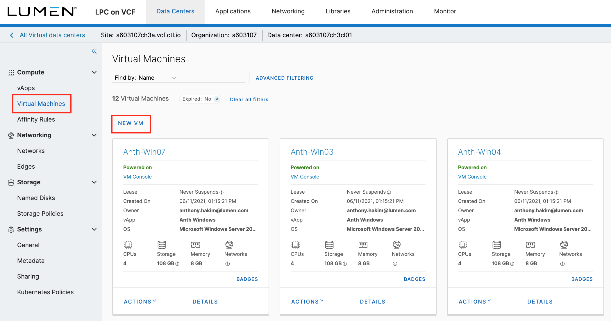
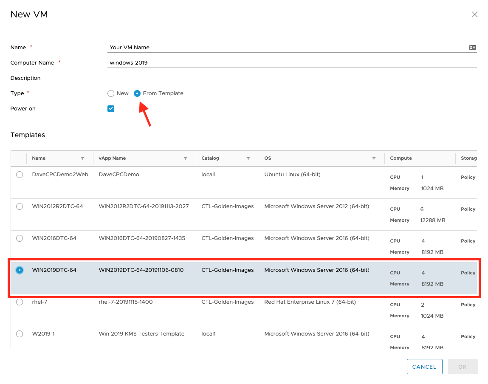
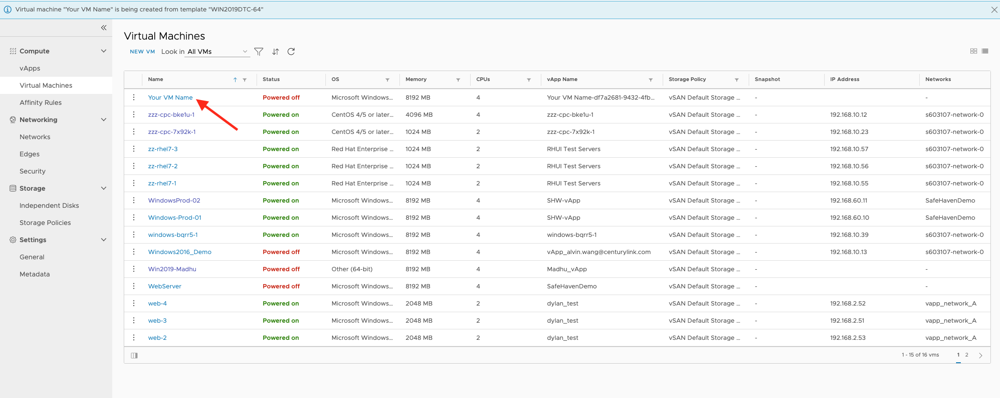

{{{
  "title": "Windows 2019",
  "date": "1-2-20",
  "author": "Hannah Melvin",
  "keywords": ["cpc", "cloud", "vm", "windows2019", "vcloud", "vcf"],
  "attachments": [],
  "related-products" : [],
  "contentIsHTML": false,
  "sticky": false
}}}

### Description
In this KB article, we walk through creating a Virtual Machine with Windows 2019 OS in vCloud Director.

### Steps

1. Log In to your CPC on vCF environment.

2. Select the datacenter you want to work in.

3. Click __Virtual Machines__ under Compute in the sidebar on the left side of the screen.

4. Click __New VM__.

5. Enter Name, Computer Name, and Description (optional). Select __From Template__ as the Type. Choose whether or not the VM should be powered on after creation.

6. In the Template options select the template with the name __WIN2019DTC-64__. Although the OS for this template shows __Microsoft Windows Server 2016 (64-bit)__, this is the Windows 2019 OS. This is a VMware known issue.

7. Click __OK__.

8. Your VM will then appear at the top of the list on the Virtual Machines page.

