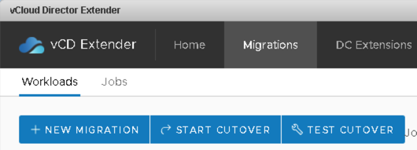

{{{
  "title": "Migrating Workloads",
  "date": "5-22-2018",
  "author": "Anthony Hakim",
  "attachments": [],
  "related-products" : [],
  "contentIsHTML": false,
  "sticky": false
}}}

### Description
In this KB article, we outline the process involved in migrating VMs in your VMware (source) environment into Lumen Private Cloud on VMware Cloud Foundation.

With vCloud Director Extender, you can migrate your virtual machines from an on-premise vCenter Server to your Lumen Private Cloud on VMware Cloud Foundation environment. You can migrate virtual machines both when they are powered on and powered off depending on the available downtime.

You can initiate virtual machines migration jobs only from a tenant vCenter Server on-premise. With vCloud Director Extender migration jobs, tenants can preserve their current IP and MAC address scheme after the migration completes.

**Note:** Preserving IP and MAC address scheme after a migration is only possible, if you extend a private, on-premise, virtual network to cloud VDC networks by using the DC Extension feature of vCloud Director Extender. Follow the information in KB titled [Configuring DC Extensions for vCD Extender](l2vpn-migration-tool.md) to configure this for your environment.

Migration of an entire data center is a slow process and is often done in stages. To ensure a minimal downtime of client applications, vCloud Director Extender provides flexibility in the different types of migrations.

You can choose from two types of migration:

**Warm Migration**
Your virtual machines are active while the migration runs, and ensure minimal downtime. After the migration completes, you start a manual Cutover to make the virtual machines available on the cloud provider site and finalize the migration. Cutover is a process of powering on the virtual machines at the cloud provider site, after the warm migration completes. The Cutover operation includes a final sync and import of a migrated VM into a destination Org VDC's vApp and an optional powering on of the VM.

**Cold Migration**
You power off your virtual machines and start the migration. No cutover process is required in this case, you can select whether to power on the virtual machines from the migration setup menu.

### Prerequisites
* You will need to setup your VMware (source) environment in readiness for migration into Lumen Private Cloud on VMware Cloud Foundation. Follow the steps in this KB article - [Preparing Your Environment for Migration into Lumen Private Cloud on VMware Cloud Foundation](migration-tool.md).

### Warm Migration
By performing a warm migration, you migrate a powered on virtual machine from an on-premise vCenter Server to an Org vDC in Lumen Private Cloud on VMware Cloud Foundation. A placeholder VM is created in Lumen Private Cloud on VMware Cloud Foundation, and you carry out an initial synchronization between the VM that runs on-premise and the placeholder VM in Lumen Private Cloud on VMware Cloud Foundation.

**Prerequisites**
* Verify that you have sufficient space available in the target storage profile.
* You must have a defined Org vDC network.
* Verify that the VM that you are migrating is powered on.

**Procedure**
* In the vSphere Web Client, navigate to Home > Inventories > vCloud Director Extender.
* In the Migrations tab, click New Migration.

  

* Select Warm migration and click Next.

  

* Select the Source VMs that you want to migrate and click Next.
  * When you select a VM, the system verifies if the selected VM is powered on.
  * If you select a VM that is powered off, the system returns an error, and you cannot proceed until you select a powered on VM.

  

* Select a Target Cloud, a target vDC, a target storage profile, a target network, and whether you want to group all virtual machines that you are migrating into a single vApp, and click Next.

  

* On the Settings page
  * Select to run the migration Immediately or At a specific time.
  * Select a target Recovery Point Objective (RPO).
  * Select the disk type.
  * (Optional) Enter a tag for the migration job that you are initiating.
  * Click Start.

  

  **Note:** You will not see the "migrated" VM in vCD until you perform a Cutover.

The migration operation is initiated and a new warm migration job appears in the Migrations tab in a Created state. After the warm migration job completes, the warm migration job goes into a cutover-ready status and you can initiate a manual cutover.

  

By Performing a cutover to a virtual machine, you finalize a warm migration. The Cutover operation includes a final sync and import of a migrated VM into a destination Org VDC's vApp and an optional powering on of the VM.

  

Once the Cutover operation has fully synchronized, it will appear in Lumen Private Cloud on VMware Cloud Foundation.

  

### Cold migration
By performing a cold migration, you migrate a powered off virtual machine from an on-premise vCenter Server to an Org vDC in Lumen Private Cloud on VMware Cloud Foundation. Upon initiation, you start simultaneous file transfer and cutover processes, so no manual operations are required after the migration completes.

During a cold migration, the Replication Manager creates a VM instance in the resource vCenter Server in the cloud.

**Prerequisites**
* Verify that you have sufficient space available in the target storage profile.
* You must have a defined Org vDC network.
* Power off the virtual machine that you about to migrate.

**Procedure**
* In the vSphere Web Client, navigate to Home > Inventories > vCloud Director Extender.
* In the Migrations tab, click New Migration.

  

* Select Cold migration and click Next.

  

* Select the VM that you want to migrate and click Next.
  * When you select a VM, the system verifies if the selected VM is powered off.
  * If you select a VM that is powered on, the system returns an error, and you cannot proceed until you select a powered off VM.

  

* Select a Target Cloud, a target vDC, a target storage profile, a target network, and whether you want to group all VMs that you are migrating into a single vApp, and click Next.

  

* On the Settings page
  * Select to run the migration Immediately or At a specific time.
  * Select if you want to power on the VM after the migration operation completes.
  * Select the disk type.
  * (Optional) Enter a tag for the migration job that you are initiating.
  * Click Start.

  

The migration job is initiated and a new cold migration job appears in the Migrations tab. You can monitor the progress of the migration job in the Migrations tab.

  

Once the VM has fully synchronized, it will appear in Lumen Private Cloud on VMware Cloud Foundation.

  
