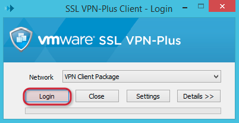

{{{
  "title": "How to securely connect",
  "date": "5-17-2018",
  "author": "Anthony Hakim",
  "attachments": [],
  "related-products" : [],
  "contentIsHTML": false,
  "sticky": false
}}}

### Description
This KB article assumes that you've created a new virtual server on Lumen Private Cloud on VMware Cloud Foundation™. If not, follow this guide to [Create a Server](../General/creating-a-server.md), then return to this guide.

Now what? How do you securely connect to your servers? This KB article describes how to use SSL VPN-Plus to securely connect to your servers.

Note: This KB article assumes that you have already setup SSL VPN-Plus in your Lumen Private Cloud on VMware Cloud Foundation environment. If not, follow this guide to [Configure SSL VPN-Plus](configuring-sslvpn-plus.md), then return to this guide.

### Steps

* Go to the path to your SSL VPN-Plus endpoint, and login using your SSL VPN-Plus credentials.

  

* Once logged in, click on __VPN Client Package__.

  

* If prompted, click on __click here__ to start the installation, then choose __Run__ to step through the installation process with default options.

  

  If you have a Mac, this step is similar &mdash; click on __Click here__ to download the .tgz file and then step through the installation with default options.

  

* Once installed, launch the client and click __Login__. Windows: On the Desktop by default (VMwareTray); Mac: In Applications (naclient.app).

  

* Click __Yes__ to proceed (Windows).

  

  Click __Proceed Anyway__ (Mac).

  

* Login with the same credentials you used to download the SSL VPN-Plus client.

  

* Once you are connected, you can use an SSL or RDP client to access the servers within your Lumen Private Cloud on VMware Cloud Foundation environment.

  

  
