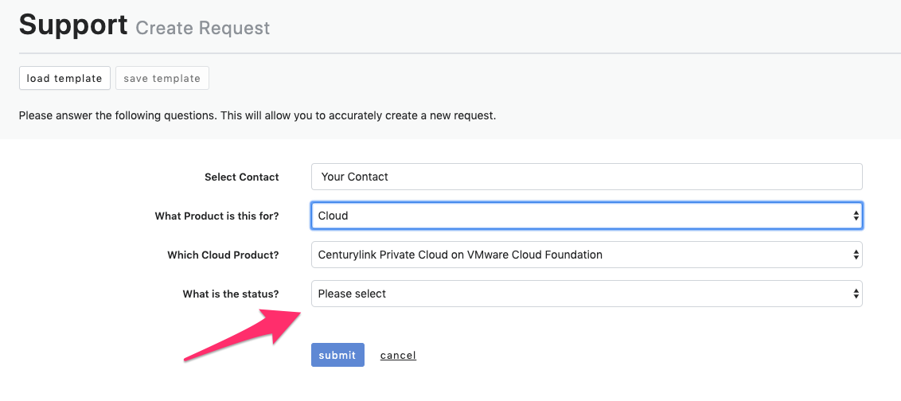

{{{
  "title": "Getting Support",
  "date": "5-8-2019",
  "author": "Hannah Melvin",
  "attachments": [],
  "related-products" : [],
  "contentIsHTML": false,
  "sticky": false
}}}

### Description
In this KB article, we demonstrate how to get support when needed. As part of our support request process, you might also need to request a SavvisStation Portal account. This KB includes contact information for our support team and the different ways to contact them, as well as steps to request a SavvisStation Portal account.

### Support Options

* Via Phone: Response Objective is 1-5 minutes
    * United States: 1-888-638-6771
    * Canada: 1-866-296-5335
    * EMEA: 00800-7288-4743
    * Asia Pacific: +65-6768-8099

* Via Email: Response Objective is less than 6 hours
    * incident@centurylink.com

* Via Ticket: Response Objective is less than 1 hour
    * Managed Support Portal - https://managedsupport.ctl.io/msp/. To submit a ticket, you will need a SavvisStation Portal account. If you do not have an account, follow the steps in the next section of this article.
    * Submitting a ticket:
      1. Go to https://managedsupport.ctl.io/msp/ and enter your login credentials.
      2. After logging in, search for and select your Company or Site ID.
      3. Next, enter your main contact. Select __Cloud__ in the "What Product is this for?" field. Select __Lumen Private Cloud on VMware Cloud Foundation__ in the "Which Cloud Product" dropdown.
      4. In the "what is the status?" dropdown, select __Experiencing an Issue__, __Requesting a Change__, or __Requesting Information__.
        
      5. Based on the option you select, additional fields will appear in the form. Once all required fields are completed, click __Submit__. 

### Steps to request a SavvisStation Portal Account.

* Call 1.888.638.6771 to speak with a Specialist.

* The Specialist will assist in opening a ticket for your SavvisStation Portal account. You will need to provide a Site Name contact. If this is unknown, please reach out to a member of your account team.

OR

* If a member of your organization has a SavvisStation Portal admin account, reach out to your admin to create a read/write account.
