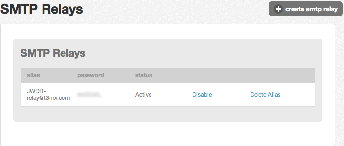

{{{
  "title": "SMTP Relay Services (Simple)",
  "date": "12-2-2014",
  "author": "Jared Wray",
  "attachments": [],
  "contentIsHTML": false
}}}

SMTP Relay can be used to do application level email relay without the need of managing your own SMTP server/service. The current offering is prices at $0.10 per 1000 emails sent via the service and billed at the account level.</p>
<p>You can sign up for the service easily by going to the Contol Portal &gt; Services &gt; SMTP Relay. From here you can create an SMTP relay account by doing the following:</p>

- Click the "Create SMTP Relay" button.

- It will create a user to be used on the service and will be listed with an alias, password, status such as:

- Now you can connect to the SMTP relay service from your virtual servers at CenturyLink Cloud.

### Connect to the SMTP Relay Service

Connecting to the SMTP service is very easy as it is done via port 25 from inside the CenturyLink Cloud. Here are the settings:

- SMTP Host: relay.t3mx.com
- SMTP Host Port: 25
- User: (what is provided in your control portal as the alias)
- Password: (what is provided in your control portal)

You will also need to add SPF record as follows: **v=spf1 ip4:66.150.160.0/24**

### API's for SMTP Relay Provisioning:

 Here are the links to the provisioning service for the SMTP Relay that can be used to manage SMTP relay accounts and get invalid addresses such as bounce backs:

- [Overview](http://www.ctl.io/api-docs/v1#smtp-relay-smtp-relay-api-overview)
- [Create Alias](http://www.ctl.io/api-docs/v1#smtp-relay-createalias)
- [List Aliases](http://www.ctl.io/api-docs/v1#smtp-relay-listaliases)
- [Disable Alias](http://www.ctl.io/api-docs/v1#smtp-relay-disablealias)
- [Remove Alias](http://www.ctl.io/api-docs/v1#smtp-relay-removealias)
- [Get Invalid Addresses](http://www.ctl.io/api-docs/v1#smtp-relay-get-invalid-addresses)

### RHEL Compatible Postfix Basic Setup

Install pre-reqs:

```> sudo yum install cyrus-sasl{,-plain}```

As root create the file `/etc/postfix/smtp_sasl_password_maps` with the following content (substituting your alias and password)

```
relay.t3mx.com $alias:$password
```

Create a hash of your password map:

```> sudo postmap /etc/postfix/smtp_sasl_password_maps```


Add the following lines to your /etc/postfix/main.cf:

```
smtp_sasl_auth_enable = yes
smtp_sasl_password_maps = hash:/etc/postfix/smtp_sasl_password_maps
smtp_sasl_security_options = noanonymous
relayhost = relay.t3mx.com
```

Reload postfix and test

```> sudo /sbin/service postfix reload```
