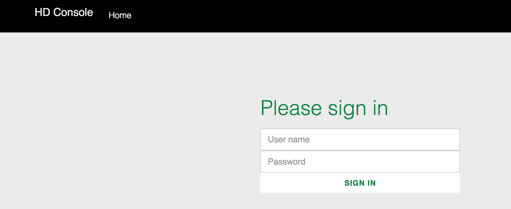

{{{
  "title": "CenturyLink Cloud HD Console for Hadoop",
  "date": "05-25-2015",
  "author": "Tim Baumgartner",
  "attachments": [],
  "contentIsHTML": false
}}}

##Overview

HD Console is available on Hadoop Clusters on CenturyLink Cloud. The console provides an overview of installed add-on services as well as host data within the cluster (memory, disk usage, IP, etc.). Additionally, links to hadoop resources (Cloudera Manager, Hue & Navigator) specific to the cluster are conveniently located on the menu bar.

###How to Access

To access the HD Console, go to port 8150 of the managment node then sign in using your Cloudera Manager credentials. The first set of credentials were created when the Blueprint was executed.

