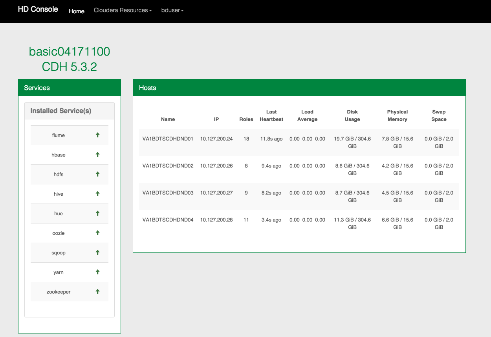

{{{
  "title": "CenturyLink Cloud HD Console for Hadoop",
  "date": "05-25-2015",
  "author": "Tim Baumgartner",
  "attachments": [],
  "contentIsHTML": false
}}}

## Overview

HD Console is available on Hadoop Clusters on CenturyLink Cloud. The console provides an overview of installed add-on services as well as host data within the cluster (memory, disk usage, IP, etc.). Additionally, links to hadoop resources (Cloudera Manager, Hue & Navigator) specific to the cluster are conveniently located on the menu bar.

### How to Access

To access the HD Console, go to port 8150 of the managment node then sign in using your Cloudera Manager credentials. The first set of credentials were created when the Blueprint was executed.

### Resize cluster

###### Remove Node
Removing a node from your cluster will perform the appropriate actions within Cloudera to decommission and delete the node from your cluster while also deleting that node within CenturyLink Cloud.  Enter the number of nodes in the box (or use the spinner) to let us know how many nodes you would like **remaining** on your cluster and we will take care of the rest.  *Note: You cannot go below 4 nodes

In order to perform a resize of your cluster, you must elevate your privileges.  Enter your CLC Portal credentials when you are presented with the screen below and the cluster resize will begin once you click the Login button.

###### Add Node
Currently HDConsole does not support Add Node.  You will need to find the appropriate Add Node Blueprint within the blueprints library of CLC to Add a Node to the cluster.