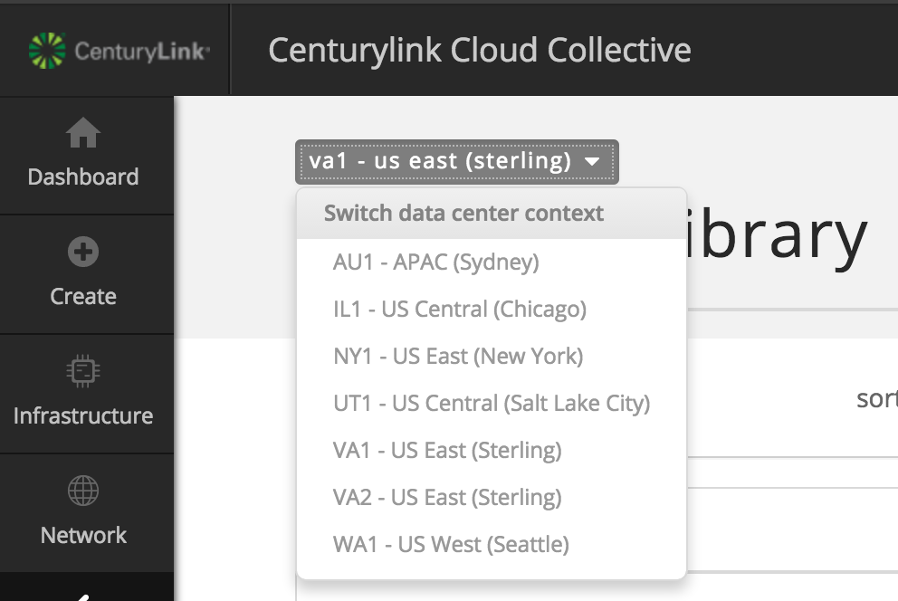

{{{
  "title": "Converting unmanaged virtual machines to managed",
  "date": "2-13-2018",
  "author": "Chris Little",
  "attachments": [],
  "contentIsHTML": false
}}}

### Overview
[CenturyLink Cloud Managed Operating System Services](https://www.ctl.io/managed-services/operating-system) provide maintenance and management of your Windows & Red Hat cloud servers, 24x7.  For a flat hourly fee, our engineers will perform support and administrative functions on your behalf.

Customers may wish to enable Managed OS on virtual machines already deployed in an **unmanaged** state to offload critical IT functions. In order to facilitate this process, the CenturyLink Cloud platform provides an automated [Blueprint](https://www.ctl.io/blueprints) to convert unmanaged virtual machines into a managed operating system.

Of course, you may also consider using the CenturyLink Cloud API to handle these actions programmatically. What follows is the simplest method, via the Control Portal.

### Audience

Users employed by companies that have agreed to terms with [CenturyLink Sales](https://www.centurylink.com) for the CenturyLink Cloud product.

### Prerequisites
- An understanding of the standard server creation process.
- Some idea of the benefits included with [managed servers](../Managed Services/managed-operating-system-frequently-asked-questions.md).

### Important Information
- Conversion from **Managed** to **Unmanaged** Operating System Services is not currently a supported feature.
- It is advised that customers perform the conversion during a maintenance window due to potential impact on running services.
- It is recommended to create a snapshot of the VM before running the management process
- Normally, a single CPI Blueprint will take between ten and thirty minutes to complete. However, this can be influenced by jobs in the queue
- Due to security concerns, customers will be unable to convert a sub-account VM to Managed while using an IP address from a parent account network. The network chosen for the VM must belong to the same account upon which the machine resides.
- To preconfigure network access, prior to making an unmanaged VM Managed, please be sure at least one [new, managed server](../Managed Services/created-a-managed-server-now-what.md) has been created in the desired VLAN/Network.

### Compatibility Matrix
The table below provides a matrix of the supported locations and Operating Systems for conversion.

**Cloud Location**| **Operating System**
----------------- | --------------------
GB3 - Great Britain (Slough)<br>VA1 - US East (Sterling)<br>UC1 - US West (Santa Clara)<br>US Central (Chicago) - IL1<br>Canada (Toronto - Mississauga) - CA3<br>APAC (Singapore) - SG1|Red Hat Enterprise Linux 5 - 64-bit<br>Red Hat Enterprise Linux 6 - 64-bit<br>Red Hat Enterprise Linux 7 - 64-bit<br>Windows Server 2008 R2 Standard - 64-bit<br>Windows Server 2008 R2 Enterprise - 64-bit<br>Windows Server 2008 R2 DataCenter Edition - 64-bit<br>Windows 2012 Server DataCenter Edition - 64-bit<br>Windows Server 2012 R2 DataCenter Edition - 64-bit<br>Windows Server 2016 Datacenter Edition - 64-bit

### Converting Windows Virtual Machines
1. Log into the [Control Portal](https://control.ctl.io). Using the left side navigation bar, click on **Orchestration** > **Blueprints Library**. Select a data center that supports managed operating system services.

    

2. Using the search feature, input **CPI** to filter the blueprints.

    

3. Choose the **Managed-Win for CPI** blueprint and select the deploy blueprint icon.

    

4. In Step 1 (customize blueprint), select the Windows virtual machine you wish to convert to a managed server. Each of the 4 customization areas **require** the user to select the VM you wish to convert and all of them should be set to the same instance.

    

5. In Step 2, validate your inputs and select the deploy blueprint button.

    

6. Validate the job completes in the queue.

    

### Converting Linux Virtual Machines
1. It is recommended to disable the EPEL repo on the server before converting it to Managed. During the make-managed process, YUM will check for updates. If the 3rd party EPEL repo is unreachable for any reason, the process will fail. Disabling the EPEL repo can be accomplished by running the below command.

    ```
    yum-config-manager --disable epel
    ```

2. Log into the [Control Portal](https://control.ctl.io). Using the left side navigation bar, click on **Orchestration** > **Blueprints Library**. Select a data center that supports managed operating system services.

    

3. Using the search feature, input **CPI** to filter the blueprints.

    

4. Choose the **Managed-RHEL for CPI** blueprint and select the **deploy blueprint** button.

    

5. In Step 1 (customize blueprint), select the Linux virtual machine you wish to convert to a managed server. Each of the 3 customization areas **require** the user to select the VM you wish to convert and all of them should be set to the same instance.

    

6. In Step 2, validate your inputs and select the **deploy blueprint** button.

    

7. Validate the job completes in the queue.

    

8. If the EPEL repo was disabled in step 1, re-enable it by running the command below.

    ```
    yum-config-manager --enable epel
    ```

### Validation
After creating a VM for management, or after deploying the blueprint to convert an existing VM to a managed one, the VM will be "Under Construction" while background processes are completed. You will not have access to the server during that time. Please allow up to 2 hours for the process to complete. If there are any issues beyond that time, contact us via email [request@centurylink.com](mailto:request@centurylink.com) or by phone at the following numbers.

    * US: +1.888.638.6771
    * UK: +44.118.322.6100
    * Singapore: +65.6305.8099.

Please do not email the CenturyLink Cloud support team or raise the issue via chat - faster responses to inquiries will come from the email address and support numbers above. This is because Managed support is provided by a different team than Platform support.

The user will receive a notification email once the virtual machine is successfully converted to Managed.

```
Your request "Managed server build VA1CCVARHEL01" has successfully completed.
```

Validation can also be confirmed by looking for the CenturyLink logo next to the name of the server in the Control Portal.


