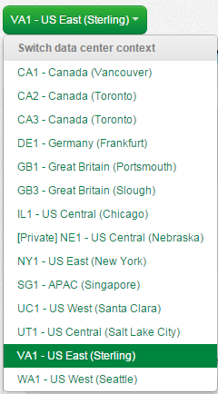
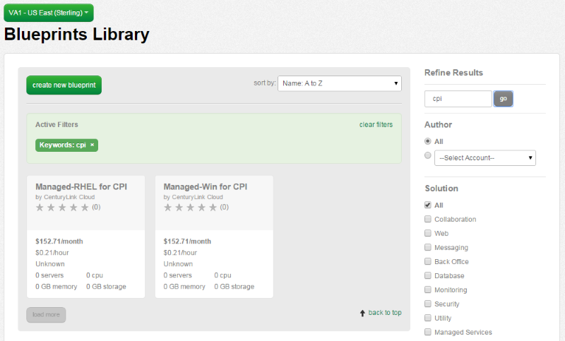
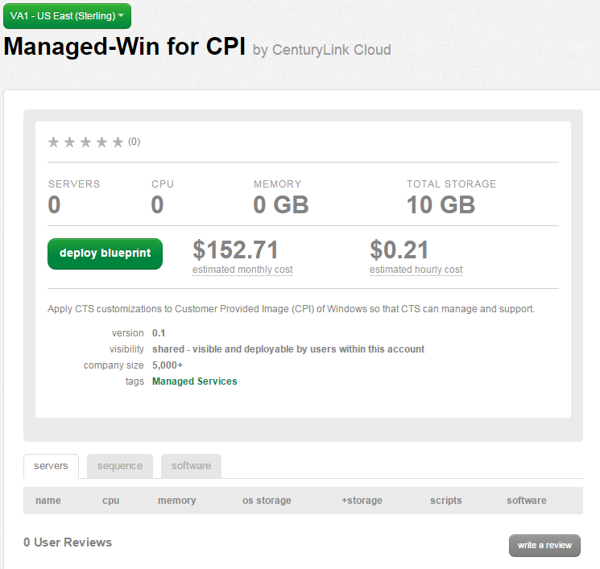
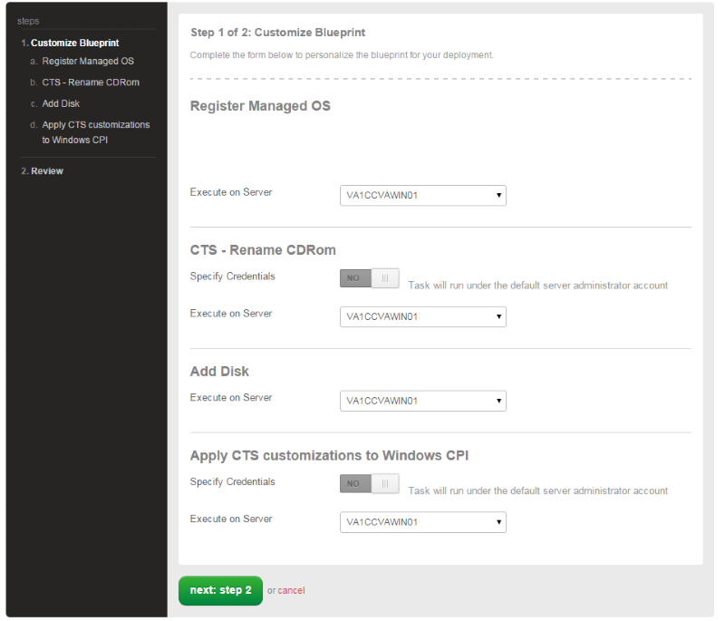
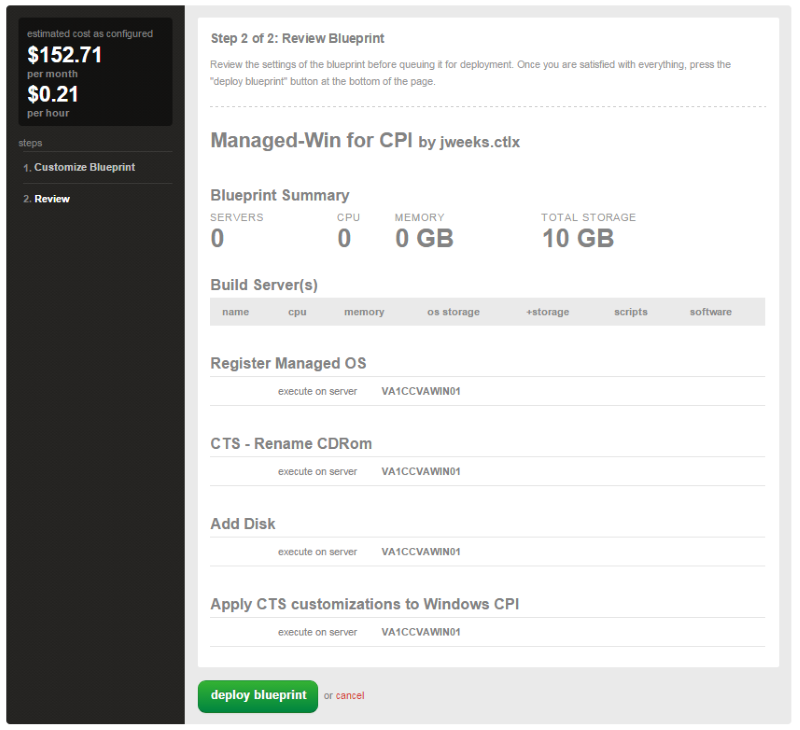
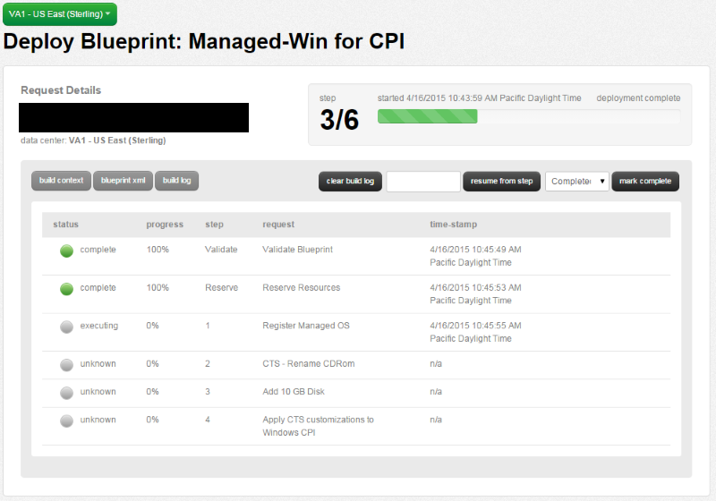
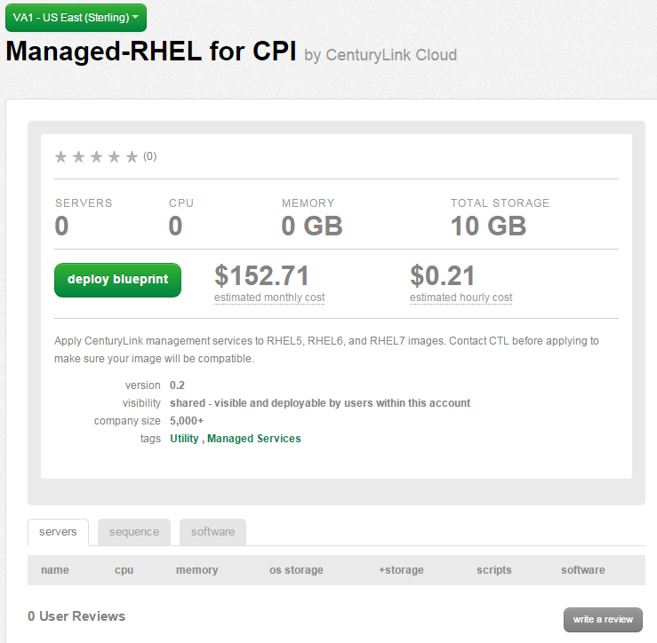
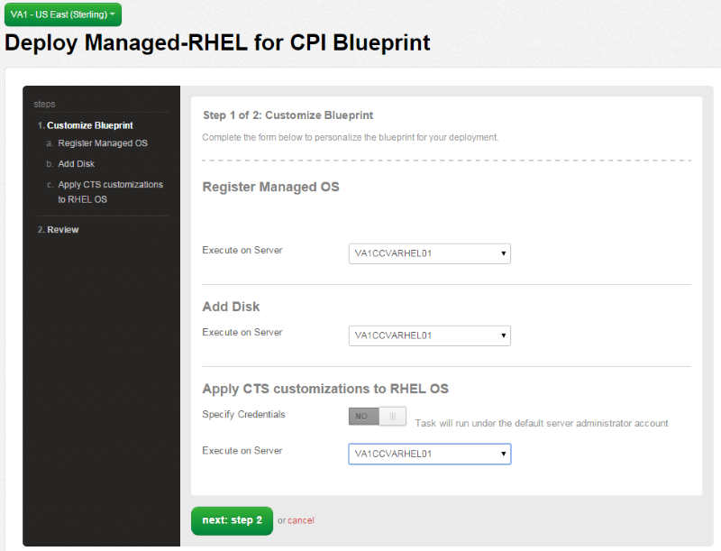
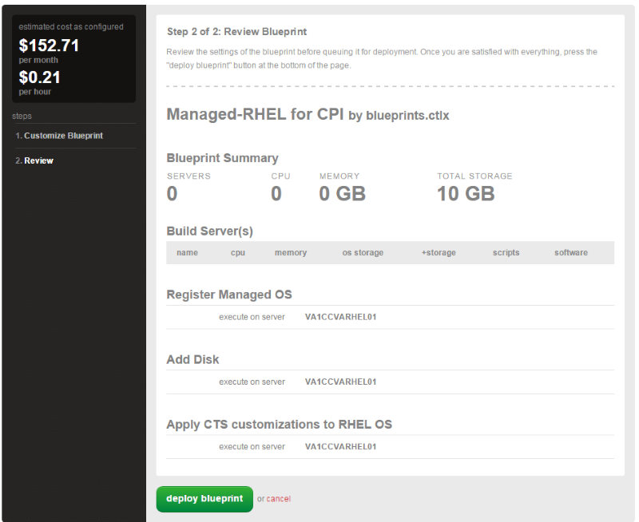
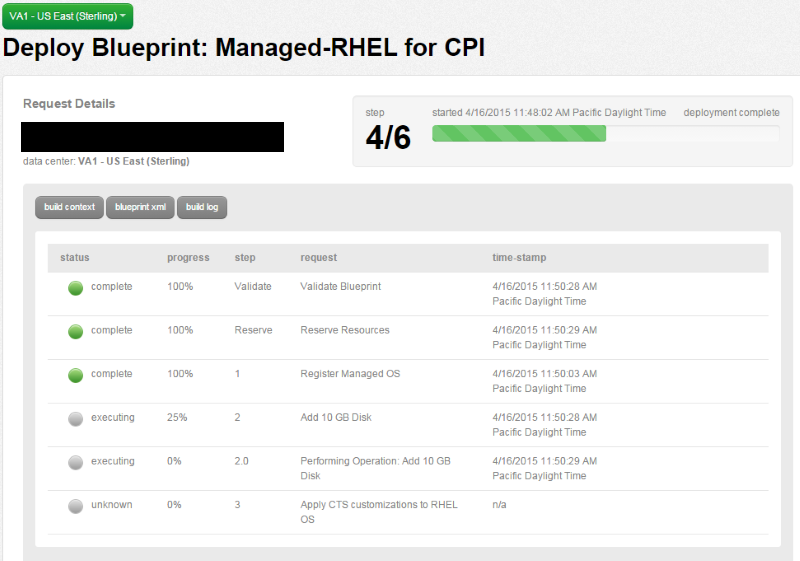

{{{
  "title": "Converting unmanaged virtual machines to managed",
  "date": "5-28-2015",
  "author": "Chris Little",
  "attachments": [],
  "contentIsHTML": false
}}}

### Overview
[CenturyLink Cloud Managed Operating System Services](//www.ctl.io/managed-services/operating-system/) provide maintenance and management of your Windows & Red Hat cloud servers, 24x7.  For a flat hourly fee, our engineers will perform common administrative functions on your behalf. Don’t worry about applying the latest patches, updating servers with the latest anti-virus tools, or keeping servers compliant with corporate access policies - we’ll do it for you!

Customers may wish to enable [Managed Operating System Services](//www.ctl.io/managed-services/operating-system/) on virtual machines already deployed in an **unmanaged** state to offload critical IT functions.  In order to facilitate this process the CenturyLink Cloud platform provides an automated [Blueprint](//www.ctl.io/blueprints/) to convert unmanaged virtual machines into a managed operating system.

### Important Information
* Conversion from **Managed** to **Unmanaged** Operating System Services is not currently a supported feature.
* It is advised that customers perform the conversion during a maintenance window due to potential impact on running services.
* It is recommended to create a snapshot of the VM before running the management process
* Normally, a single CPI Blueprint will take between ten and thirty minutes to complete. However, this can be influenced by jobs in the  queue
* By design, we do not put existing, unmanaged servers "Under Construction" while this Blueprint runs. So users may easily get the impression they have access to the servers after the Blueprint has completed, however the management process is actually still running in the background. Please do not access the VM until the user who initiated the Blueprint receives an email notification that the process for that VM has completed successfully.
* To preconfigure network access, prior to making an unmanaged VM Managed, please be sure at least one [new, managed server](../Managed Services/created-a-managed-server-now-what.md) has been created in the desired VLAN/Network.


### Compatibility Matrix
The table below provides a matrix of the supported locations and Operating Systems for conversion.

**Cloud Location**|**Operating System**
------------------|--------------------
GB3 - Great Britain (Slough)<p>VA1 - US East (Sterling)<p>UC1 - US West (Santa Clara)<p>US Central (Chicago) - IL1<p>Canada (Toronto - Mississauga) - CA3<p>APAC (Singapore) - SG1|Red Hat Enterprise Linux 5 - 64-bit<p>Red Hat Enterprise Linux 6 - 64-bit<p>Red Hat Enterprise Linux 7 - 64-bit<p>Windows 2008 R2 Standard - 64-bit<p>Windows 2008 R2 Enterprise - 64-bit<p>Windows 2008 R2 DataCenter Edition - 64-bit<p>Windows 2012 DataCenter Edition - 64-bit<p>Windows 2012 R2 DataCenter Edition - 64-bit<p>

### Converting Unmanaged Windows Virtual Machines to Managed
1. In the Control Portal, navigate to the Blueprint Library and select a Cloud location that supported managed operating system services.

    

2. Using the search feature, input **CPI** to filter the blueprints.

    

3. Choose the **Managed-Win for CPI** blueprint and select the deploy blueprint icon.

    

4. In Step 1 (customize blueprint) select the Windows Virtual Machine you wish to convert to a managed server.  Each of the 4 customization areas **require** the user to select the virtual machine you wish to convert and all of them should be set to the same instance.

    

5. In Step 2 validate your inputs and select the deploy blueprint button.

    

6. Validate the Job completes in the queue

    

### Converting Unmanaged Linux Virtual Machines to Managed
1. In the Control Portal, navigate to the Blueprint Library and select a Cloud location that supported managed operating system services.

    

2. Using the search feature, input **CPI** to filter the blueprints.

    

3. Choose the **Managed-RHEL for CPI** blueprint and select the deploy blueprint icon.

    

4. In Step 1 (customize blueprint) select the Linux Virtual Machine you wish to convert to a managed server.  Each of the 3 customization areas **require** the user to select the virtual machine you wish to convert and all of them should be set to the same instance.

    

5. In Step 2 validate your inputs and select the deploy blueprint button.

    

6. Validate the Job completes in the queue

    

### Validation
Customers will receive a notification email once the virtual machine is successfully converted to Managed.
```
Your request "Managed server build VA1CCVARHEL01" has successfully completed.
```

Validation can also be confirmed by looking for an asterisk (*) next to the name of the server in the Control Portal.


