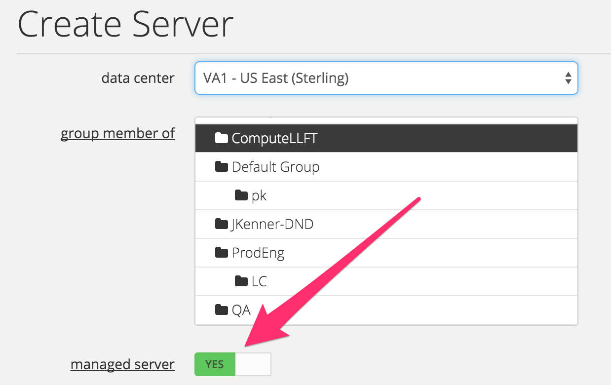

{{{
  "title": "I want a managed server. So what do I do now?",
  "date": "11-09-2021",
  "author": "Derek Jansen",
  "attachments": [],
  "contentIsHTML": false
}}}

### Overview

[Lumen Cloud Managed Operating System Services](//www.ctl.io/managed-services/operating-system/) provide maintenance and management of your Windows & Red Hat cloud servers, 24x7.  For a flat hourly fee, our engineers will perform support and administrative functions on your behalf.
The following is the simplest method for creating a managed server via the Control Panel.

Please also consider using the [Lumen Cloud v2.0 API](https://www.ctl.io/api-docs/v2/#servers-create-server) Create Server capability for performing the same action programmatically.

### Audience

Users employed by companies that have agreed to terms with [Lumen Sales](http://www.centurylink.com/) for the Lumen Cloud product.

### General Prerequisites
* An understanding of the standard server creation process.
* Some idea of the benefits included with [managed servers](../Managed Services/managed-operating-system-frequently-asked-questions.md)

### Technical Requirements
* The Managed Server build process requires HTTPS outbound connectivity (and DNS resolution) to the API endpoint webhook.managedos.ctl.io
* Account impersonation is not supported when building Managed Servers. Account impersonation simply refers to the end users ability to leverage our [Account Hierarchy](../Accounts & Users/account-hierarchy-user-network-and-firewall-policy-primer.md) feature to login to a parent account and operate services in sub-accounts. For the provisioning process of Managed Servers, users of the platform should leverage a named user in the specific [account alias](../Control Portal/finding-account-alias.md) into which the server is being deployed.

### Important Information

* Conversion from **Managed** to **Unmanaged** Operating System Services is not currently a supported feature.
* Normally, a single CPI Blueprint will take between ten and thirty minutes to complete. However, this can be influenced by jobs in the queue

### Compatibility Matrix
The table below provides a matrix of the supported locations and Operating Systems for conversion.

**Cloud Location**|**Operating System**
------------------|--------------------
GB3 - Great Britain (Slough)<br>VA1 - US East (Sterling)<br>UC1 - US West (Santa Clara)<br>US Central (Chicago) - IL1<br>Canada (Toronto - Mississauga) - CA3<br>APAC (Singapore) - SG1|Red Hat Enterprise Linux 5 - 64-bit<br>Red Hat Enterprise Linux 6 - 64-bit<br>Red Hat Enterprise Linux 7 - 64-bit<br>Windows Server 2008 R2 Standard - 64-bit<br>Windows Server 2008 R2 Enterprise - 64-bit<br>Windows Server 2008 R2 DataCenter Edition - 64-bit<br>Windows Server 2012 DataCenter Edition - 64-bit<br>Windows Server 2012 R2 DataCenter Edition - 64-bit<br>Windows Server 2016 Datacenter Edition - 64-bit

### Creating a Managed Server


* From the Control Portal menu, select “Create Server.”  
* After selecting a data center that supports Managed OS, select a server group.
* Click the “managed server” element to “Yes.”

  

The operating system drop-down menu will automatically show supported, Managed OS options. Choose your version, and then proceed with the remainder of the server creation process.

After creating a VM for management or after deploying the blueprint to convert an existing VM to a managed one, the VM will be 'Under Construction' while background processes are completed. You will not have access to the server during that time. Please allow up to 2 hours for the process to complete. If there are any issues beyond that time, contact us via email <a href="mailto:request@centurylink.com">request@centurylink.com</a> or by phone at the following numbers.

* In the US: 888.638.6771
* UK: +44.118.322.6100
* Singapore: +65.6305.8099.

Please do not email the Lumen Cloud NOC or raise the issue via chat - faster responses to inquiries will come from the email address and support numbers above. This is because Managed support is provided by a different team than Platform support.

### Validation
The user will receive a notification email once the virtual machine is successfully converted to Managed.
```
Your request "Managed server build VA1CCVARHEL01" has successfully completed.
```

Validation can also be confirmed by looking for an asterisk (*) next to the name of the server in the Control Portal.


