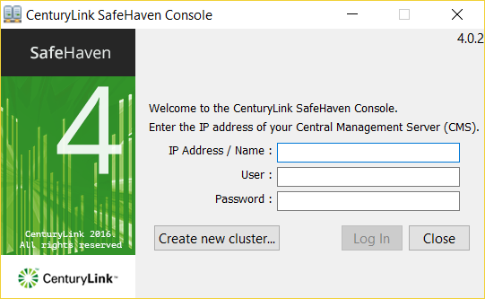
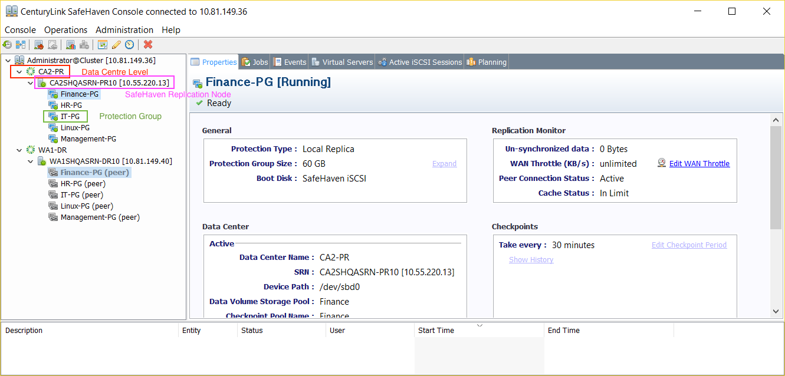
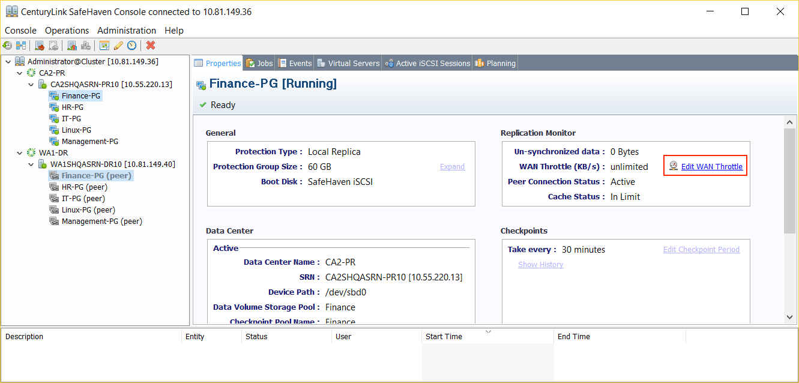
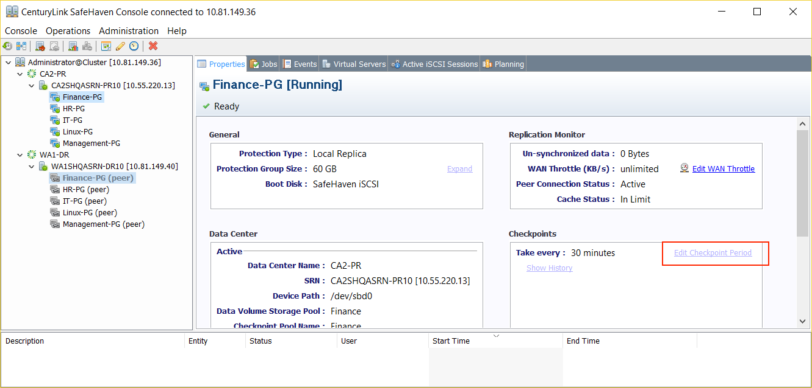
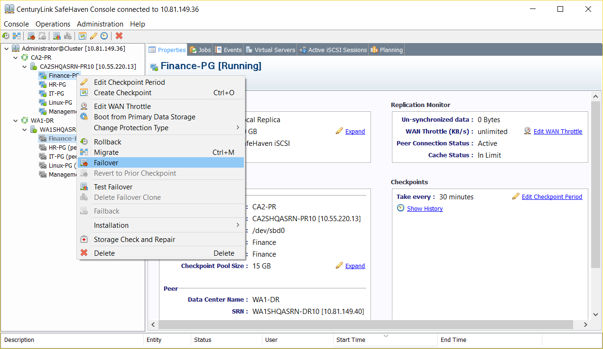

{{{
  "title": "Configure Disaster Recovery Management Service",
  "date": "25-07-2017",
  "author": "Shasha Zhu",
  "attachments": [],
  "contentIsHTML": false
}}}

After deploying SafeHaven and the monitoring system, CenturyLink shares with customer the credentials to log into SafeHaven console to view the solution. Customer can edit certain fields to accommodate the solution and their daily workloads. To ensure the integrity of the solution, it is highly recommended that customer ONLY edit the fields listed below. Customer can also ask for assistance or recommendation from CenturyLink before editing them. 

#### 1. Log into the SafeHaven Console 

#### 2. Overview from SafeHaven Console 

After logging into SafeHaven Console, you are able to see the recovery site, SafeHaven replication nodes, protection groups. For each of the protection group, you are able to see the protection group information including protected servers, WAN sync speed, recovery point information and storage usage etc. 

#### 3. Edit Protection Group WAN sync rate

The default rate limit is 2048 KB/ Sec. Depends on the network bandwidth and server workflow, you can adjust the WAN rate from 1 KB/Sec to unlimited.

#### 4. Edit Checkpoint Interval 

Checkpoint is a recovery point used to perform test failover and failover of a protection group. Checkpoint interval is a time span the checkpoint is taken. Checkpoint interval can be as low as 30 seconds. You can change the checkpoint interval to align with your DR strategy.  You can also check all the checkpoints via SafeHaven console.

#### 5. Add Email to Receive Periodic DR Report 

On the top banner of SafeHaven console, click *Administration*, then choose *email list*, the following window will prompt out. Add the new emial address to receive periodic DR reports.

#### 6. Change the Built-in Disaster Recovery Plan

SafeHaven built-in recovery plan defines the recovery server and production servers boot up and power off sequences. You are able to edit the delay time as well. 

#### 7. Failover A Protection Group

When disaster happens, right click on the protection group and choose Failover option. Normally we recommend Customer have a conversation with CenturyLink first before invoking a failover operation. 

