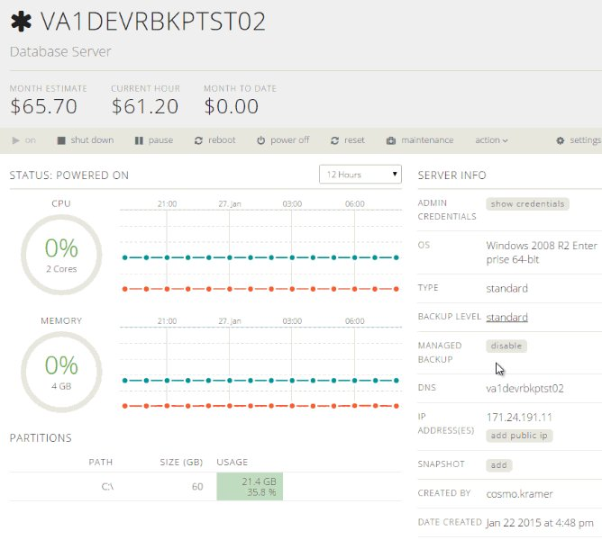

{{{
  "title": "Enabling and Disabling Managed Backup",
  "date": "03-21-2018",
  "author": "",
  "attachments": [],
  "contentIsHTML": false
}}}

**Managed Backup went End of Sale 6/25/19, all existing subscriptions will still continue to function**

**You will not be able to add Managed Backup to new servers, but it can be removed from existing servers**

### Description
The Managed Backup service can be configured on new or existing managed servers. For more information on what Managed Backup provides, review the [Managed Backup FAQ](../Managed Services/managed-backup-frequently-asked-questions.md). The steps below walk through how to configure Managed Backup in both scenarios.

### Steps

##### New Server
1. Follow the [steps for creating a new server](../Servers/creating-a-new-enterprise-cloud-server.md).

2. From the Create Server page click the Managed Server toggle to turn it on and then the option for Managed Backup will appear. Click this toggle as well to enable Managed Backup on the new server. An updated [list of locations that support managed services can be found in our knowledge base.](../General/CenturyLinkCloud/centuryLink-cloud-feature-availability-matrix.md)

    

3. The list of operating systems will now be limited to only ones that are supported by both Managed Server and Managed Backup. Select the one you'd like to use for this server, [complete the remaining requested fields](../Servers/creating-a-new-enterprise-cloud-server.md) and click the "create server" button.

4. Your server will now be provisioned with Managed Backup (and Managed OS) enabled.

##### Existing Server
1. Navigate to the Server Details page for the server you'd like to enable or disable Managed Backup on. Make sure the server is in one of the data centers that supports both Managed Services and Managed Backup. An updated [list of locations that support managed services can be found in our knowledge base.](../General/CenturyLinkCloud/centuryLink-cloud-feature-availability-matrix.md). **IMPORTANT: Managed OS services are required on the existing server to enable managed backup.**

2. On the right side under the Server Info section, find the button for enabling or disabling Managed Backup.

    

3. Selecting this button will slide down the Managed Backup configuration area where you may toggle Managed Backup on or off

    

4. After setting the toggle, click "apply" and a Blueprint will run to configure the server as indicated.

### Troubleshooting

##### Error on New Server Creation - VA1
As of Sept 10th, 2016, any customer that tries to create a new VM with Managed Backup enabled in the VA1 datacenter, on a network that was created after Sept 10th, 2016, will receive an error that looks like the below.

  

Upon receiving this error, you will need to wait while we manually enable managed backup for the network you have chosen to create the new server. Updates on our progress will come via our ticketing system and this is a one time change that is needed for any new network that is created after Sept 10, 2016. Once this work is complete, you can go ahead and create servers on this network with managed backup enabled. Alternatively, you can go ahead and create a server on this network without managed backup. Then, after we are complete with this work, you can go ahead and add managed backup to this server.

##### Managed Backup isn't enabled in VA1, but should be.
Even though managed backup is a service that is available in VA1, under certain conditions our user interface will not allow you to create new servers with managed backup. As of Sept 10th, 2016, on any CenturyLink Cloud account that has no networks in VA1, the 'add managed backup' button will be disabled on the create server webpage. To resolve this, you will need to first create a network manually in VA1. Once you do that, you will need to follow the process above listed in section 'Error on New Server Creation - VA1'.
