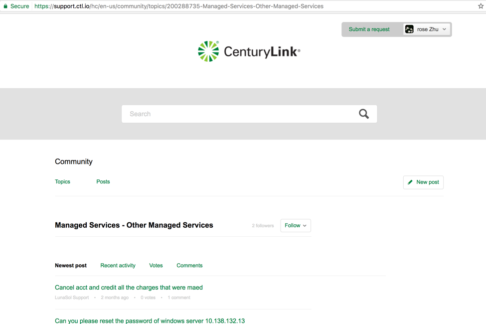

{{{
  "title": "Getting Started with Disaster Recovery Management Service",
  "date": "07-25-2017",
  "author": "Shasha Zhu",
  "attachments": [],
 "contentIsHTML": true
}}}

 For customers lacking Disaster Recovery (DR) expertise or short of staff to maintain DR solution, Disaster Recovery Management Service (DRMS) takes the responsibilities and delivers end-to-end services. Unlike other DRaaS solution, CTL DRMS carries out regular test, audit and ATOD failover services to ensure the reliability, accuracy and efficiency.  DRMS offers services including:
	- White glove implementation
	- 24 X 7 monitoring and maintenance
	- Regular test
	- Regular audit
	- At-time-of-disaster failover services
	- Failback services
	- Develop and maintain the runbook
	- Application recovery services

 
 
 Disaster Recovery Management Service is deployed and maintained by CenturyLink. To start with DRMS, please submit a service request via CenturyLink support channel. 

 
 
 1.	Go to CenturyLink support website and click the Submit a request link 

 	
 
	 

 
 
2. Choose *Normal* from priority drop-down menu, put *Request Disaster Recovery Management Service* as the subject, put the description and # of servers you want to protect and submit the request. 

 
 
	 

 
 
3.  Upon receiving the request, CenturyLink will transfer your ticket to a cloud architect to work with you on designing and implement the DR solution for your IT environment. 
