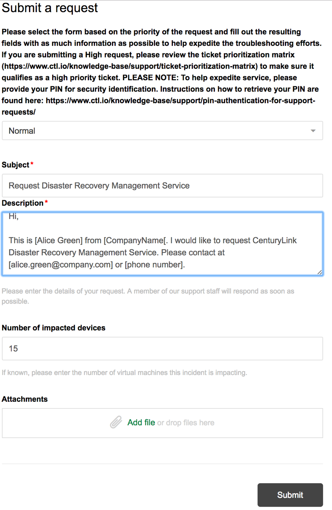

{{{
  "title": "Getting Started with Disaster Recovery Management Service",
  "date": "07-25-2017",
  "author": "Shasha Zhu",
  "attachments": [],
 "contentIsHTML": false
}}}

### Overview
For customers lacking Disaster Recovery (DR) expertise or that are short of staff to maintain a DR solution, Disaster Recovery Management Service (DRMS) takes the responsibilities and delivers end-to-end services. Unlike other DRaaS solutions, CenturyLink DRMS carries out regular audits, tests, and at-time-of-disaster (ATOD) failover services to ensure the reliability, accuracy, and efficiency of your DR solution. DRMS offers services including:

* White-glove on boarding
* 24 X 7 monitoring and maintenance
* Semi-annual testing
* Quarterly audits
* ATOD failover services
* Failback services
* Runbook automation and maintenance
* Application recovery services

### Requesting the Service
Disaster Recovery Management Service is deployed and maintained by CenturyLink. To start with DRMS, please submit a service request via CenturyLink support channel.

1. Go to the CenturyLink support website. At the top of the screen, click **Submit a request**.
   

2. From the drop-down menu, select **Normal**.
   * Include **Request Disaster Recovery Management Service** as the subject.
   * For the **Description**, enter the details of your request.
   * Enter the number of servers you want to protect.
   * Upload attachments, if any. (This is optional.)
   * Click **Submit**.

   

 3. Upon receiving the request, CenturyLink transfers your ticket to a cloud architect to work with you on designing and implement the DR solution for your IT environment.
