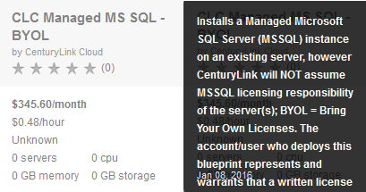
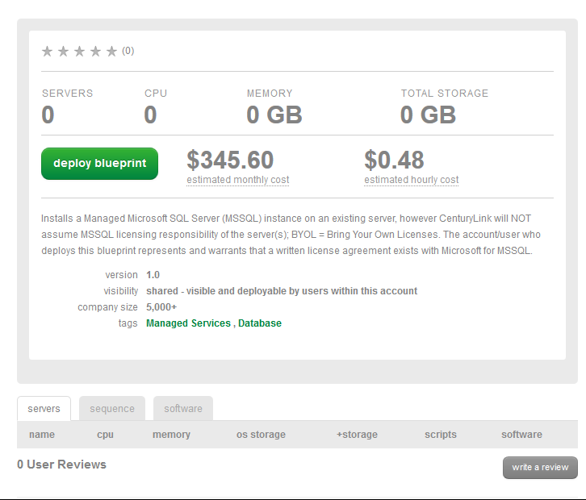
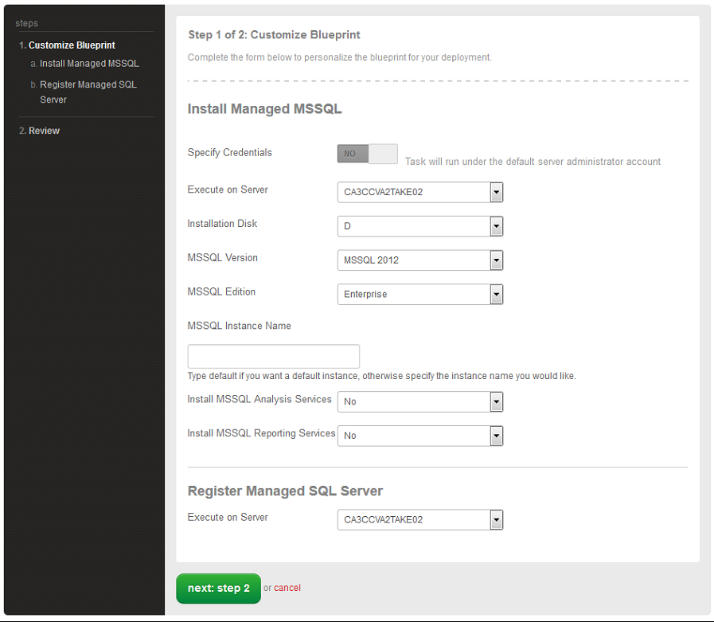
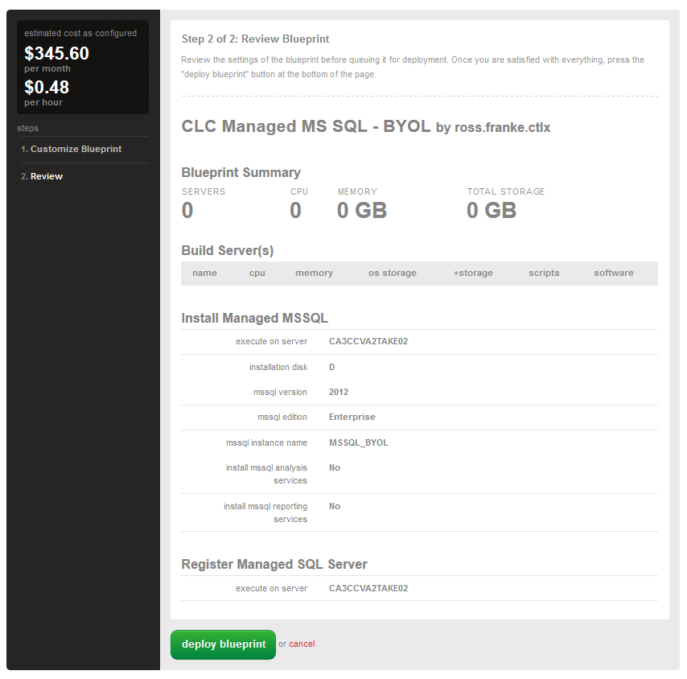

{{{
  "title": "Getting Started with Managed Microsoft SQL Server",
  "date": "05-14-2018",
  "author": "Chris Little",
  "attachments": [],
  "contentIsHTML": false
}}}
### Table of Contents
* [Overview](#overview)
* [Socket to vCPU Allocation](#socket-to-vcpu-allocation)
* [Prerequisites](#prerequisites)
* [Supported Managed Operating Systems](#supported-managed-operating-systems)
* [Supported Managed Microsoft SQL Server Editions](#supported-managed-microsoft-sql-server-editions)
* [Important Information](#important-information)
* [Managed SQL with CenturyLink provided license](#managed-sql-with-centurylink-provided-license)
* [Managed SQL with BYOL](#managed-sql-with-byol)
* [Frequently Asked Questions](#frequently-asked-questions)

### Overview
The Microsoft SQL Server (MS-SQL) database is a comprehensive and integrated data management and analysis software application that enables the reliable management of mission-critical information.  This Managed Service is available for both CenturyLink provided Microsoft provided SQL server licenses and customer Bring Your Own License (BYOL).

### Socket to vCPU Allocation
It is recommended customers review our delivery model for [Sockets to vCPU](../Servers/platform-socket-to-vcpu-allocation.md) prior to deploying Microsoft SQL Server to be fully aware of the platform default operations when allocating vCPUs for use with the database service.

### Prerequisites
* A CenturyLink Cloud Account
* [Managed Operating System Services](//www.ctl.io/managed-services/operating-system) on the Virtual Machine

### Supported Managed Operating Systems
* Managed Microsoft Windows Server 2008 R2
* Managed Microsoft Windows Server 2012 or 2012 R2

### Supported Managed Microsoft SQL Server Editions
* Microsoft SQL Server 2008 Standard Edition
* Microsoft SQL Server 2008 Enterprise Edition
* Microsoft SQL Server 2008 R2 Standard Edition
* Microsoft SQL Server 2008 R2 Enterprise Edition
* Microsoft SQL Server 2012 Standard Edition
* Microsoft SQL Server 2012 Enterprise Edition
* Microsoft SQL Server 2014 Standard Edition
* Microsoft SQL Server 2014 Enterprise Edition
* Microsoft SQL Server 2016 Standard Edition
* Microsoft SQL Server 2016 Enterprise Edition

### Important Information
* The costs shown in the Blueprint UI do not include licenses fees, only managed services fees
* Bring Your Own License (BYOL) is available via Blueprint

### Managed SQL with CenturyLink provided license

1. Log on to the [Control Portal](https://control.ctl.io/). Using the left side navigation bar, click on **Orchestration** > **Blueprints Library**. Search for **MS SQL** in the Blueprint library. Then, click on the **CLC Managed MS SQL** Blueprint.

    

2. Click on the deploy blueprint button.

    

3. Select the appropriate virtual machine, editions, location to install, features and licensing you wish to implement.

    

4. Review the blueprint parameters and select deploy blueprint.  

    

5. An email notification will be sent to the initiator of the blueprint for both queuing and completion.

    ```
    Your request "CLC Managed MS SQL" has been queued.
    ```

    ```
    Your request "CLC Managed MS SQL" has successfully completed.
    ```

### Managed SQL with BYOL

1. Search for **MS SQL** in the Blueprint library. Then, click on the **CLC Managed MS SQL BYOL** Blueprint (shown mouse over description in the diagram below).

    

2. Click on the deploy blueprint button.

    

3. Select the appropriate virtual machine, editions, location to install, features and licensing you wish to implement.

    

4. Review the blueprint parameters and select deploy blueprint.  

    

5. An email notification will be sent to the initiator of the blueprint for both queuing and completion.

    ```
    Your request "CLC Managed MS SQL BYOL" has been queued.
    ```

    ```
    Your request "CLC Managed MS SQL BYOL" has successfully completed.
    ```

### Frequently Asked Questions

**Q: How is the CenturyLink Cloud for Managed Microsoft SQL priced?**

A: Please see [Pricing Catalog](//www.ctl.io/pricing/) for more information.

**Q: How do I request MSSQL Mirroring or MSSQL AlwaysOn Configuration?**

A: MSSQL Mirroring and MSSQL AlwaysOn configurations are [available as a paid service task request](//www.ctl.io/service-tasks/#mssql-alwayson-configuration).  After provisioning your MSSQL instances, you can request configuration of either service by simply [opening a service task request](../Service Tasks/requesting-service-tasks-on-centurylink-cloud.md).    

**Q: Can the customer have multiple MS SQL instances installed on the same server?**

A: Not at this time.

**Q: Can the customer provide their own MS SQL Licenses?**

A: Please see [Managed SQL with BYOL](#managed-sql-with-byol) for details.

**Q: How are licensing costs incurred?**

A: SQL licenses costs are calculated separate from the managed SQL hourly costs based on the edition and number of CPUs on the virtual machine. Please see [Pricing Catalog](//www.ctl.io/pricing) for more information.

**Q: Can un-managed Microsoft SQL Instances be converted to Managed (or vice versa)?**

A: This capability is not available at this time.
