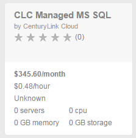
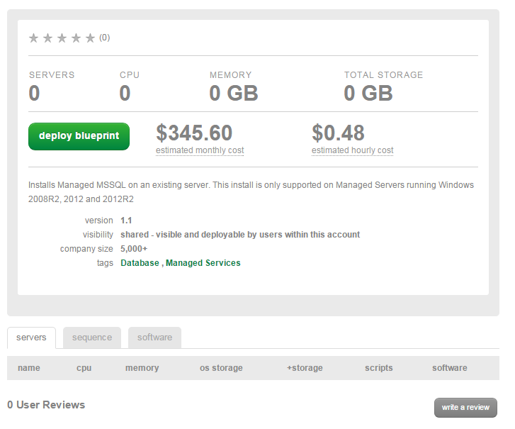
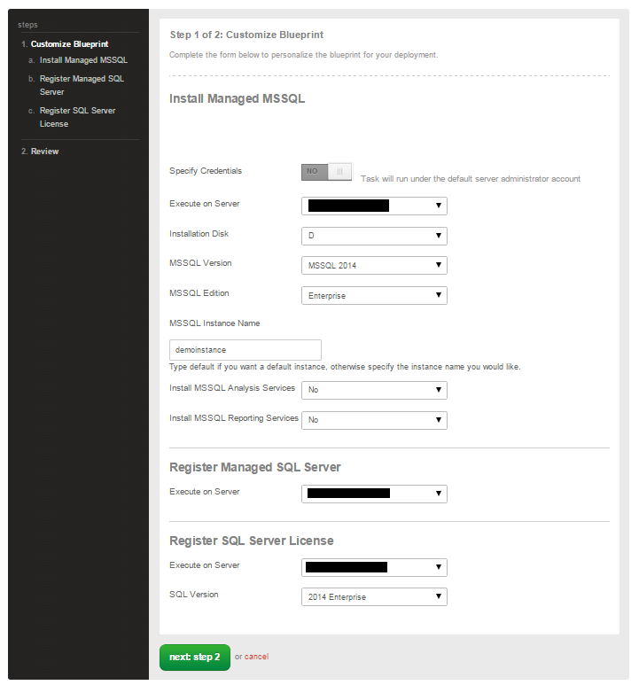
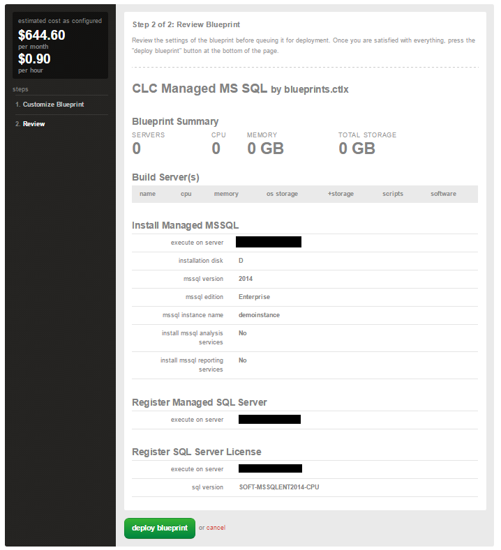

{{{
  "title": "Getting Started with Managed Microsoft SQL Server",
  "date": "4-21-2015",
  "author": "Jared Ruckle",
  "attachments": [],
  "contentIsHTML": false
}}}

### Overview
The Microsoft SQL Server (MS-SQL) database is a comprehensive and integrated data management and analysis software application that enables the reliable management of mission-critical information.

### Prerequisites
* A CenturyLink Cloud Account
* [Managed Operating System Services](//www.ctl.io/managed-services/operating-system) on the Virtual Machine

### Supported Managed Operating Systems
* Managed Microsoft Windows Server 2008 R2
* Managed Microsoft Windows Server 2012 or 2012 R2

### Supported Managed Microsoft SQL Server Editions
* Microsoft SQL Server 2008 Standard Edition
* Microsoft SQL Server 2008 Enterprise Edition
* Microsoft SQL Server 2008 R2 Standard Edition
* Microsoft SQL Server 2008 R2 Enterprise Edition
* Microsoft SQL Server 2012 Standard Edition
* Microsoft SQL Server 2012 Enterprise Edition
* Microsoft SQL Server 2014 Standard Edition
* Microsoft SQL Server 2014 Enterprise Edition

### Important Information
* The costs shown in the Blueprint UI do not include licenses fees, only managed services fees

### Installation Process

1. Search for **MS SQL** in the Blueprint library. Then, click on the **CLC Managed MS SQL** Blueprint.

  

2. Click on the deploy blueprint button.

  

3. Select the appropriate virtual machine, editions, location to install, features and licensing you wish to implement.

  

4. Review the blueprint parameters and select deploy blueprint.  

  

5. An email notification will be sent to the initiator of the blueprint for both queuing and completion.

  ```
  Your request "CLC Managed MS SQL" has been queued.
  ```

  ```
  Your request "CLC Managed MS SQL" has successfully completed.
  ```

### Frequently Asked Questions

**Q: How is the CenturyLink Cloud for Managed Microsoft SQL priced?**

A: CenturyLink Cloud Managed MS SQL is priced by the instance, billed hourly.

**Q: How do I request MSSQL Mirroring or MSSQL AlwaysOn Configuration?**

A: MSSQL Mirroring and MSSQL AlwaysOn configurations are available as a service task request to the CenturyLink Cloud helpdesk.  After provisioning your MSSQL instances, you can request configuration of either service by simply opening a ticket with noc@ctl.io.  Configuration of the services are billed at a rate of $195/hr.  

**Q: Can the customer have multiple MS SQL instances installed on the same server?**

A: Not at this time.

**Q: Can the customer provide their own MS SQL Licenses?**

A: Not at this time.

**Q: How are licensing costs incurred?**

A: SQL licenses costs are calculated separate from the managed SQL hourly costs based on the edition and number of CPUs on the virtual machine.

**Q: Can un-managed Microsoft SQL Instances be converted to Managed (or vice versa)?**

A: This capability is not available at this time.
