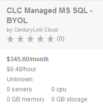
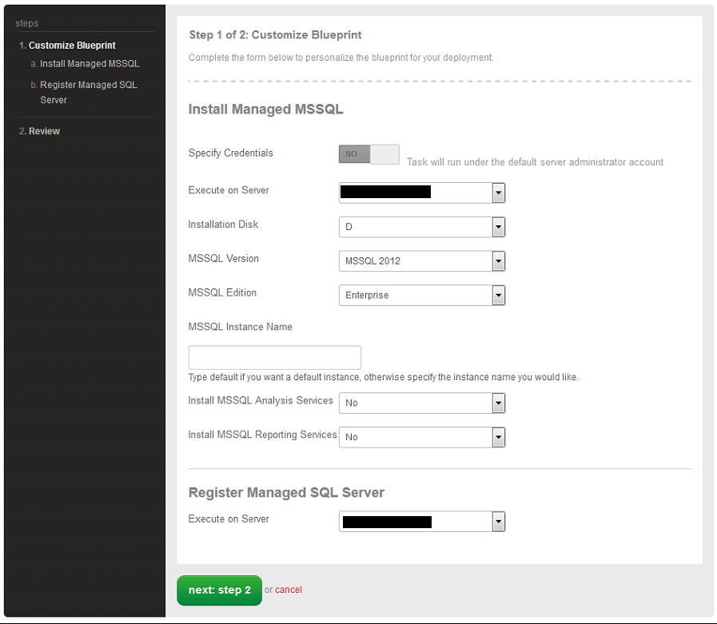
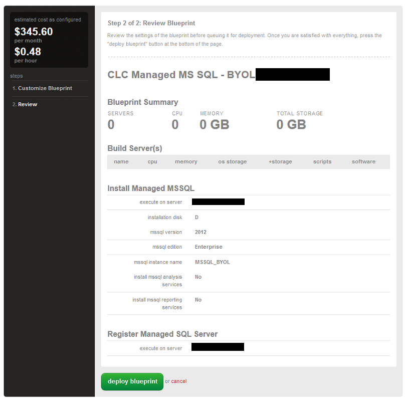

{{{
  "title": "Getting Started with Managed Microsoft SQL Server",
  "date": "02-10-2019",
  "author": "Christian Presley",
  "attachments": [],
  "contentIsHTML": false
}}}
### Table of Contents
* [Overview](#overview)
* [Socket to vCPU Allocation](#socket-to-vcpu-allocation)
* [Prerequisites](#prerequisites)
* [Supported Managed Operating Systems](#supported-managed-operating-systems)
* [Supported Managed Microsoft SQL Server Editions](#supported-managed-microsoft-sql-server-editions)
* [Important Information](#important-information)
* [Managed SQL with Lumen provided license](#managed-sql-with-lumen-provided-license)
* [Managed SQL with BYOL](#managed-sql-with-byol)
* [Frequently Asked Questions](#frequently-asked-questions)

### Overview
Microsoft SQL Server (MSSQL) is a full relational database management suite. The different editions provide specific features, which include but is not limited to: Database Services, Reporting Services, Data Analytics, and Integration Services.

Lumen provides this Managed Service using either your own license, or a Lumen provided license.

### Socket to vCPU Allocation
It is recommended customers review our delivery model for [Sockets to vCPU](../Servers/platform-socket-to-vcpu-allocation.md) prior to deploying Microsoft SQL Server to be fully aware of the platform default operations when allocating vCPUs for use with the database service.

### Prerequisites
* A Lumen Cloud Account
* [Managed Operating System Services](//www.ctl.io/managed-services/operating-system) on the Virtual Machine

### Supported Managed Microsoft SQL Server Editions for New Servers
* Microsoft SQL Server 2016 Standard
* Microsoft SQL Server 2016 Enterprise
* Microsoft SQL Server 2016 Web

### Supported Managed Microsoft SQL Server Editions for Existing Servers
* Microsoft SQL Server 2008 R2 Standard
* Microsoft SQL Server 2008 R2 Enterprise
* Microsoft SQL Server 2008 R2 Web
* Microsoft SQL Server 2012 Standard
* Microsoft SQL Server 2012 Enterprise
* Microsoft SQL Server 2012 Web
* Microsoft SQL Server 2014 Standard
* Microsoft SQL Server 2014 Enterprise
* Microsoft SQL Server 2014 Web

### Important Information
The cost estimate(s) do not include vendor licensing and is intended to provide an estimate of Managed Service fees.

### Managed SQL with Lumen provided license

1. Log on to the [Control Portal](https://control.ctl.io/). Using the left side navigation bar, click on **Orchestration** > **Blueprints Library**. Search for **MS SQL** in the Blueprint library. Then, click on the **CLC Managed MS SQL** Blueprint.

    

2. Click on the deploy blueprint button.

    

3. Select the appropriate virtual machine, editions, location to install, features and licensing you wish to implement.

    

4. Review the blueprint parameters and select deploy blueprint.  

    

5. An email notification will be sent to the initiator of the blueprint for both queuing and completion.

    ```
    Your request "CLC Managed MS SQL" has been queued.
    ```

    ```
    Your request "CLC Managed MS SQL" has successfully completed.
    ```

### Managed SQL with Bring Your Own License (BYOL)

1. Search for **MS SQL** in the Blueprint library. Then, click on the **CLC Managed MS SQL BYOL** Blueprint (shown mouse over description in the diagram below).

    

2. Click on the deploy blueprint button.

    

3. Select the appropriate virtual machine, editions, location to install, features and licensing you wish to implement.

    

4. Review the blueprint parameters and select deploy blueprint.  

    

5. An email notification will be sent to the initiator of the blueprint for both queuing and completion.

    ```
    Your request "CLC Managed MS SQL BYOL" has been queued.
    ```

    ```
    Your request "CLC Managed MS SQL BYOL" has successfully completed.
    ```

### Frequently Asked Questions

**Q: How is the Lumen Cloud for Managed Microsoft SQL priced?**

A: Please see [Pricing Catalog](//www.ctl.io/pricing/) for more information.

**Q: How do I request MSSQL Mirroring or MSSQL AlwaysOn Configuration?**

A: Database Mirroring or SQL AlwaysOn configuration are available as Service Tasks. For your existing Managed MSSQL instance(s), you can request configuration of Database Mirroring or SQL AlwaysOn by opening a Service Task ticket. You can find more information on what Service Tasks are available and how to request them in our [Requesting Service Tasks on Lumen Cloud](//www.ctl.io/knowledge-base/service-tasks/requesting-service-tasks-on-lumen-cloud) article.

Service Tasks are billed at a rate of $195 per hour.

You can find more information and pricing for these Service Tasks: 
[AlwaysOn](//www.ctl.io/service-tasks/#mssql-alwayson-configuration)
[Mirroring](//www.ctl.io/service-tasks/#mssql-database-mirroring)

**Q: Can the customer have multiple MS SQL instances installed on the same server?**

A: Not at this time.

**Q: Can the customer provide their own MS SQL Licenses?**

A: Please see [Managed SQL with BYOL](#managed-sql-with-byol) for details.

**Q: How are licensing costs incurred?**

A: SQL licenses costs are calculated discretely from the Managed MSSQL hourly costs, and is based on the MSSQL edition and number of allocated vCPUs on the virtual machine. Please see our [Pricing Catalog](//www.ctl.io/pricing/#/va1) for more information.

**Q: Can un-managed Microsoft SQL Instances be converted to Managed (or vice versa)?**

A: Existing Virtual Machines can be converted to Managed Virtual Machines, and then MSSQL can be registered, or installed and registered, as a Managed Service. We do not currently support converting a Managed Server or Service to Unmanaged due to licensing restrictions.
