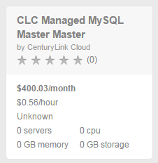
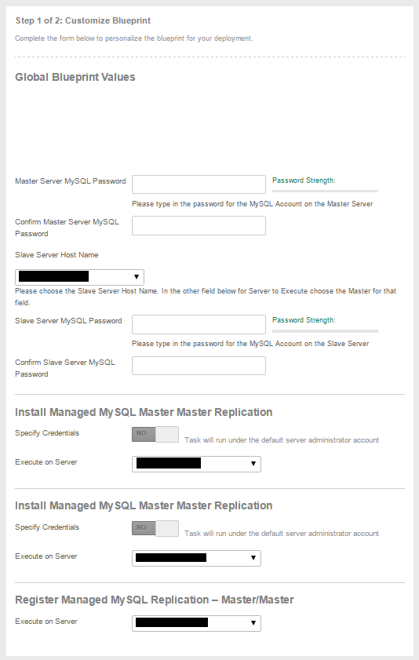
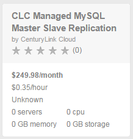
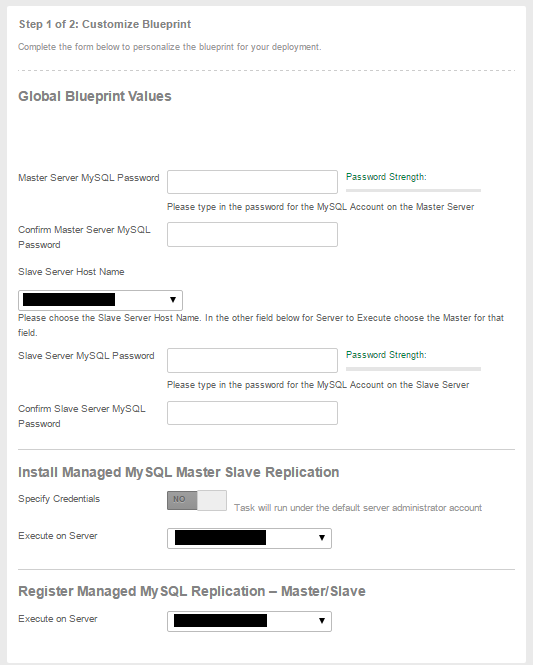

{{{
  "title": "Getting Started with Managed MySQL Replication",
  "date": "12-9-2015",
  "author": "Chris Little",
  "attachments": [],
  "contentIsHTML": false
}}}

### Overview
We offer two options of MySQL replication:
* [Master-Slave Replication](//dev.mysql.com/doc/refman/5.7/en/replication.html): Enables data from one MySQL database server (the master) to be copied (typically asyncronous) to one or more MySQL database servers (the slaves).  
* [Master-Master Replication](//dev.mysql.com/doc/refman/5.1/en/mysql-cluster-replication-multi-master.html): Enables data from **any** Master MySQL database server to be copied (typically syncronous) to other master nodes.  **CenturyLink Cloud Managed MySQL Services only supports (2) nodes currently.**

This guide provides (2) unique options and customers should evaluate their needs to decide which fits business requirements.

### Prerequisites

* [Data Center must support Managed Services](../CenturyLinkCloud/centuryLink-cloud-feature-availability-matrix.md)
* [Deploy (2) Managed RHEL 6/7 Servers](../Managed Services/created-a-managed-server-now-what.md) or [Convert existing RHEL 6/7 Servers to Managed](../Managed Services/converting-unmanaged-virtual-machines-to-managed.md)
* [Deploy Managed MySQL Services to the Servers](../Managed Services/getting-started-with-managed-mysql.md)

### Creating a Managed MySQL Master-Master Replication Service using Blueprints

1. Log on to the [Control Portal](https://control.ctl.io/). Using the left side navigation bar, click on **Orchestration** > **Blueprints Library**. Search for the **CLC Managed MySQL Master Master Replication** Blueprint in the Blueprint library. Select the Blueprint, followed by the deploy blueprint button.

      

2. Fill out the appropriate details for the Blueprint.

    * Master Server MySQL Password: The password for the MySQL account on **Node 1 of the Master-Master configuration**. Note: This should be the password used when MySQL was configured and can be found at /root/.mysqlclc
    * Slave Server Host Name: In a Master-Master configuration this is the **name of the secondary node** you wish to be part of the Master-Master replication configuration.
    * Slave Server MySQL Password:  The password for the MySQL account on **Node 2 of the Master-Master configuration**. Note: This should be the password used when MySQL was configured and can be found at /root/.mysqlclc</b></li>
    * Install Managed MySQL Master Master Replication: Select **Node 1 of the Master-Master** configuration.
    * Install Managed MySQL Master Master Replication: Select **Node 1 of the Master-Master** configuration.
    * Register Managed MySQL Replication: Select **Node 1 of the Master-Master** configuration.

      

3. Verify your entries and Deploy the Blueprint.

4. You will receive an email that your Blueprint has been installed when the Blueprint is complete.

### Creating a Managed MySQL Master-Slave Replication Service using Blueprints

1. Search for the **CLC Managed MySQL Master Slave Replication** Blueprint in the Blueprint library. Select the Blueprint, followed by the deploy blueprint button.

      

2. Fill out the appropriate details for the Blueprint

    * Master Server MySQL Password: The password for the MySQL account on the **Master** Server for the configuration. Note: This should be the password used when MySQL was configured and can be found at /root/.mysqlclc
    * Slave Server Host Name: In a Master-Slave configuration this is the **name of the slave node** you wish to be part of the Master-Slave Replication configuration.
    * Slave Server MySQL Password:  The password for the MySQL account on the **Slave** server for the configuration. Note: This should be the password used when MySQL was configured and can be found at /root/.mysqlclc</b></li>
    * Install Managed MySQL Master Master Replication: Select the **Master** Server.
    * Register Managed MySQL Replication: Select the **Master** Server.

      

3. Verify your entries and Deploy the Blueprint.

4. You will receive an email that your Blueprint has been installed when the Blueprint is complete.

### Frequently Asked Questions

**Q: How is the CenturyLink Cloud for Managed Oracle MySQL Replication priced?**

A: CenturyLink Cloud Managed Oracle MySQL Replication is priced per install, billed hourly depending on the version of Replication you are using. The hourly rate encompasses all servers in the replicated environment, but is in addition to the hourly rate charged for MySQL licensing and management. Refer to our [Pricing Catalog](//www.ctl.io/pricing) for more information.

**Q: What Versions of Oracle MySQL Replication are supported?**

A: CenturyLink Cloud Supports MySQL v5.5 and MySQL 5.6.

**Q: What operating systems are supported for Managed Oracle MySQL Replication?**

A: Managed RHEL 6 or 7

**Q: Can *un-managed* MySQL Replication Services be converted to *Managed* (or vice versa)?**

A: This capability is not available at this time.
