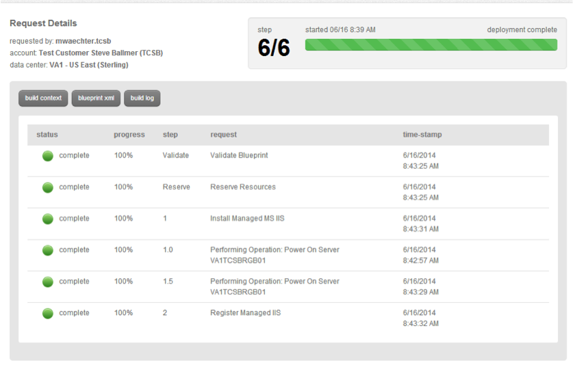

{{{
  "title": "Getting Started with Managed MySQL",
  "date": "7-5-2017",
  "author": "CenturyLink",
  "attachments": [],
  "contentIsHTML": false
}}}

MySQL is an open source Relational Database Management System (RDBMS) that uses Structured Query Language (SQL). This article will cover creating a managed MySQL environment in CenturyLink Cloud.

### Prerequisites
- The server must have internet access.
- The server must already have a Managed Red Hat OS.

### Steps
1. Log onto the [Control Portal](https://control.ctl.io). Using the left side navigation bar, click on **Orchestration** > **Blueprints Library**. Search for the "MySQL" in the Blueprint library, then click on the “CLC Managed Oracle MySQL Enterprise” Blueprint.

2. Click on the **deploy blueprint** button, then fill out the appropriate details for the CLC Managed Oracle MySQL Enterprise Blueprint. **NOTE: Ensure the Install and Registration is executed on the same server.**

3. Verify the information is correct.

4. Once verified, click on the **deploy blueprint** button. You will be presented with the deployment details along with an email stating the Blueprint has been queued and another one when it is complete. **NOTE: The server now has the Managed Oracle MySQL Enterprise service.**

### Frequently Asked Questions

**Q: How is the CenturyLink Cloud for Managed Oracle MySQL Enterprise product priced?**

A: Managed Oracle MySQL Enterprise is priced according to our [pricing catalog](//www.ctl.io/pricing) and includes MySQL Enterprise software as part of the ongoing fees for the service.

**Q: What versions of Oracle MySQL Enterprise are supported?**

A: CenturyLink Cloud Supports MySQL v5.5, MySQL 5.6 and MySQL 5.7.

**Q: What operating systems are supported for Managed Oracle MySQL?**

A: **Managed** Red Hat Enterprise Linux

**Q: Can *un-managed* MySQL Services be converted to *Managed* (or vice versa)?**

A: This capability is not available at this time.
