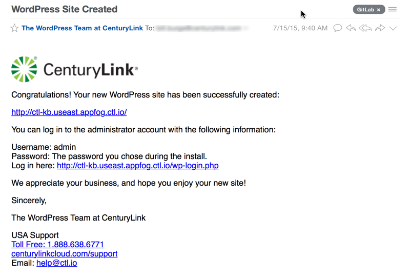

{{{
  "title": "Getting Started with WordPress as a Service",
  "date": "04-30-2015",
  "author": "Bill Burge",
  "attachments": [],
  "contentIsHTML": false
}}}

###Overview

[WordPress](http://www.wordpress.org "WordPress.org") is a free open-source blogging tool and content management system (CMS) based on PHP and MySQL.

CenturyLink Cloud's WordPress as a Service is a secure, Enterprise class, cloud-based WordPress installation for enterprise level customers.

###Prerequisites

* Access to the CenturyLink Cloud platform as an authorized user.
 
###Configuring a New WordPress Site

1. Browse to the [CenturyLink Cloud WordPress Site Creation Login](wpaas-dashboard.useast.appfog.ctl.io "CenturyLink Cloud WordPress Site Creation Login")

  

2. Input your CenturyLink Cloud username and password and click Login

  

3. Click Create

  

4. Chose a Plan, input the Name for your site and your GitHub username, and click Create

  

5. When created, you will then see the credentials for your WordPress site, and its associated phpMyAdmin and GitHub repository.

  

6. You will also receive an email from CenturyLink Cloud with limited site details.

  
  
###Frequently Asked Questions

**Q: What are the differences between a standard WordPress install and a CenturyLink Cloud WordPress install?**

A:

**Q: Can I have persistent storage with CenturyLink Cloud WordPress as a Service?**

A: Persistent storage must be configured with CenturyLink Cloud Object Storage.

