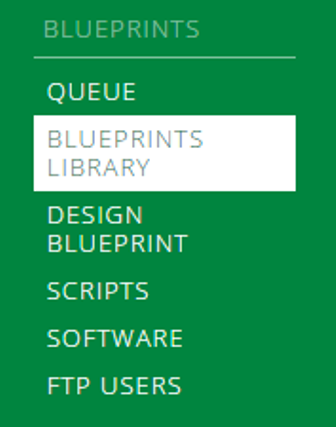
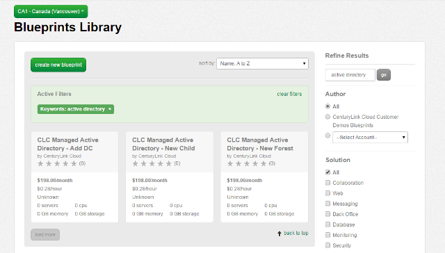

{{{
  "title": "Managed Active Directory – Blueprint Decision Guide",
  "date": "6-5-2015",
  "author": "Jamie Parker",
  "attachments": [],
  "contentIsHTML": false
}}}

### Overview

Centurylink Cloud offers three blueprints to customers who are interested in using our Managed Active Directory.  This article describes the three blueprints and explains when you would want to use each one.

### Prerequisites

* A Centurylink Cloud account
* A server that has been created with Managed Windows operating system

### General Notes

To use our Managed Active Directory services, a domain must have a one way trust to NA.MSMPS.NET, which is the domain that Centurylink Cloud uses for operations management.  Depending on a user’s requirements, they may choose to create a new intermediate forest that has a two way trust with their existing domain and a one way trust to NA.MSMPS.NET.

### Managed Active Directory Blueprint Decision Guide

1. To access the blueprints, first navigate to the dropdown menu, then under “Blueprints,” select “Blueprints Library.”

  

2. When the Blueprints Library page loads, search for “Active Directory.”  This will return the three Managed Active Directory Blueprints.

  

3.  CLC Managed Active Directory – New Forest

The scripts within this Blueprint create an entirely new Managed Active Directory forest.  A user should run this Blueprint on the server that is intended to be the first domain controller in a new forest.  The New Forest Blueprint should only be run on one server and only be run once per new forest.  Also, a user cannot run the Add DC Blueprint while the New Forest Blueprint is running – you must wait until this Blueprint completes before you add a new domain controller to the newly created forest.

4.  CLC Managed Active Directory – New Child

The scripts within this Blueprint create an entirely new Managed Active Directory child domain within a forest.  Like the New Forest Blueprint, a user should run the New Child Blueprint on the server that is intended to be the first domain controller in a new child domain.  Before this Blueprint runs, a user must create a new site and subnet in Active Directory Sites and Services.  The New Child Blueprint should only be run on one server, and only be run once per new child domain.  Also, like the New Forest Blueprint, a user cannot run the Add DC Blueprint while the New Child Blueprint is running – you must wait until this Blueprint completes before you add a new domain controller to the newly created child domain.

5.  CLC Managed Active Directory – Add DC

The scripts within this Blueprint create a new Managed Active Directory domain controller within an existing domain.  You can run multiple instances of this Blueprint simultaneously if you need to create more than one domain controller.  
