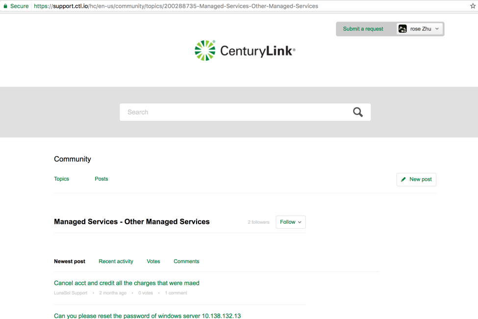
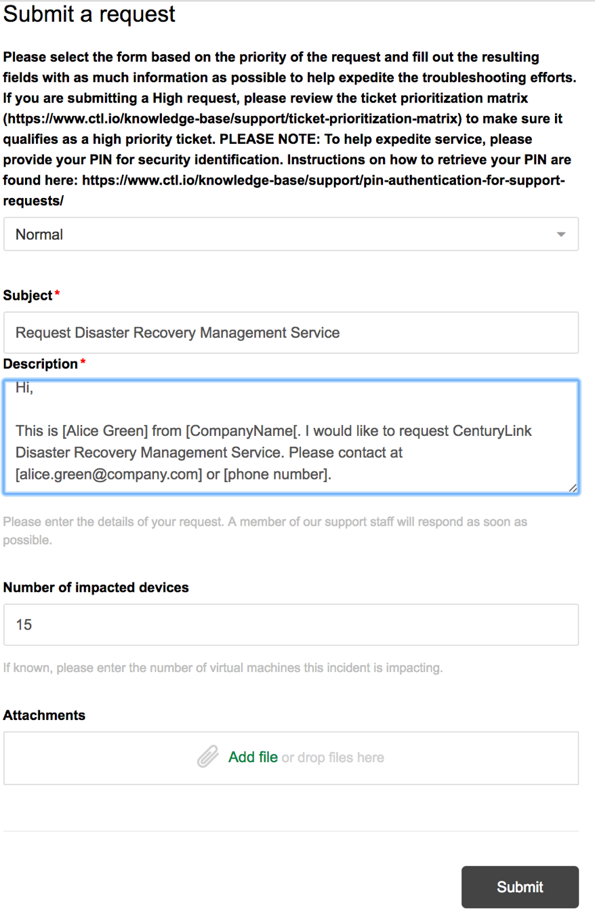

{{{
  "title": "Getting Started with Managed Disaster Recovery Services",
  "date": "07-25-2017",
  "author": "Shasha Zhu",
  "attachments": [],
 "contentIsHTML": false
}}}

### Overview
Managed Disaster Recovery Services (MDRS) are ideal for customers who lack Disaster Recovery (DR) expertise or do not have the staff needed to maintain a DR solution. Lumen takes over these responsibilities and delivers end-to-end services. Unlike other DRaaS solutions, Lumen MDRS carries out regular audits, tests, and at-time-of-disaster (ATOD) failover services to ensure the reliability, accuracy, and efficiency of your DR solution. MDRS services including:

* White-glove on boarding
* 24x7 monitoring and maintenance
* Semi-annual testing
* Quarterly audits
* ATOD failover services
* Runbook automation and maintenance
* Application recovery services

### Requesting the Service
Managed Disaster Recovery Services are deployed and maintained by Lumen. To get started with MDRS, please submit a service request via the Lumen support channel.

1. Go to the Lumen support website. At the top of the screen, click **Submit a request**.
   

2. From the drop-down menu, select **Normal**.
   * Include **Request Managed Disaster Recovery Services** as the subject.
   * For the **Description**, enter the details of your request.
   * Enter the number of servers you want to protect.
   * Upload attachments, if any. (This is optional.)
   * Click **Submit**.

   

3. Upon receiving the request, Lumen transfers your ticket to a cloud architect to work with you on designing and implement the DR solution for your IT environment.
