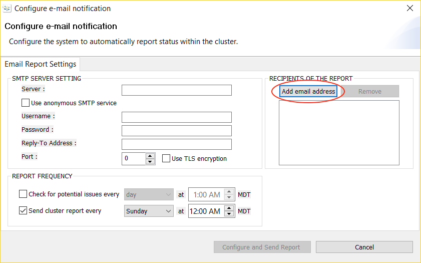

{{{
  "title": "Configure Managed Disaster Recovery Services",
  "date": "07-25-2017",
  "author": "Shasha Zhu",
  "attachments": [],
  "contentIsHTML": false
}}}

### Overview
After deployment of the SafeHaven and the monitoring system, CenturyLink provides the customer with credentials to log into the SafeHaven console to view the solution. The customer can edit certain fields to accommodate the solution and their daily workloads. In order to ensure the integrity of the solution, we strongly recommend that the customer edit **only** the fields listed below. The customer can also request assistance and/or recommendation from CenturyLink before editing them.

### Console Access to the Solution
1. Log into the CenturyLink SafeHaven Console.
   

2. Navigate around the SafeHaven Console.
   * You are able to see the recovery site, SafeHaven replication nodes, and protection groups.
   * Protection group information includes protected servers, WAN sync speed, recovery point data, storage usage, etc.

   

3. Edit the Protection Group WAN sync rate.
   * The default rate limit is 2048 KB/Sec.
   * Depending on network bandwidth and server workflow, you can adjust the WAN rate from 1 KB/Sec to unlimited.

   

4. Edit the Checkpoint Interval.
   * This is the time span between checkpoints.
   * The interval can be as low as 30 seconds.
   * The checkpoint is a recovery point used for test failover and protection group failover.
   * You can change the checkpoint interval to align with your DR strategy.
   * You can also check all the checkpoints via the SafeHaven console.

   

5. Add email addresses to receive periodic DR report.
   * In the SafeHaven console, click **Administration > email list**.
   * Add the email addresses.

   

6. Change the Built-in Disaster Recovery Plan.
   * SafeHaven built-in recovery plan defines the recovery server and production servers boot up and power off sequences.
   * You can edit the delay time as well.

   

7. Failover a Protection Group.
   * When disaster occurs, right-click the protection group and choose **Failover**.
   * **Note:** We recommend having a phone conversation your CenturyLink DR Manager prior to invoking a failover operation.

   
