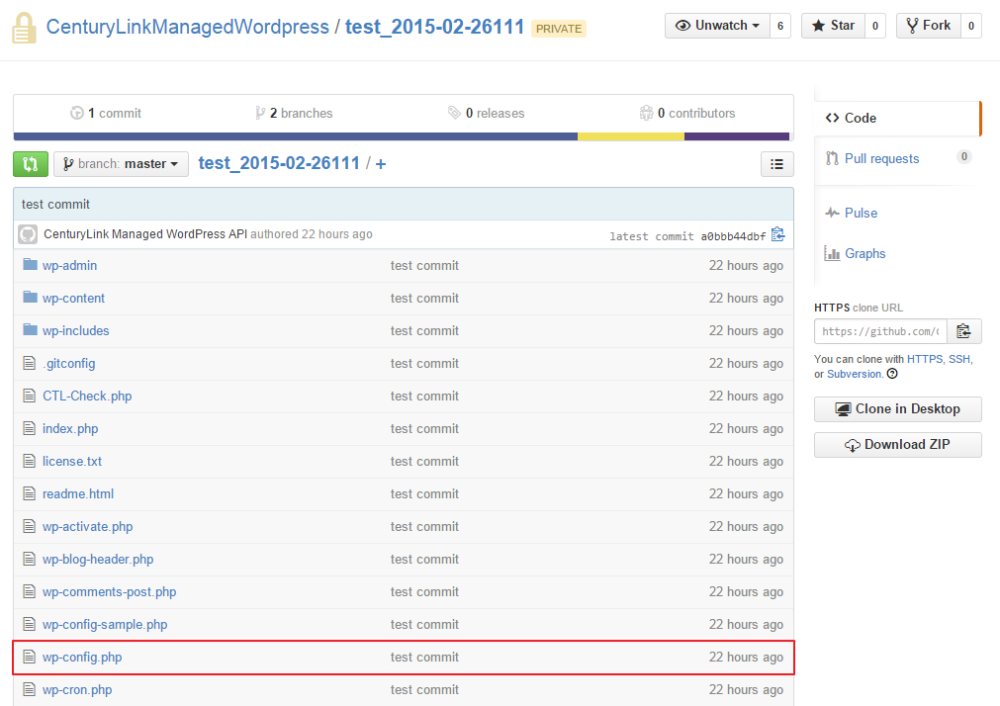
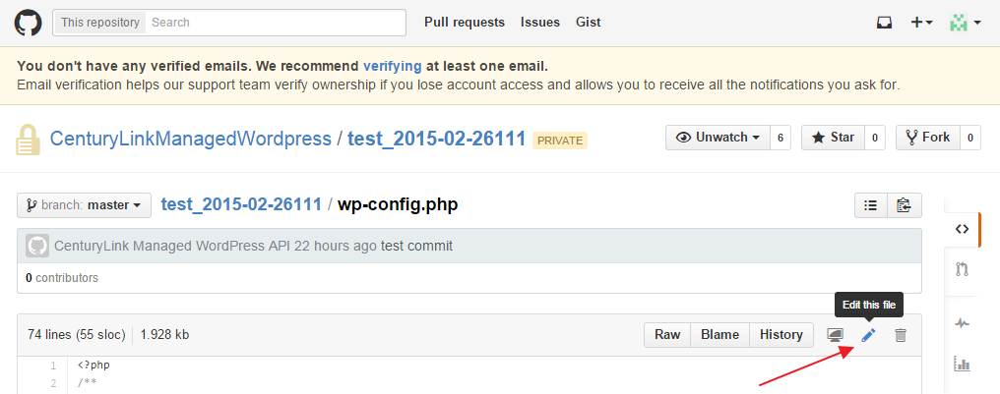
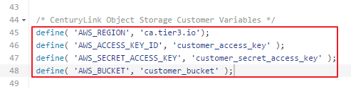
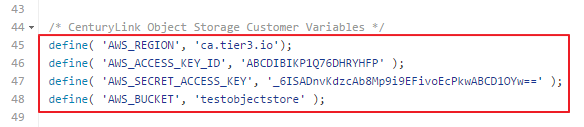
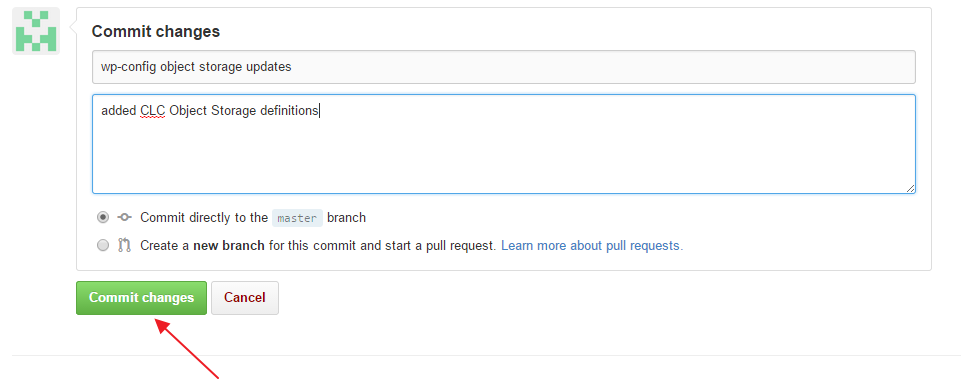
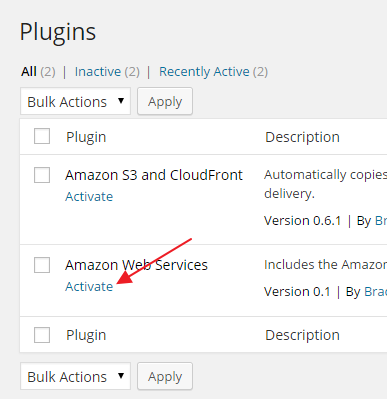

{{{
  "title": "Persisting Wordpress Files",
  "date": "04-02-2015",
  "author": "Bill Burge",
  "attachments": [],
  "contentIsHTML": true
}}}

<h3>Persisting Wordpress Files</h3>

CenturyLink Cloud WordPress sites utilize Object Storage for persistent WordPress content files such as images and file attachments.  In order to utilize persistent storage you must first manually configure Centurylink Cloud Object Storage using the following link:

[Using object storage from the control portal](../Object Storage/using-object-storage-from-the-control-portal.md)

Once object storage has been configured, you must edit your base  WordPress *wp-config.php* file on http://www.github.com to integrate your Wordpress site with your object storage account.  

---

**Note: There are many methods to edit and commit this file. This guide covers editing it in place on http://www.github.com.**

---

**1. Login to http://www.github.com using the GitHub username and password provided to CenturyLink during your WordPress installation.**

**2. Browse to the GitHub repository associated with your WordPress blog and open wp-config.php**

3. In the upper right-hand corner, click the pencil icon to Edit the file.

**4. Find the section of the file labeled *"CenturyLink Object Storage Customer Variables"* **

In this section you will see three replaceable variables:

1. customer_access_key
2. customer_secret_access_key
3. customer_bucket

**NOTE: These are variables you will have obtained when configuring your [*CenturyLink Cloud Object Storage.*](../Object Storage/using-object-storage-from-the-control-portal.md) **

*The following example shows the variables replaced:*

**5. Once you have updated the file, browse to the bottom of the screen, input a reason for the changes, and click *Commit changes.* **

**6. Login to your CenturyLink Cloud WordPress Blog Dashboard utilizing the password supplied during setup.**

**7. Expand AWS in the left column.**

**8. Select *S3 and Cloudfront* **

**9. Ensure the following settings are configured:**

**S3 Settings**
* Ensure the bucket you created is selected in the drop down
* Bucket is setup for virtual hosting - **UNCHECKED**
* Set a far future HTTP expiration header for uploaded files - **CHECKED**
* Object Path: /uploads/

**CloudFront Settings**
* Domain Name - **BLANK**
* Implement object versioning by appending a timestamp to the S3 file path - **UNCHECKED**

**Plugin Settings**
* Copy files to S3 as they are uploaded to the Media Library - **CHECKED**
* Point file URLs to S3/CloudFront for files that have been copied to S3 - **CHECKED**
* Remove uploaded file from local filesystem once it has been copied to S3 - **CHECKED**
* Always serve files over https (SSL) - **CHECKED**
* Copy any HiDPI (@2x) images to S3 (works with WP Retina 2x plugin) - **UNCHECKED**

*The following example is correctly configured:*

**9. Once settings are verified, click *Save Changes* to commit configuration changes.**

