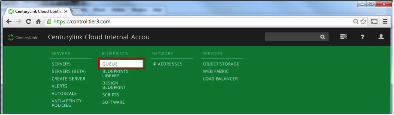
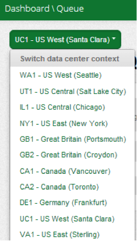
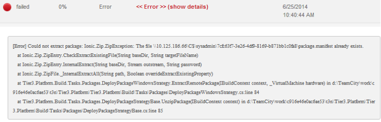
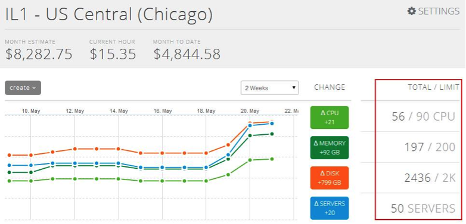

{{{
  "title": "Troubleshooting a Failed Managed Services Blueprint",
  "date": "10-24-2014",
  "author": "Jared Ruckle",
  "attachments": [],
  "contentIsHTML": false
}}}

If a Managed Services Blueprint does not complete as expected, please note the OS and the time the Blueprint was attempted. RHEL Managed Services Blueprints will fail from 9am to 10am UTC as a result of regular maintenance in our managed services infrastructure. Please wait one hour before attempting again.

If that is not the issue, follow these steps to expedite troubleshooting.
##### 1. From within the Control Portal, hover over the green bar at the top of the page.

##### 2. Select Queue beneath Blueprints.

##### 3. On the Deployment Queue page, click the pull-down list and select the correct data center.

##### 4. Click on the radio buttons to find the relevant job and status.

.
* If the Blueprint failed after “Reserve Blueprint,” expand the step where the error failed by clicking on it. Call Support at 1-888-638-6771. Please notify us about the step the Blueprint failed (such as “Install Managed MSSQL”).
  * You may be able to further expand the errant step to see details of the error:

##### 7. If the issue occurs during Server Creation for a VM you are attempting to “Make Managed” and the job fails at the same point a second time, continue to troubleshoot by:
* Checking to see if Blueprint failed prior to a step called "Apply CTS customizations to ______." (The blank would be specific to an Operating System) If so, it is possibly a resource issue.
* Check the main dashboard to determine if you have exceeded resource limits.

  * If it is a resource issue and you require more resources, please adjust accordingly or request limit increases from your account administrator.
  * If it is not a resource issue, please contact Support at 1-888-638-6771. Please also note the step at which the Blueprint failed.
* Check to see if the Blueprint failed at the step called "Apply CTS customizations to ______" (blank is specific to the OS). If this is the case call Support at 1-888-638-6771. Please also note what step at which the Blueprint failed and approximate dates and times when you attempted to have it resumed.
