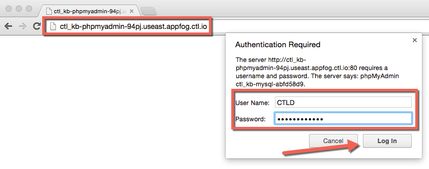
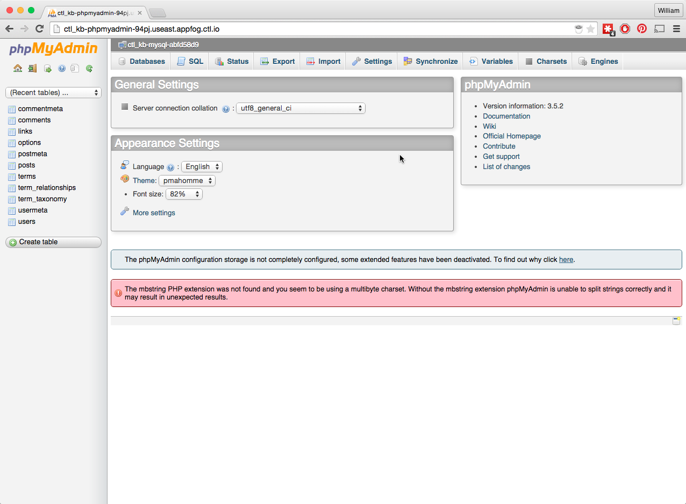

{{{
  "title": "Wordpress Database Access with phpMyAdmin",
  "date": "05-04-2015",
  "author": "Bill Burge",
  "attachments": [],
  "contentIsHTML": false
}}}

WordPress uses a MySQL relational database for storing and retrieving content like posts, pages, image paths and comments as well as user login information.

At times it is necessary to manage the database to resolve issues or add functionality.  With your CenturyLink Cloud WordPress site this is achieved via the free php software tool, [phpMyAdmin](http://www.phpmyadmin.net "phpMyAdmin Homepage").

--

###Prerequisites:

* The phpMyAdmin URL provided by CenturyLink during WordPress Site Creation
* The phpMyAdmin username provided by CenturyLink during WordPress Site Creation
* The phpMyAdmin password provided by CenturyLink during WordPress Site Creation

--

**1. In a web browser navigtate to the phpMyAdmin URL provided by CenturyLink**

**2. Input the phpMyAdmin User Name and Password and click Log In**

**3. You will now have full access to phpMyAdmin** 

### Additional Links:
--

* [WordPress.org Database Description, Diagram, and Table Overview](https://codex.wordpress.org/Database_Description "WordPress.org Database Description, Diagram, and Table Overview")
* [WordPress.org Database Code Reference (Functions, Hooks, classes, and methods)](https://developer.wordpress.org/reference "WordPress Database Description, Diagram, and Table Overview")