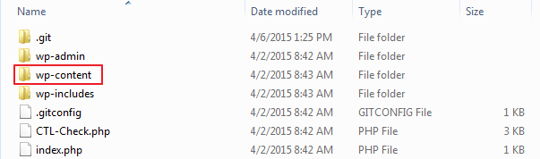
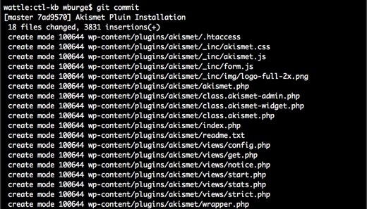
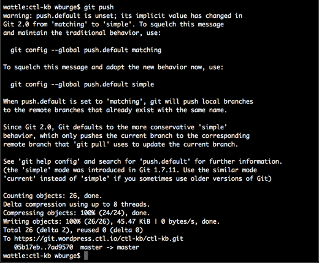
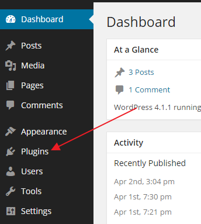
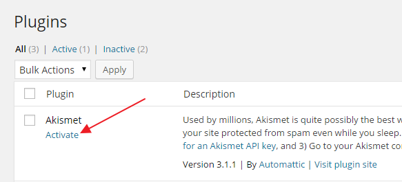

{{{
  "title": "WordPress Plugin Installation",
  "date": "04-30-2015",
  "author": "Bill Burge",
  "attachments": [],
  "contentIsHTML": false
}}}

CenturyLink Cloud WordPress sites use [GitHub](http://www.github.com "GitHub Homepage") to deploy new WordPress code including new plugins.

In order to activate a plugin you will need to download a WordPress Plugin and upload it into the Master branch of the GitHub repository provided to you during your CenturyLink Cloud Wordpress site creation. This will then force a refresh of your WordPress blog and allow you to activate and configure the plugin.

---

**NOTE:** These instructions assume a working knowledge of GitHub usage and will utilize Windows and the GitHub for Windows Application to sync a new plugin directly to the Master Branch.

---

**1. Open GitHub, right click your cloned repository, and select Open in Explorer.**

**2. Open the wp-content folder.**

**3. Open the plugins folder.**

**4. Download the WordPress Plugin you want to install.**

_In this example we will be installing Akismet_.

**5. Locate the local folder the plugin was downloaded to and copy it into the plugins folder of your cloned GitHub repository.**

You will end up with the following...

**6. In the GitHub Client you will now see _Uncommitted Changes_**

**7. Click _Show_ to expand the view and see local changes to the repository.**

**8. In the right pane you will see a list of changes that can be committed to GitHub.**

**9. Add a comment and click _Commit to master_.**

**10. In the upper right hand corner click _Sync_ to upload the commited changes to GitHub.**

**11. On [www.github.com](http://www.github.com "GitHub Homepage") you will now the plugin in the plugins directory.**

**12. In your WordPress installation expand _Plugins_.**

**13. Next to your installed plugin click _Activate_**

**14. Your plugin is now installed.**
