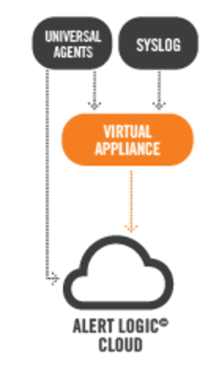

{{{
"title": "Getting Started Guide: Alert Logic Log Manager",
"date": "04-05-2017",
"author": "",
"attachments": [],
"contentIsHTML": false
}}}

### Summary

Alert Logic Log Manager with ActiveWatch is a Security-as-a-Service (SaaS) solution that meets compliance requirements and identifies security issues across your entire environment, including public cloud. It collects, processes and analyzes your data, while our ActiveWatch team unlocks the insights hidden in your log data with 24x7 expert monitoring and analysis.

Alert Logic Log Manager collects, aggregates and normalizes log data from your CenturyLink Cloud servers. The web interface provides a unified view into all of your data, with tools to rapidly uncover the insight and alerts you need to remain secure and compliant.

### Description

Alert Logic Log Manager provides increased visibility, rapid custom reporting, and scalable, real-time log collection and log management for a predictable monthly fee. Our cloud security solution:

* Deploys rapidly, wherever your IT resides

* Scales to your particular business needs

* Provides deep security insight into your environment with an intuitive interface

* Collects syslog from firewalls, switches, routers, printers, Unix servers and many more devices

* Turns your data into action, delivering correlations and validated incidents directly to you

* This diagram illustrates the Log Manager virtual appliance architecture.

### Additional Information

For more details on the Alert Logic Log Manager architecture, please visit the [Log Manager Documentation page](https://docs.alertlogic.com/products101/log-manager-101.htm).

### Deployment Process

This Runner job performs the following steps:

1. Provisions an Alert Logic Log Manager virtual appliance in the customer's CenturyLink Cloud account and initiates a monthly recurring subscription based on the selected license, currently only the 5 node option is available.  Support for up to 5, 10, 15, 20 or more server "nodes" to be released soon.

2. Initiates a one-time charge for the Alert Logic On-boarding service.

3. Notifies the Alert Logic On-boarding team to contact the user and begin the on-boarding engagement.

### Prerequisite(s)

* Access to the CenturyLink Cloud platform as an authorized user.

* The CenturyLink Cloud Network to which the Log Manager virtual appliance will be deployed to.

* The contact information for the designated IT contact. The Alert Logic On-boarding Product Manager (OPM) will contact this individual to begin the on-boarding engagement.

### Postrequisite(s)

none

### Pricing

Pricing will vary based on the Alert Logic Log Manager license selected.

### Frequently Asked Questions (FAQ)

**Will executing this Runner job charge my CenturyLink Cloud account?**

Yes, executing this Runner job will initiate a recurring monthly subscriptions for the selected Log Manager license, plus a one-time $825 charge for the On-boarding engagement.

**Who should I contact for support?**

Please send support requests to: support@alertlogic.com.
For issues related to CenturyLink Cloud infrastructure (VMs, network, etc.), please open a support ticket by emailing [help@ctl.io](mailto:help@ctl.io) or through the [support website](https://support.ctl.io/access/unauthenticated?return_to=https%3A%2F%2Ft3n.zendesk.com%2Ftickets%2Fnew).

**How difficult is it to deploy?**

Click the "Run" button to begin the deployment process. Then, populate the Runner job user-input fields with the following: * Data center, Network (VLAN), and Server Group * Server Name * Number of CPUs and Amount of Memory (GBs) * Contact information

After updating the form fields, click the "Run" button again to initiate the Log Manager virtual appliance deployment. The designated contact will receive an email or phone call from the On-boarding Project Manager (OPM) to schedule an initial discovery meeting within 1 business day.
