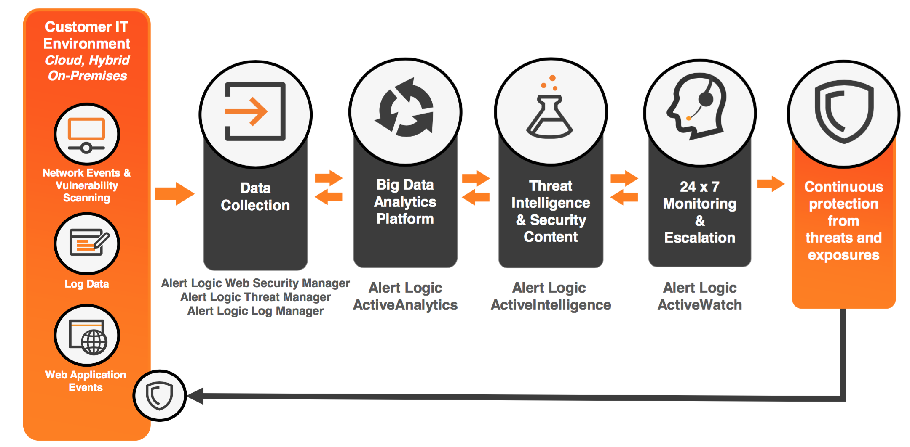

{{{
"title": "Getting Started Guide: Alert Logic Web Security Manager",
"date": "04-05-2017",
"author": "",
"attachments": [],
"contentIsHTML": false
}}}

### Summary

Alert Logic Web Security Manager Premium is a cloud-based managed solution that allows you to secure your web applications. Our managed web application firewall (WAF) is delivered in a Security-as-a-Service model which guards against emerging threats such as the OWASP Top 10, and provides immediate PCI DSS 6.6 compliance, providing you the web application security that you need.

### Description

Alert Logic Web Security Manager Premier includes both an Out-of-Band web application firewall (WAF) that monitors your web traffic and logs web violations, and an Inline WAF that actively blocks attacks.

As part of the Alert Logic Cloud Defender solution, Web Security Manager Premier ensures attacks are detected and mitigated. This diagram illustrates how it fits in with the rest of Cloud Defender components.

### Additional Information

For more details on the Alert Logic Web Security Manager Premier architecture, please visit the [Web Security Manager Premier Documentation page](https://docs.alertlogic.com/userGuides/web-security-manager-premier.htm#wsmp).

### Deployment Process
This Runner job performs the following steps:

1. Provisions an Alert Logic Web Security Manager Premier virtual appliance in the customer's Lumen Cloud account and initiates a monthly recurring subscription based on the selected license. Currently only the 5 node option is available.  Support for up to 5, 10, 15, 20 or more server "nodes" to be released soon. (e.g. Support for protecting up to 5, 10, 15, 20 or more websites, or "nodes").

2. Initiates a one-time charge of $4,050 for the Alert Logic On-boarding service.

3. Notifies the Alert Logic On-boarding team to contact the user and begin the on-boarding engagement.

### Prerequisite(s)

* Access to the Lumen Cloud platform as an authorized user.

* The Lumen Cloud Network to which the Web Security Manager Premier virtual appliance will be deployed to.

* The contact information for the designated IT contact. The Alert Logic On-boarding Product Manager (OPM) will contact this individual to begin the on-boarding engagement.

### Postrequisite(s)

none

### Pricing

Pricing will vary based on the Alert Logic Web Security Manager Premier license selected.

### Frequently Asked Questions (FAQ)

**Will executing this Runner job charge my Lumen Cloud account?**

Yes, executing this Runner job will initiate a recurring monthly subscription for the selected Web Security Manager Premier license (based on the number of protected web sites, or "nodes"), plus a one-time $4,050 charge for the On-boarding engagement.

**Who should I contact for support?**

Please send support requests to: support@alertlogic.com.
For issues related to Lumen Cloud infrastructure (VMs, network, etc.), please open a support ticket by emailing [help@ctl.io](mailto:help@ctl.io) or through the [support website](https://support.ctl.io/access/unauthenticated?return_to=https%3A%2F%2Ft3n.zendesk.com%2Ftickets%2Fnew).

**How difficult is it to deploy?**

Click the "Run" button to begin the deployment process. Then, populate the Runner job user-input fields with the following:

* Data center, Network (VLAN), and Server Group

* Server Name

* Number of CPUs and Amount of Memory (GBs)

* Contact information

After updating the form fields, click the "Run" button again to initiate the Web Security Manager virtual appliance deployment. The designated contact will receive an email or phone call from the On-boarding Project Manager (OPM) to schedule an initial discovery meeting within 1 business day.
