{{{
"title": "Getting Started Guide: InstantAPI Platform",
"date": "05-02-2017",
"author": "",
"attachments": [],
"contentIsHTML": false
}}}

### Technology profile

[InstantAPI](http://instantapi.com/) makes it easy to create, host, manage, support and sell your own enterprise grade API platform.

Key features include:

* Easy API endpoint creation - create REST based API endpoints from existing data,service, or code.

* One click version control and deployment - not only can you deploy new versions and work on a staged test version of an API, you can also sunset an API or decommission it completely, all within seconds.

* Complete suite of API management tools - API management tools covering multiple dashboards, API subscribers, subscriber key management, API limiting and throttling, detailed API plans, and monetization.

* Enterprise grade API security - machine learning security that comes with the basics such as white / blacklisting IPs, to one of a kind security threat detection.

* API auditing - always stay on top of the API calls made to your API with audit logs.

### Description

The purpose of this KB article is introduce the InstantAPI Platform and show how easy it is to create an enterprise grade API platform from existing data, services or code. A task that traditionally takes a skilled team of developers months can now be done in a fraction of the time
and cost.
Not only can you create and host your enterprise grade API platform with ease, InstantAPI also provides the tools necessary to successfully manage and support your API platform and its users. Enabling you to operate your API platform for others to use.

### Audience

* Consumers of the [Instant API Enterprise Grade API Platform](https://www.ctl.io/marketplace/partner/IAPI/product/InstantAPI/)

* Current CenturyLink Cloud Customers

If you are ready to get started, but are not yet a CenturyLink Cloud customer, no problem. Get started with CenturyLink Cloud with a [free trial](https://www.ctl.io/free-trial/). Try out our most popular products, allowing you to create a custom combination of products that best fits your business needs.

### Step-by-Step Guide

To help you understand how quick and easy it is to create your own enterprise grade API platform, we have prepared step-by-step guides.

### Configuring API Backend

The first thing that you need to do to start creating your API platform, is configure a backend. In this case we are using a demo MySQL database. To configure a backend, select **Backend Management** in the navigation.

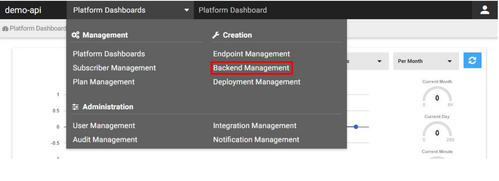

Click on + **BACKEND SERVICE** button and select **DATA SILO**.

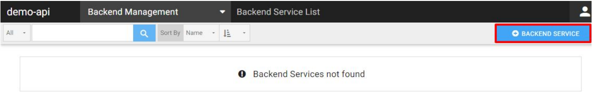

Select **MySQL**.

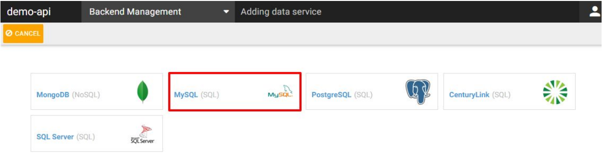

Put in the following information and click **DONE**.
**Address**: demo.mysql.instantapi.com
**Port**: 37777
**User Name***: iaDemo
**Password***: iaDemo
**Database Name***: Domainbroker
**case sensitive information**

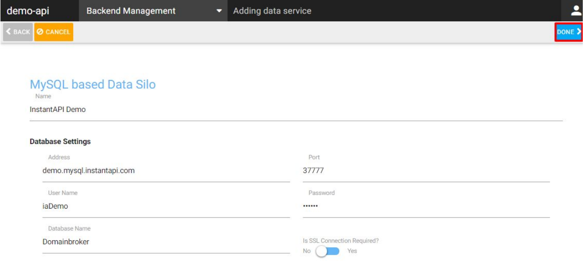

The backend is now configured and we can start creating the first API endpoint.

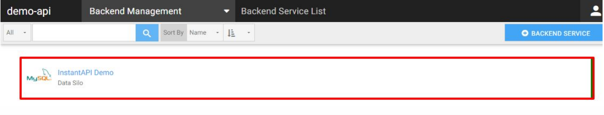

To do so, select **Endpoint Management** in the navigation.

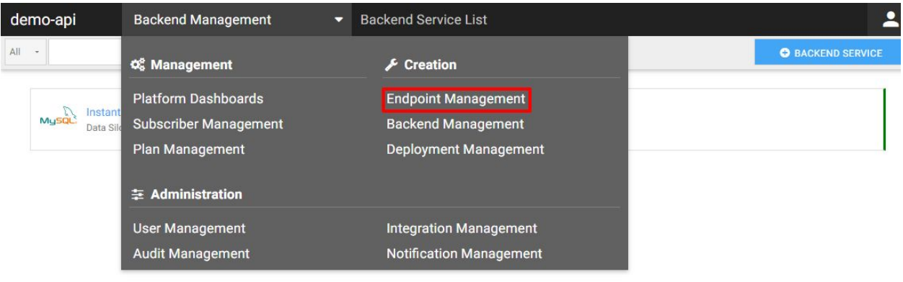

Click on **+ ENDPOINT** button.

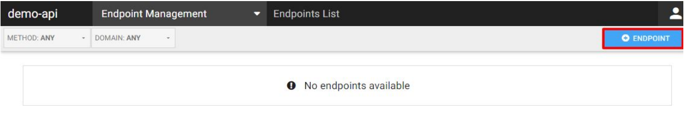

Now you can start creating the first API call for the DomainBroker Demo API. As you can see in the screen below, you can select different types of API call methods: GET, POST, PUT,
PATCH, DELETE.

The API endpoint you are about to create is made up of 3 separate parts. The HTTP
VERB/METHOD which can be GET, POST, PUT, DELETE or PATCH. The next part is the domain of endpoint.

Also note that the /staged/ part of endpoint is a special version that is used to test an endpoint before it is deployed into production. The final and most important part of an endpoint is the URI/URL of the API call.

InstantAPI has its own markup that enables you to create almost any format of endpoint. For example in the following endpoint: /partner/{id}/orders/{?status}

We can clearly see that **id** is a passed value in the API URL and **status** is the query string value. We can make a query string optional by surrounding it with a square brackets like this
[{?status}]. We can have as many passed querystring and url parameters as we want, and the order of querystring parameters does not matter. However, for this guide we will be using the GET method. By default GET should already be selected.

Under **API Call Map**, we can add a friendly URL based on our needs. For this API endpoint use the following URL: demo/domain/list/[{?domainname}]

We can add the URL with a query string or without it. The API call we are creating is with a query string. This means that we can pass the parameter as a URL.
For example:
?domainname=google

Add a brief description, then select the sample InstantAPI Demo MySQL database which we
added.

Once selected as the backend for the API call you will see a combo-box with different SQL based command primitives. Since we are using a pre-configured Data Silo that is accessing a MySQL database, we now have to provide the base type of the database call. We do this to add
an extra layer of **SQL injection protection**.

Once the API command type is selected, put in the following **API Command**: SELECT * FROM
domain WHERE domainname LIKE '%[[domainname:string:default='']]%'

InstantAPI was designed to make it easy for existing database users to pull out data via an API using the knowledge they already have in the case of a SQL database. You only need to know how to query, GET/PUT/UPDATE and DELETE data in SQL, and also know what an API endpoint is to create a fully functional enterprise API endpoint.

This API command will list all available domains from the domains table and as an optional parameter we will filter the result by passing in the optional [{?domain}] as defined in the API endpoint previously.
We can also limit the results by enabling the paging support and entering the page size number.
Once the configuration is done we can save the settings by clicking on **DONE** as shown in the screen below.

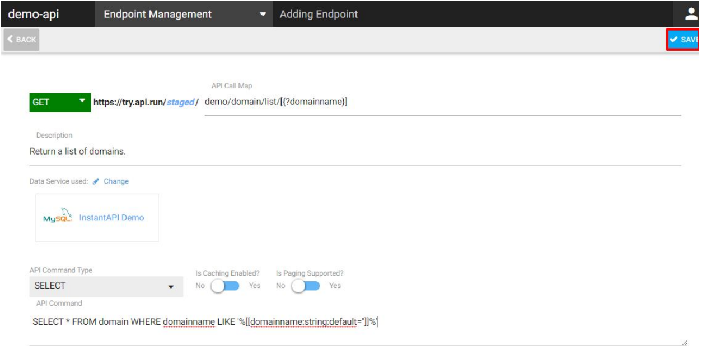

Click **OK** to continue.

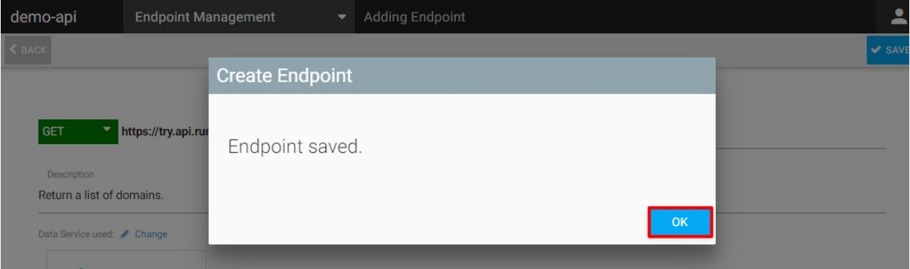

Your first API endpoint has now been deployed to a staged (non-production) version and is available for testing.

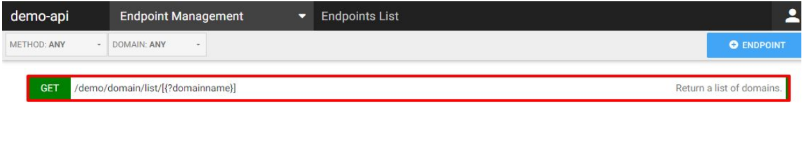

### Testing API Call in a Browser

Now that we have an endpoint saved and deployed to a staged testing area, we can test it in a web browser as it is a **GET** based API call. To do this you first need your API key from the platform. Only the Master API Key for the API platform can be used to make **staged** API calls.

To get your Master API Key click on the **ACCOUNT PROFILE** icon.

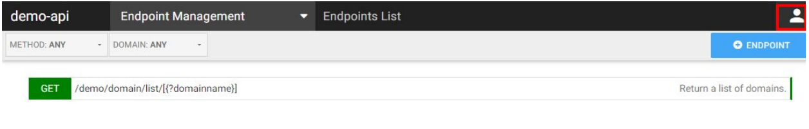

Copy the Master API key from the pane and also enable Store response in audit data as shown below. Audit data will come in useful with the next next guide.

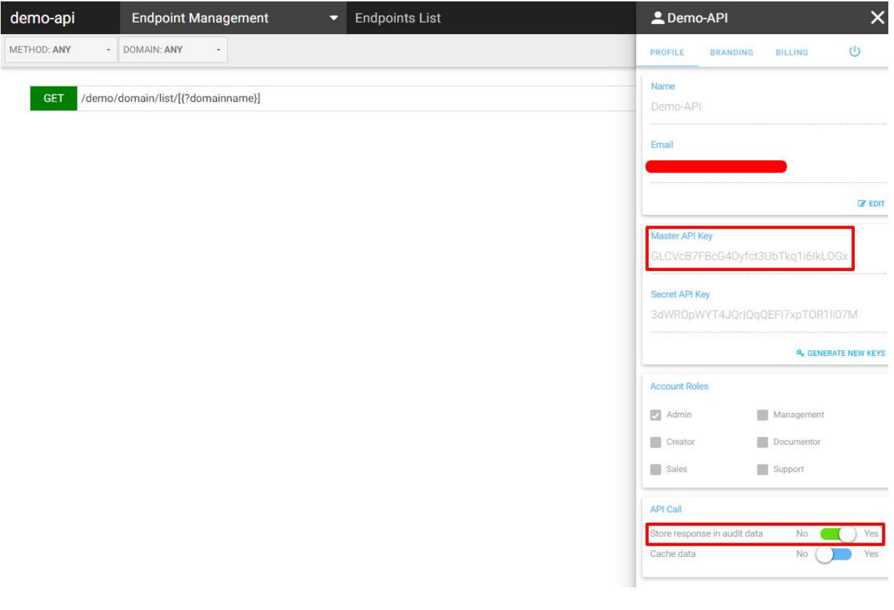

Once done, you can paste the following URL into your browser version section. (our
recommended browser is Chrome)
..URL..with apikey before the /staged/

In the above example we have put the API key before the version being tested for readability.

The API key can also be added to the URL as a query string parameter as follows:

https://ctl-us-try.api.run/staged/demo/domainbroker/domain?apikey=

It can also be added to the HTTP Header of the call (normally done via code).
If you added paging support you can also add query string parameters for limit (amount of items to return) and skip (used to get results after the first items) these are used commonly for paging purposes.

Copy your Master API Key and replace the value for apikey shown above and pasted into your browser. Once done you should see a result as a JSON response based on your API call as shown below. This is how our test API call URL looked like:

 https://ctl-us-try.api.run/GLCVcB7FBcG4Oyfct3UbTkq1i6IkLOGx/staged/demo/domain/list?domainname=google

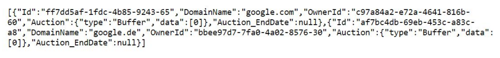

###  Audit Management

One of the key features in InstantAPI is **Audit Management** from which we can monitor all API calls made.

Select the **Audit Management** in the navigation.

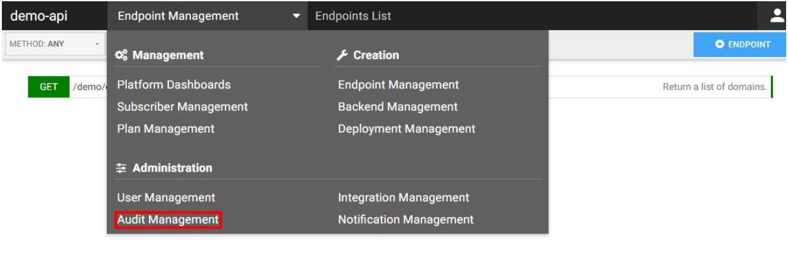

Click on the API call that we made to learn more about it.

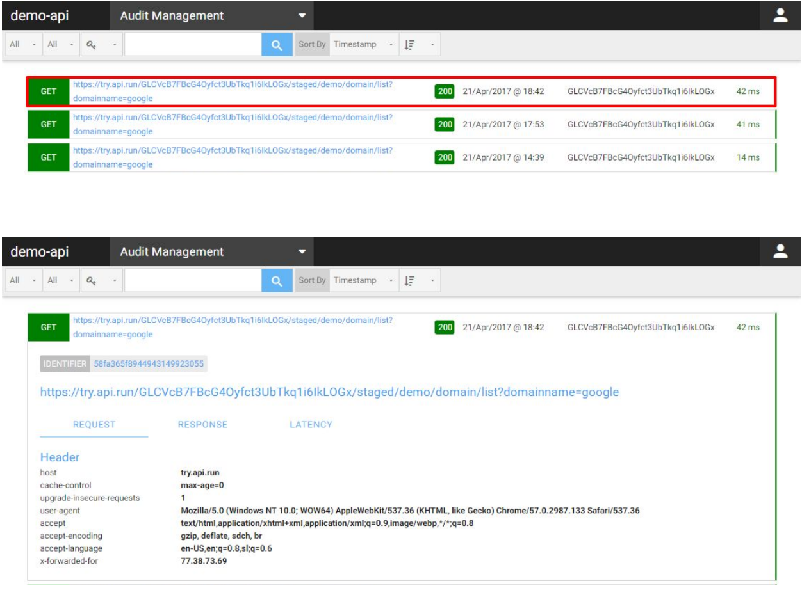

This concludes our quick start step-by-step guide on creating your very first API endpoint using the InstantAPI platform.

### Who Should I Contact for Support

For issues related to cloud infrastructure (VM's, network, etc.) or if you experience a problem deploying the Blueprint or Script Package, open a CenturyLink Cloud Support ticket by emailing [noc@ctl.io](mailto:noc@ctl.io) or through the CenturyLink Cloud Support website.

For InstantAPI support related questions, please send an email to: [support@instantapi.com](mailto:support@instantapi.com).

For enterprise sales, please send an email to: [sales@instantapi.com](mailto:sales@instantapi.com).
