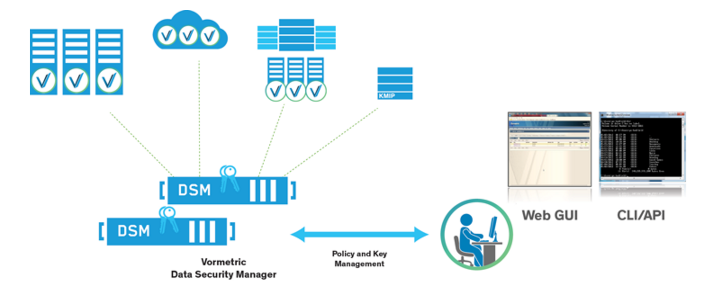

{{{
"title": "Getting Started Guide: Vormetric's Data Security Manager and Agents",
"date": "04-05-2017",
"author": "",
"attachments": [],
"contentIsHTML": false
}}}

Vormetric's Data Security Manager (DSM) technology is available in the CenturyLink Cloud Marketplace, enabling customers to purchase and deploy the DSM virtual appliance onto their CenturyLink Cloud account, securing mission-critical applications.

The purpose of this article is to help the reader understand the Runner deployment process, and how to achieve rapid time-to-value with the Vormetric Transparent Encryption solution.

### Description

The Vormetric Data Security Manager (DSM) is the brain of the Vormetric Data Security Platform. The Vormetric Data Security Manager is a data security appliance which enables centralizes policy control and key management for data-at-rest-encryption, privileged user access control and security intelligence across an organization. The Data Security Manager changes the data security management game by enabling an IT organization to have a consistent and repeatable method for encrypting, enforcing access policies and gaining security intelligence for all structured and unstructured data.

The diagram below depicts the Data Security Manager (DSM) architecture and deployment options available, and also shows the Vormetric Transparent Encryption Agents -- represented with a 'V' -- and deployed separately via the [CenturyLink Marketplace](https://www.ctl.io/marketplace/partner/VRSJ/product/Vormetric%20Encryption%20Agent/).

### Additional Information

For more information on the Vormetric Data Security Manager (DSM) Virtual Appliance, including whitepapers and data sheets, please visit the [Vormetric DSM Product page](https://www.vormetric.com/products/data-security-manager).

### Deployment Process

This Runner job performs the following:

1. Provisions a "placeholder" server in the customer's CenturyLink Cloud account for the DSM virtual appliance and initiates a monthly recurring subscription based on the selected DSM Bundle (e.g. Support for up to 5, 10, or 20 Agents; with or without Live Data Transformation (LDT) support).

2. Initiates a one-time charge for the Quickstart Vormetric Standard On-boarding service.

3. Notifies the Quickstart On-boarding team to contact the user and begin the on-boarding process as described in the Marketplace Product tile.

4. OPTIONAL - If the High-Availability (HA) option is selected, an additional DSM server (for HA) will be provisioned and the corresponding monthly recurring subscription initiated.

### Prerequisite(s)

1. Access to the CenturyLink Cloud platform as an authorized user.

2. The CenturyLink Cloud Network VLAN to which the Vormetric DSM will be deployed to.

3. A valid email address for a designated IT contact (The Quickstart On-boarding team will message this individual).

### Postrequisite(s)

None. However, Vormetric Encryption Agents can be installed using this [CenturyLink Marketplace Tile](https://www.ctl.io/marketplace/partner/VRSJ/product/Vormetric%20Encryption%20Agent/). The Vormetric Encryption Agent connects to the Vormetric Data Security Manager (DSM) Server, which is licensed to support up to a specified number of Encryption agents (Windows and Linux). E.g. The "Vormetric DSM Bundle - 15 agents" will support up to 15 Vormetric Encryption Agents.

### Pricing

Vormetric license fees will billed for this installation. Pricing will vary based on the Vormetric DSM Bundle selected, and whether the HA configuration is selected. The dropdown selectors in the Runner job details pricing for each option.

### Frequently Asked Questions

**Will executing this Runner job charge my CenturyLink Cloud account?**

Yes, executing this Runner job will initiate on-going monthly subscriptions for the selected Vormetric DSM Bundle (pricing varies) and (optional) High-Availability DSM, plus a one-time $2,000 charge for the Quickstart Vormetric Standard On-boarding engagement.

**Who should I contact for support?**

For issues regarding the Vormetric DSM virtual appliance, please contact Vormetric: [support@vormetric.zendesk.com](mailto:support@vormetric.zendesk.com).
For issues related to cloud infrastructure (VMs, network, etc.), please open a CenturyLink Cloud Support ticket by emailing [noc@ctl.io](mailto:noc@ctl.io) or through the support website.

**What is the performance impact of Vormetric encryption?**

Vormetric customers typically report no perceptible impact to the end-user experience. In almost every case, the impact of encryption overhead is minimal, so IT teams can continue to meet their SLAs. In a benchmark conducted with Intel, Vormetric Transparent Encryption demonstrated under 2% performance overhead at 70% system utilization.

**How difficult is it to deploy Vormetric?**

Click the "Run" button to begin the deployment process. Then, populate the Runner job user-input fields with the following:
* Contact information

* Data center, server group and VLAN for the primary and secondary (Optional: for HA) placeholder servers

* Primary and secondary DNS servers, and NTP server

* Select the desired DSM Bundle and High-Availability option

After updating the form page, click the "Run" button again to initiate the deployment process. You will receive an email or phone call from the Quickstart On-boarding team to schedule a Discovery call within 1 business day.
