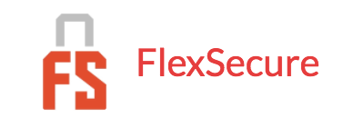
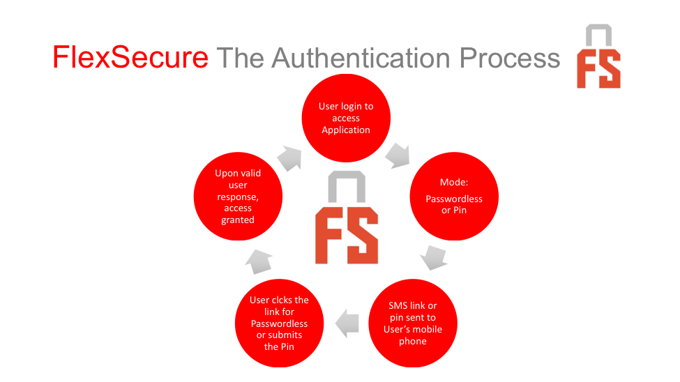
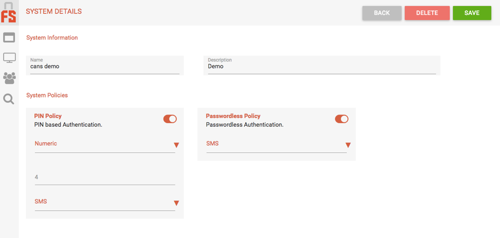
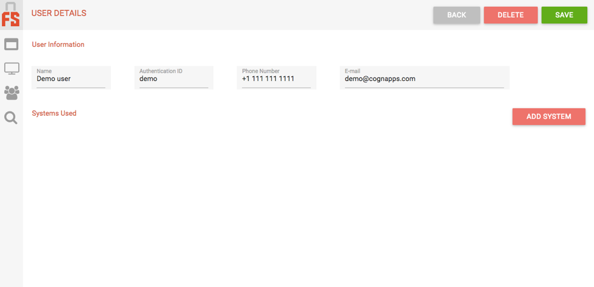
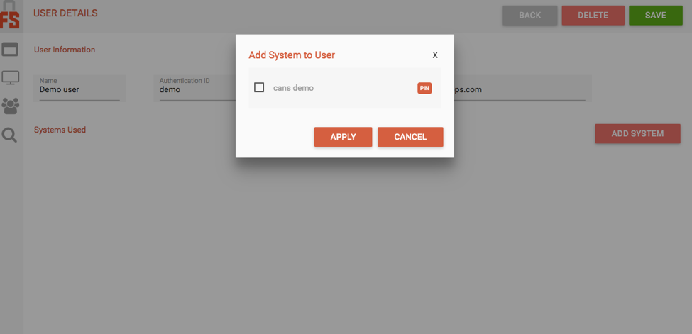
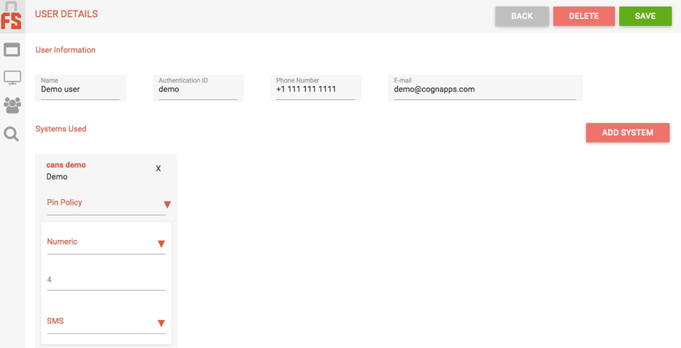

{{{
"title": "Getting Started Guide: FlexSecure Passwordless Authentication",
"date": "04-11-2017",
"author": "Sid Prasanna",
"attachments": [],
"contentIsHTML": false
}}}

### Technology Profile

[FlexSecure](https://www.flexsecure.co/) has integrated their technology on the CenturyLink Cloud Marketplace.
FlexSecure is a flexible User Authentication platform, providing Passwordless and Pin-based authentication, without the need to install an app. This platform enables organizations of all sizes to mix and match appropriate user authentication methods to protect applications on their Cloud, Mobile, and IT infrastructure.

By adding FlexSecure to their existing authentication or access control systems, organizations can adopt multi-layered authentication options. Multi-layered authentication enable organizations to add significant levels of security to protect their data from hackers and prevent unauthorized access.

Passwordless Authentication made easy!

•	Easy to integrate; easy to use

•	No apps to install

•	No need to remember passwords

•	Quick and easy integration into existing applications

•	Easy to use administration console

•	Simple for the administrator to manage and switch authentication methods

•	Audit trail for login activities

### Description

FlexSecure solves a unifying problem -- the need to dynamically secure access to resources and data, based on the user and their level of authorized access. Many solutions exist for granting access in a static way, but no easy-to-use solution exists that can adjust the security authentication requirements in real-time, based on dynamic factors in the security equation.

### Solution Overview

FlexSecure sees authentication as a dynamic problem that needs a dynamic solution. Our technology enables companies to provide a strong and flexible authentication solution to more sensitive resources and data, while relaxing the requirements for access to less sensitive content. This allows users to get more work done without interruption, while giving the highest level of security when necessary.

The FlexSecure technology is implemented through a secure API that allows for easy integration into your existing applications, websites, and enterprise systems.

### Audience

Cloud Users, Application Developers, & Enterprises

### Deployment Process

After FlexSecure assigns a customer an account, the customer can then add systems, applications, and users and assign authentication methods. It is suggested that systems be entered first and thereafter, assigned to users.

Systems are anything that users want to access -- like applications, cloud infrastructure, etc.  Users can be anyone or any device that needs to be authenticated.

### Steps to Configure the System

After gaining access, the account administrator should follow the steps below to configure the system:

	1.  Set up the systems and their policies:

(note that an application can have both Pin and Passwordless policies turned on, while assigning only one of the policies to a user)

	2.  Set up the user:

	3.  Set up the systems that a user can access:

* multiple systems can be added at once

**User info, depicting assigned systems:**

 

 4.  Making API Calls:

The FlexSecure system uses JSON-formatted data payloads for communicating with the service. All API calls require the two following header variables.

Content-Type: application/json
apikey:  <the api key given to you when you registered your account>

**a. Starting Authentication**

POST https://api.flexsecure.co/v1/start

Body: 	{
“system”: “name of system”,
			“authid”:	“authentication id of user”
		}

    **Expected Results:**

    200:  { result: “success” }
    403:  { result: “security error” }

**b.	Checking Authentication**

**Note on Passwordless authentication:**

Once the Start API call is made, the user will receive a SMS/Email that contains the link to click and proceed with the Passwordless authentication.

You will need to keep calling the /check API endpoint until you get an expired or authenticated result. (We suggest every 2 seconds).

POST https://api.flexsecure.co/v1/check

Body: 	{
“system”: “name of system”,
			“authid”:	“authentication id of user”
		}

    **Expected Results:**

    200:  { result: “authenticated” }
    403:  { result: “expired” }
    403:  { result: “security error” }

**Notes on Pin based authentication:**

The process is the same as the Passwordless check, apart from that you need to also provide the pin entered by a user in the body of the check call as shown below:

POST https://api.flexsecure.co/v1/check

Body: 	{
“system”: “name of system”,
			“authid”:	“authentication id of user”,
			“pin”: 12345678
		}

    **Expected Results:**

    200:  { result: “authenticated” }
    403:  { result: “expired” }
    403:  { result: “security error” }

For more info, please refer to the FlexSecure website at: [www.flexsecure.co](https://www.flexsecure.co/)
Or, send an email to [support@flexsecure.co](mailto:support@flexsecure.co).
