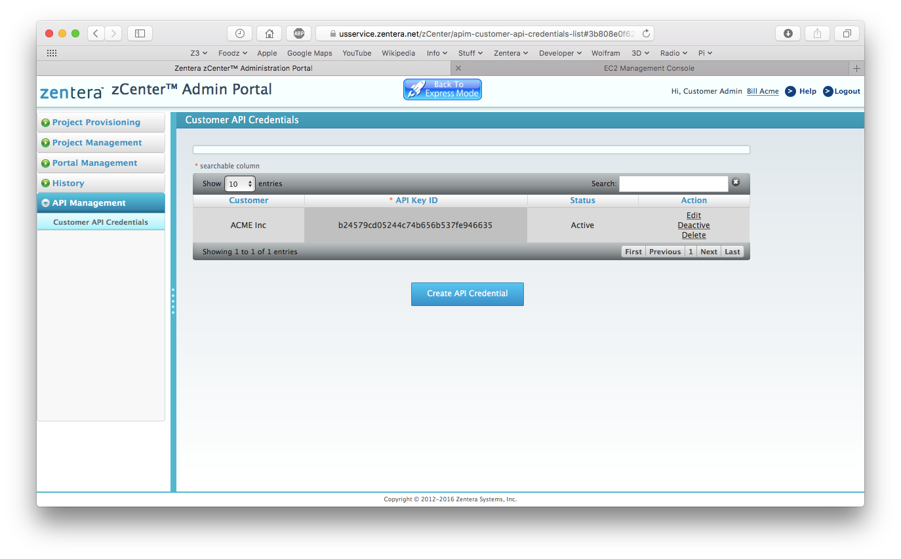
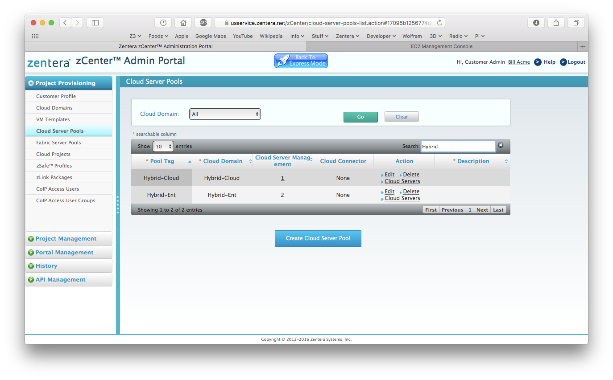
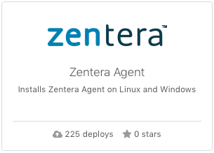
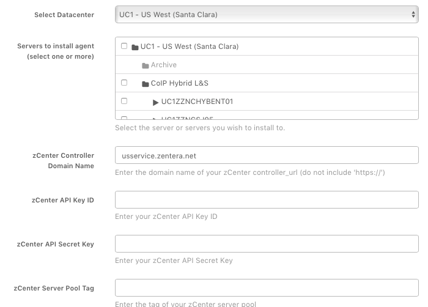
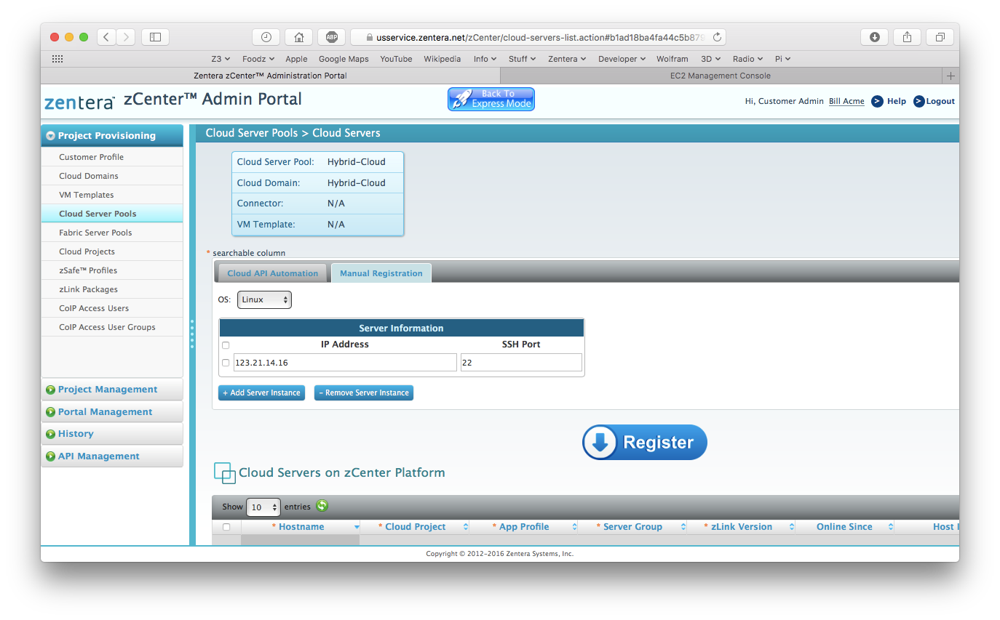

{{{
"title": "Getting Started Guide: Zentera Systems",
"date": "03-01-2017",
"author": "",
"attachments": [],
"contentIsHTML": false
}}}

### Getting Started with Zentera Systems

After reading this article, the reader should know how to deploy the [Zentera](http://www.zentera.net) CoIP® (Cloud over IP®) secure networking solution on Lumen Multi-Cloud.

### Partner Profile

Zentera's CoIP solution directly addresses the security and networking needs of the multi-cloud market. CoIP's security capabilities are deeply integrated with its virtual overlay network, accelerating productivity, and business agility. CoIP works with any transport in any environment, does not interfere with existing infrastructure, and can be up and running in less than a day. The company is a Red Herring Top 100 winner and Info Security PG Magazine 2017 Top Startup of the Year based in Silicon Valley, and offers CoIP through select partners.

* Multi-cloud Security

* Multi-cloud Networking

* Cloud Migration

### Description

CoIP connects dispersed endpoints instantly and securely across multi-cloud environments as if they were in one unified private network. It protects by allowing enterprises to keep their security, physical networks, and compliance intact during deployments. CoIP shields production workloads and cloud endpoints through network encryption, east-west micro-segmentation, application interlock and white listing. CoIP can be integrated with existing network management platforms and security engines as well.

### Solution Overview

The CoIP platform runs on a network appliance, available either as a virtual appliance. The CoIP platform includes the zCenter™, zLink™, zChamber™, CoIP LAN™ and CoIP WAN™ software components.

The Zentera CoIP platform offers the following benefits:

* Enterprise-controlled virtual network across cloud ecosystems

* High-performance overlay virtual network

* Extremely fast implementation within days/weeks not months/year

**zCenter** - The web management portal for Zentera's CoIP platform

**zLink** - Zentera software controller that runs on CoIP endpoints

**zChamber** - Software-based cloud firewall system that automatically provisions secure chambers in multi-tenant cloud environments and enterprise datacenters

**CoIP LAN and WAN** - CoIP supports dynamically provisioned virtual LAN and WAN using private routing with any public or private IP addresses and using the underlying data center networks as the high-speed forwarding fabric with optional transport encryptions

### Offer

The Zentera CoIP solution is available for Lumen Cloud users as a virtual appliance. To receive a 60-day CoIP trial license, please contact Zentera Systems using the following link: [http://www.zentera.net/try-it-now](http://www.zentera.net/try-it-now)

### Audience

Lumen customers with Multi-cloud deployments.

### Prerequisites

* Access to the Lumen Cloud platform as an authorized user

* [Create a New VM](https://www.ctl.io/guides/servers/create-a-custom-server/) if you don't have an existing VM.

* Enable port 22 and 443. Port 22 can be disabled after the Runner has been successfully installed.

* Zentera currently supports RedHat, CentOS, SuSE, and Ubuntu, Debian, and Windows 2012 in 32-bit and 64-bit modes.

### Deploying the Zentera CoIP Runner

**Steps to Deploy the Zentera CoIP Runner:**

**Step 1: Obtain Your Trial License and zCenter Login**

1. Request a trial license at [http://www.zentera.net/try-it-now](http://www.zentera.net/try-it-now). This will trigger Zentera to provision a virtual CoIP Controller Appliance (VA) for your zCenter (CoIP web management portal). Zentera will send you an email with your zCenter VA URL and your login credentials.

**Step 2: Log into zCenter (CoIP management portal) and Save the zCenter URL for Later Use with the Runner**

1. Save your zCenter URL. You will need it in a later step.

2. Log into your zCenter with the URL and credentials received from Zentera via email in Step 1.

**Note:** We recommend watching the training videos after you have completed this Runner. Also, if you see an Express Mode screen after you log in, click on the **Advanced Mode** button on the lower right to continue following these directions.

**Step 3: Create a Customer in zCenter and Save the API Keys for Later Use with the Runner**

1. Click on the **Portal Management** menu item on the left to begin.

* Click on **Customers** and create a customer by filling out the dialogue box, then click on the **Save** button.

* Find your customer and click on the **Edit** link.

* Locate the API Keys. Copy the API Keys - 32-character alphanumeric strings - and save it into a text file. You will need it in a later step.

**Step 4: Create API Keys**

In the zCenter Portal, Click the API Management Tab on the left bar.

* Click Customer API Credentials.

* Select Your Customer from the Drop down menu.

* Click Create API Credentials.

* Select Access Types (CustomerFullAccess or ProjectFullAccess)

* Click **Save** then Download.

**Step 5: Create a Cloud Server Pool on zCenter and Save the Cloud Pool Tag for Later Use with the Runner**

1. Click on the **Project Provisioning** menu on the left to begin.

* Click on **Cloud Domains** and create a cloud domain: provide a Domain Name, select the Customer you just created from the drop-down list and set Cloud Connector to None, then click the **Save** button.

* Click **Cloud Server Pools** and create a cloud server pool. Provide a Pool Tag, then select Customer and the Cloud Domain you just created from the drop-down lists. Then click the **Save** button.

* Locate the Pool Tag and save it into your text file. You will need it later.

* Locate and Copy Cloud Pool Tag from zCenter

* You can remain logged in. You will be returning to zCenter at the end of this Runner job.

**Step 6: Deploy Runner on Lumen to Install CoIP zLink agents into your servers (VMs)**

1. Locate the Zentera Runner tile from the Lumen Runner panel.

2. Click on the Zentera tile.

* Click on **Zentera zLink Agent Installer for RedHat, CentOS, SuSE, and Ubuntu, Debian, or Windows 2012.**

* Click on **Run**.

* Select your server from the **Execute on Server** drop-down list.

* Copy and paste the **CoIP Controller Appliance URL** (your zCenter URL), **zCenter API Keys** and zCenter Cloud Server Pool Tag into the dialogue box.

* Review your information and click **Run**.

3. Monitor the Deployment Queue for progress. You can access the queue at any time by clicking the Queue link from the main navigation menu on the left.

**Step 7: Verification in zCenter of CoIP zlink Installation into Your Server**

1. Once the Runner completes successfully, verify that your server is registered on zCenter.

* In your zCenter, click **Project Provisioning** then choose **Cloud Server Pools**.

* Find your Pool Tag and click on its **Cloud Servers** link.

* Verify that your VM is listed here.

### Post-Installation Note

If you want to access your CoIP web management portal, zCenter, from a computer that is outside of the Lumen Cloud network, you need to [add a public IP](../../Network/CenturyLink Cloud/how-to-add-public-ip-to-virtual-machine.md) to your server through the Lumen Control Portal.

### Pricing

The costs associated with the Zentera CoIP Runner deployment are for the Lumen Cloud infrastructure only. The Zentera CoIP Proof of Concept (PoC) comes with 60-day trial license. For a production license, please contact: [ctl-sales@zentera.net](mailto:ctl-sales@zentera.net).

### Frequently Asked Questions

**Where do I obtain a license?**

Trial licenses are available at [http://www.zentera.net/try-it-now](http://zentera.net/try-it-now/).

Purchase license by sending email: [ctl-sales@zentera.net](mailto:ctl-sales@zentera.net)

**Who should I contact for support?**

For issues related to deploying the Zentera CoIP on Lumen Cloud, please contact [ctl-support@zentera.net](mailto:ctl-support@zentera.net).
For issues related to cloud infrastructure, please open a ticket using the [Lumen Cloud Support Process](../../Support/how-do-i-report-a-support-issue.md).
