{{{
"title": "Getting Started Guide: Marketplace & Provider Portal",
"date": "12-07-2017",
"author": "Brandy Smith",
"attachments": [],
"contentIsHTML": false,
"sticky": true
}}}

The Provider Portal (PP) is an application that allows CenturyLink Cloud Provider Partners to manage the display of their products on the CenturyLink Marketplace. Once a Provider has certified a product, a member of the Marketplace Team provides the partner with a welcome email and credentials to log into PP.

### Signing In

Sign into the [Provider Portal](https://provider-portal.ctl.io/#/login) using your credentials. You will be redirected to the Welcome screen. **New** You can now log in using your Google credentials.

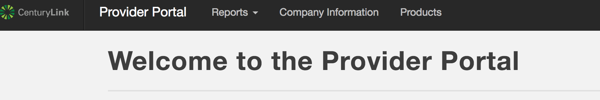

### Provider Homepage

Once logged in you will directed to your Provider Home page. The home page will have any message that the CenturyLink Marketplace team have sent you or have been created due to an error with a product deployment. There is also a Provider Workflow which is a dashboard that shows your company specific progress on onboarding tasks as well as product completion progress.
You can hover over the pie charts on the dashboard for more information.

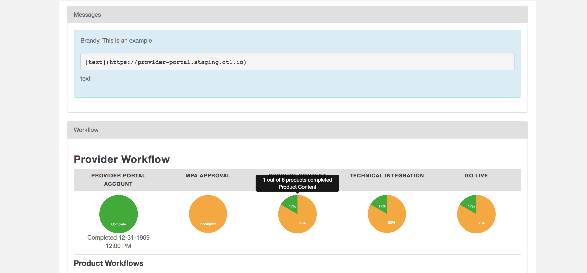

### Company Information

Click the **Company Information** tab. This takes you to your **Provider Details** page, which was created for you when we established your CenturyLink Marketplace profile. Here you can review, edit, update your company information, and change the logo.

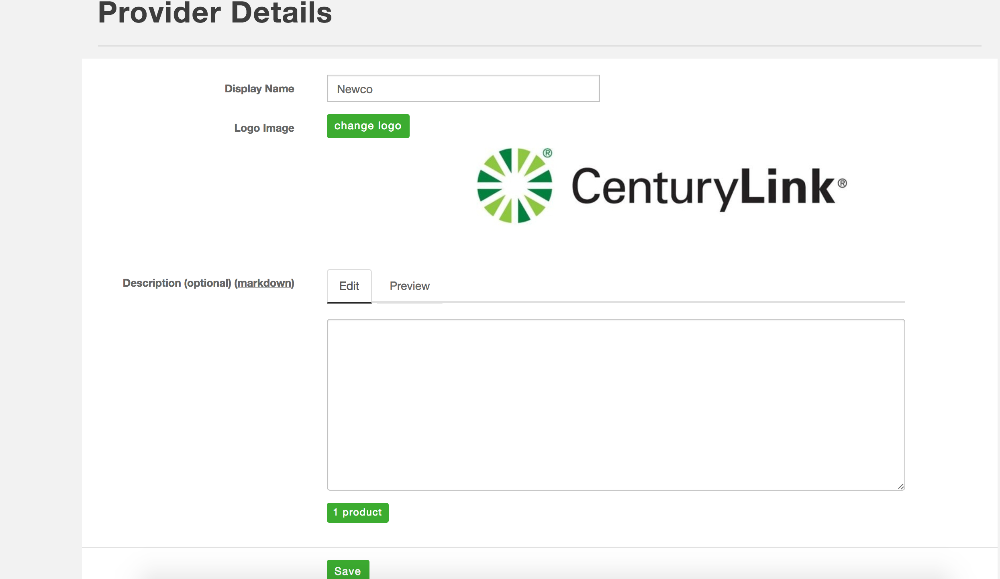

- Uses Markdown formatting. Most Markdown is recognized.
- Click the **Preview** tab to see how your Markdown renders.
- Click **Save** once you are satisfied.

You can sign up to be notified upon the creation of a subscription for your software on the Company Information page by adding the appropriate email addresses to be notified in the Notification Emails field and clicking **Save**.


The company logo, content that is provided in the **Description** field and products that are available in the CenturyLink Marketplace are what the customer will see when clicking the company name in the Marketplace.

This is a sample of the customer view of your Company Information on the Marketplace:

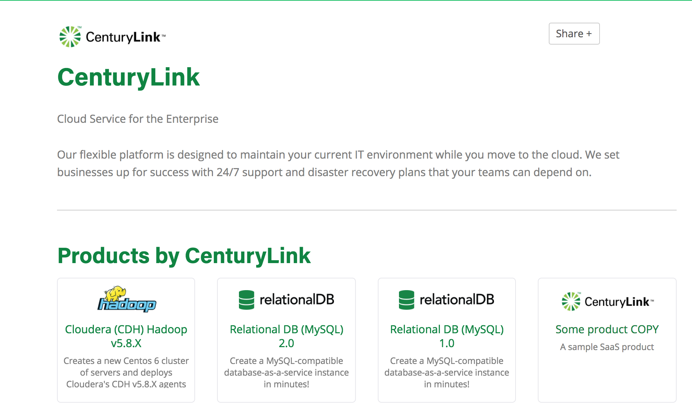

### Marketplace Provider Agreement (MPA)

On the **Provider Details** page is also where you must agree to the Marketplace Provider Agreement(MPA), which governs the Terms & Conditions of your products entry into the Marketplace.
It can be found [here](https://www.ctl.io/legal/marketplace/). Once you have read and agree to the terms, click the check box and click **Save**.
**Note** While it is not necessary to accept the MPA to add products and content, it is a required step for any products to be published to the Marketplace.

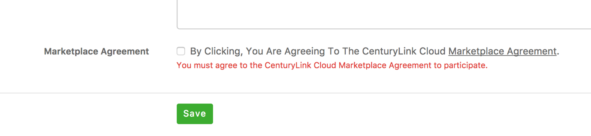

### Creating a New Product

From the **Provider Details** page, you can find a list of your products that have been added to the Marketplace. If you're a new Provider, you may not see any products listed.

1. To add a new product click the green **add product** button. A blank **Product Details** form opens.

 	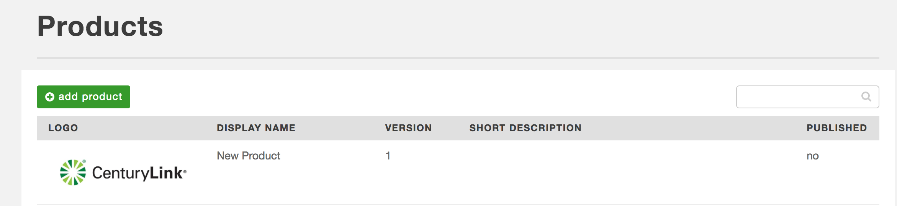

2. In the **Display Name** field, enter the name of your product.

3. Enter the Version number (optional).

4. Click **Create**.

   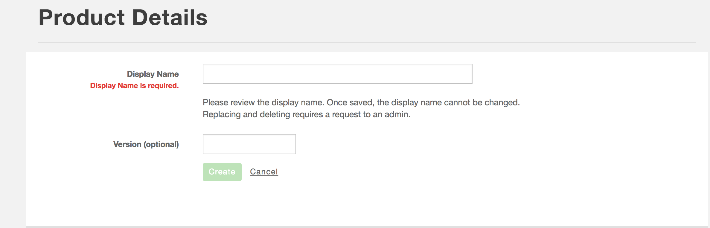

5. After clicking **Create**, an updated **Product Details** page appears containing additional fields to fill about the product.
   * Products defaults to using your company logo. If you wish to use a different image, click **change logo**, and upload a logo image.
   * Files must be 1MB or smaller.
   * The following image file types may be used: PNG, BMP, JPG, or GIF.

   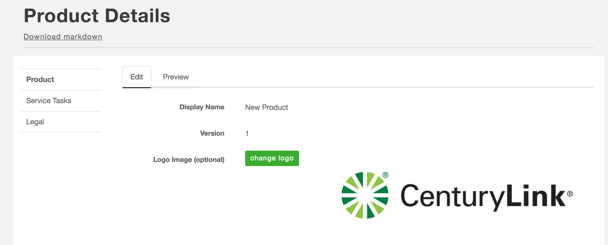

6. Complete any additional fields. Note: Some fields are required. Others are optional. **Important** The Provider Portal supports Markdown within specified fields. When adding links or email addresses, please note that ensuring that you are using proper Markdown formatting is very important. Improper links will cause 404s. The correct format for links and emails are below. If you have any questions or concerns with loading content into the Provider Portal, please reach out to the [Marketplace team](mailto:Marketplace@ctl.io).

**Markdown Link**
```[Link Text](http://google.com)```

**Email Link** `[email@xxx.com](mailto:email@xxx.com)`and emails are below. If you have any questions or concerns with loading content into the Provider Portal, please reach out to the [Marketplace team](mailto:Marketplace@ctl.io).

   * Enter **Short Description** (required).
   * Enter **Full Description** (required).
             - This field accepts Markdown formatting.
             - Click the **Preview** tab to see how your Markdown renders.
   * The **Demo URL** field is optional. Use this field if you want to provide a different URL where users can download or view a demo video for your product.
   * The **Badge** field is optional. It is useful for grouping your products for a given audience.
   * Select at least one **Category** for your product (required).
   * If applicable, select the appropriate **Operating System** for your product.

7. You may provide other supplemental product information including:
   * **Dependencies** (optional).
   * **Support Information** (required) Support is the responsibility of the provider.
   * **Contact Information** (optional).
   * **Use Cases** for the product (optional).
   * **Product Features** (required). Enter at least one feature.
             - This field accepts Markdown formatting.
             - Click the **Preview** tab to see how your Markdown renders.
   * **Resources** (optional), such as links to Knowledge Base articles, whitepapers, demos, or blog posts.
   * **Pricing** (optional) for hourly, monthly, or one time usage.

8. Once you enter all product information, click the **Preview** button to see how your Markdown renders.

9. Click **Done with Preview** to exit Preview mode or click the **Edit** tab at the top of the form.

10. Click **Create**.

11. Click **Request Publication**. This forwards a request to the CenturyLink Marketplace team notifying them to review and publish your product. If there are questions/issues related to the submission, a Marketplace team member will contact you. Otherwise, your product is published within two business days.

**Note**:

Required steps for publication of products are as follows:

1) MPA has been reviewed and accepted.
2) W-9 has been submitted to the Marketplace team, reviewed, and approved.
3) Product EULA URL is listed under the product EULA field.
4) Support information is listed under the product support field.
5) Technical integration has been completed and tested.
6) Billing integration has been completed and tested.


   


### Making Changes to a Product

1. Log into the [Provider Portal](http://provider-portal.ctl.io/#/login) and click the **Products** tab. This opens a window containing a list of your products that have been added to the Marketplace.

2. Navigate to the **Product Details** page for the product you want to change.

3. Edit the details as needed, preview, and click **Save**.

4. Click **Request Publication**. Note: You have to click this button or your changes won't be visible on the Marketplace.

5. A CenturyLink Marketplace team member will review and approve the changes and publish.

### Cloning a Product

This is a great way to simplify entering similar products into the Marketplace.

1. Navigate to the **Product Details** page.

2. Click the **Clone** button. This opens a new **Product Details** page with the **Display Name** of "ProductName Copy".

3. Edit the **Display Name** for the cloned product  and any other relevant details.

4. Click **Save**.

5. Click **Preview in Marketplace**.

6. Close preview mode and return to the **Product Details** page.

7. Click **Request Publication**  to publish your product to the Marketplace.

### Adding End User License Agreements (EULA)

It is a requirement that partners enter an End User License Agreement (EULA) for each product in the Marketplace. It is also the responsibility of the partner to ensure that the (EULA)s for their products in the Marketplace are kept current.

1. To add the (EULA), sign into the [Provider Portal](http://provider-portal.ctl.io/#/login) and navigate to the **Product** tab. This will take you to the product details page for your company.

	 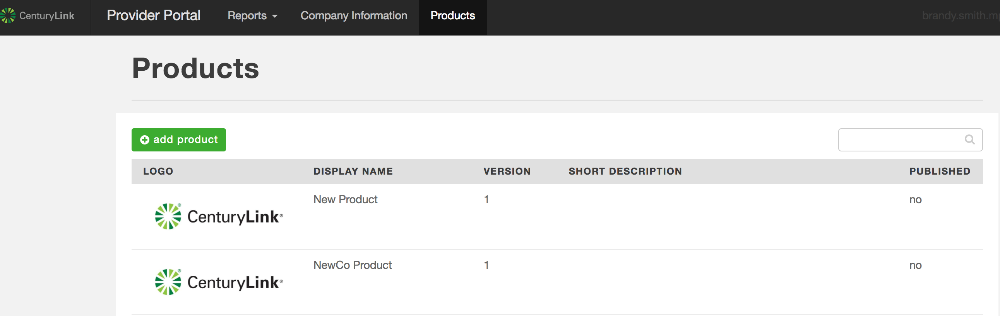

2. Click on the product in which to add the (EULA).

3. Inside the product, click the **Legal** tab on the left side of the page.

	 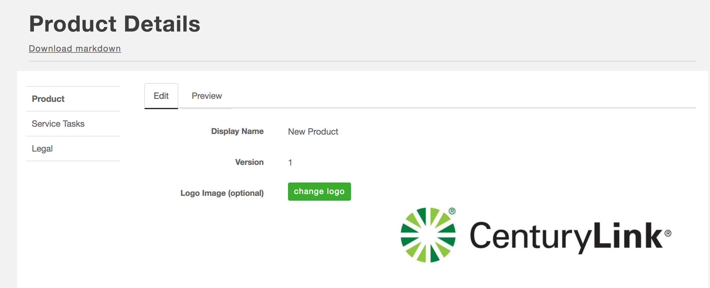

4. On the **Legal** tab you can add a link to the (EULA) for each product. It is the responsibility of the provider to ensure that the (EULA) is current.

   * This field accepts markdown.
   * Click the **Preview** tab to see how the Markdown renders.

5. Click the **Save** button.

6. Repeat these steps for each company product in the Marketplace.

### Service Tasks

Some products are assigned service tasks. This is determined between the partner and the CenturyLink Ecosystem engineer during the integration process. If a product requires service tasks, you can add information as needed by accessing the **Service Task** tab per the directions below:

1. Sign into the [Provider Portal](http://provider-portal.ctl.io/#/login) and navigate to the **Product** tab. This takes you to the product details page for your company.

2. Click on a product to add service task information.

3. Once inside the product click, the **Service** tab.

  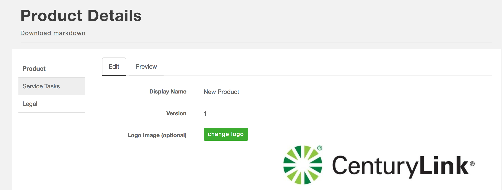

4. Fill in the required fields. If you need assistance filing in the information on this tab, reach out to the [Ecosystem team](mailto:support@ecosystem@ctl.io).


### Frequently Asked Questions

**Q: What if I have forgotten my EPP password?**
**A:** If you forget your password, just click **Forgot your password**?

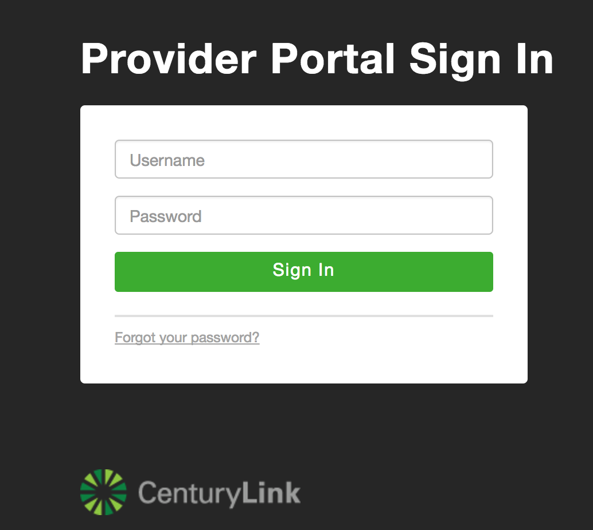

This opens a new form where you input your user name, and a new password will be emailed to you.

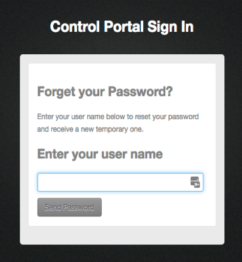

**Q: What if I forget my User Name?**
**A:** Reach out to the [CenturyLink help desk](mailto:help@ctl.io).

**Q: What Markdown is accepted by EPP?**
**A:** Most Markdown formatting is recognized. See the [markdown-it](https://markdown-it.github.io/), the GitHub Markdown editor, for more detail.

**Q: What types of image files can I use for Company and Product logos?**
**A:** Files must be 1MB or smaller. EPP accepts the following image file types: PNG, BMP, JPG, or GIF.

**Q: How long after I click Request Publication can I expect my product to be published?**
**A:** Within 2 business days, the CenturyLink Cloud Marketplace Team will approve and publish your product. At that point, it will be fully available for customers in the [Marketplace](https://www.ctl.io/marketplace/).

**Q: Why are there two different ways to Preview my content on the Product Detail page?**
**A:** Here's the difference.

1.	**Form Fields: Edit vs. Preview**
   * Selecting **Preview** above a form field lets you see how the Markdown you entered for the field renders. Below is how Markdown content looks in **Edit** mode.

   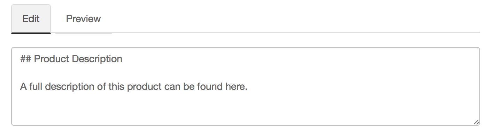

Here's how that same content looks when rendered in **Preview** mode.

  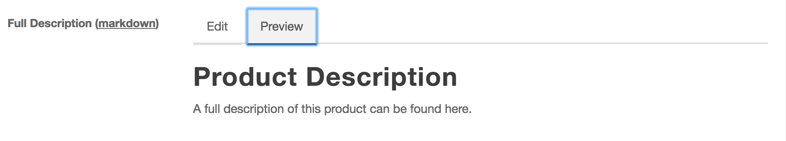

2.	**Product Details Page: Edit vs. Preview**
   * Clicking the **Preview** button on the **Product Details** page allows you to see the whole page rendered, as opposed to single elements.
   * Below is what it looks like in **Edit** mode.

   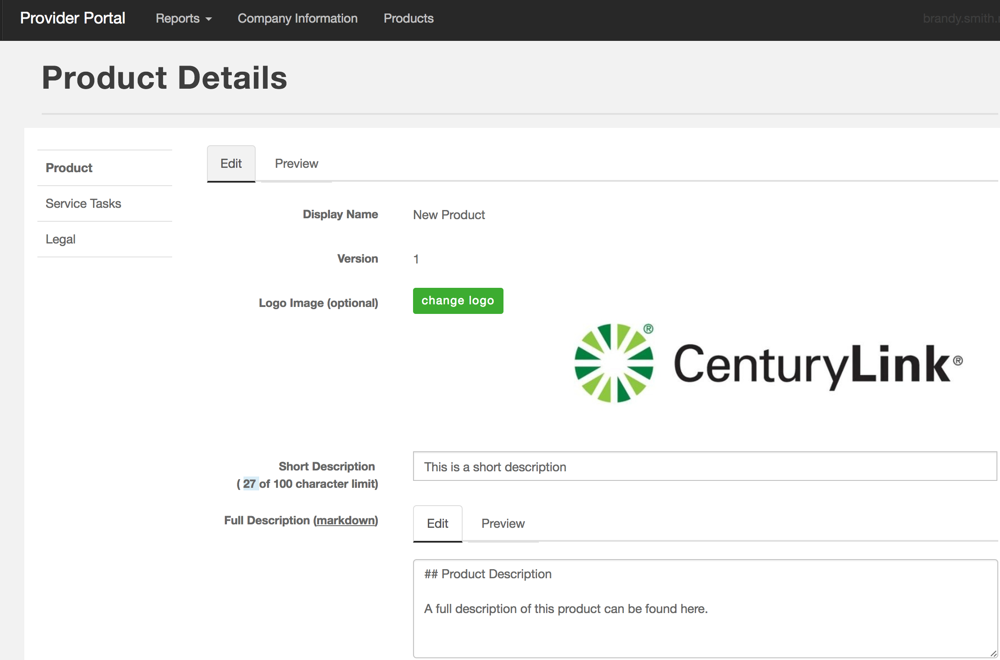

This is what it looks like in **Preview** mode.

   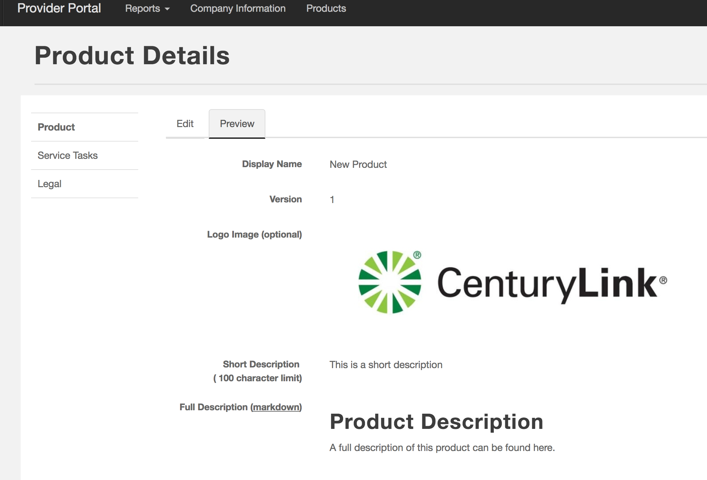


**Q: I clicked “switch to published mode” but see a 404 error page. Why am I getting this error?**

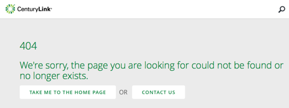

**A:** You may have already completed your data entry and requested publication, but your product isn't viewable in published mode until the CenturyLink Cloud Marketplace Team approves and publishes the content.


### Other Resources

* Within the Provider Portal there is a [Help](https://provider-portal.ctl.io/#/help) tab that has links and videos on how to use the provider portal.
* Within the Provider Portal there are Green ? bubbles next to certain fields, click the ? to learn more.
* [GitHub Markdown Editor](https://markdown-it.github.io/)
* The CenturyLink Cloud [Marketplace](https://www.ctl.io/marketplace/)
* Marketplace Provider [Onboarding Resource Guide](onboarding-resources.md).
* For questions or suggestions on how to make this Guide more useful, email the [Marketplace team](mailto:Marketplace@ctl.io).
