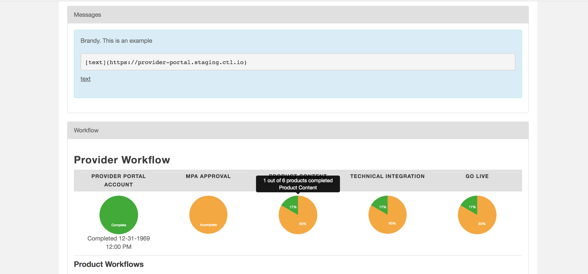

{{{
"title": "Marketplace Provider Guide: Provider Portal Navigation",
"date": "01-01-2019",
"author": "Brandy Smith",
"attachments": [],
"contentIsHTML": false,
"sticky": true
}}}

The Provider Portal (PP) is an application that allows Lumen Cloud Provider Partners to manage the display of their products on the Lumen Marketplace. This guide is for providers who have already reviewed and completed the steps in the [Getting Started Guide: Marketplace & Provider Portal](getting-started-guide-marketplace-ecosystem-provider-portal.md).

### Signing In

Sign into the [Provider Portal](https://provider-portal.ctl.io/#/login) using your credentials. You will be redirected to the Welcome screen. **New** You can now log in using your Google credentials.

### Provider Homepage

Once logged in you will directed to your Provider Home page. The home page will have any messages that the Lumen Marketplace team has sent you or have been created due to an error with a product deployment. There is also a Provider Workflow which is a dashboard that shows your company-specific progress on onboarding tasks as well as product completion progress.
You can hover over the pie charts on the dashboard for more information.

There are several tabs that Providers can access in the Provider Portal, they are shown below:

We will review the functionality of each.

### Reports

Under the Reports tab, Providers can review and download monthly reports for their active products and subscriptions in the Marketplace.

### Company Information

Click the **Company Information** tab. This takes you to your **Provider Details** page, which was created for you when we established your Lumen Marketplace profile. Here you can review, edit, update your company information, and change the logo.

- Uses Markdown formatting. Most Markdown is recognized.
- Click the **Preview** tab to see how your Markdown renders.
- Click **Save** once you are satisfied.

You can sign up to be notified upon the creation of a subscription for your software on the Company Information page by adding the appropriate email addresses to be notified in the Notification Emails field and clicking **Save**.

The company logo, content that is provided in the **Description** field and products that are available in the Lumen Marketplace are what the customer will see when clicking the company name in the Marketplace.

This is a sample of the customer view of your Company Information on the Marketplace:

### Products

The Products tab is where Providers can view, create, edit, add, and clone products.

### Deployments

The Deployments tab is where Providers can review and download monthly reports for their active and non-active products and subscriptions in the Marketplace. The Provider can also see deployment success or failure messages here. There are filters to allow the Provider to search by customer, product type, and month.

### Help

The Help tab is where Providers can go to watch tutorial videos and find links to helpful resources regarding the Provider Portal.

### Other Resources
* Within the Provider Portal there is a [Help](https://provider-portal.ctl.io/#/help) tab that has links and videos on how to use the provider portal.
* Within the Provider Portal there are Green ? bubbles next to certain fields, click the ? to learn more.
* [GitHub Markdown Editor](https://markdown-it.github.io/)
* The Lumen Cloud [Marketplace](https://www.ctl.io/marketplace/)
* Marketplace Provider [Onboarding Resource Guide](onboarding-resources.md).
* For questions or suggestions on how to make this Guide more useful, email the [Marketplace team](mailto:Marketplace@centurylink.com).
