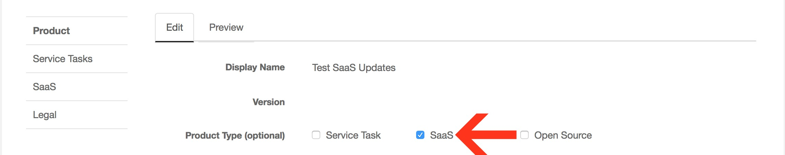
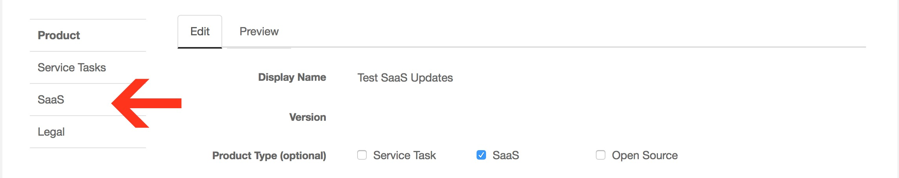
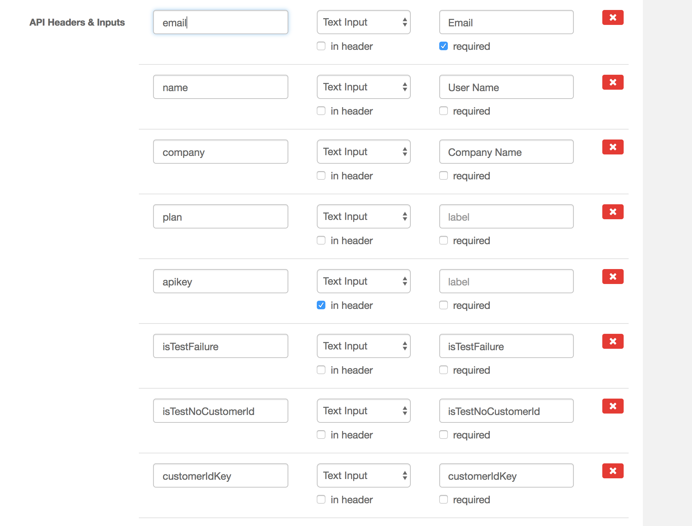
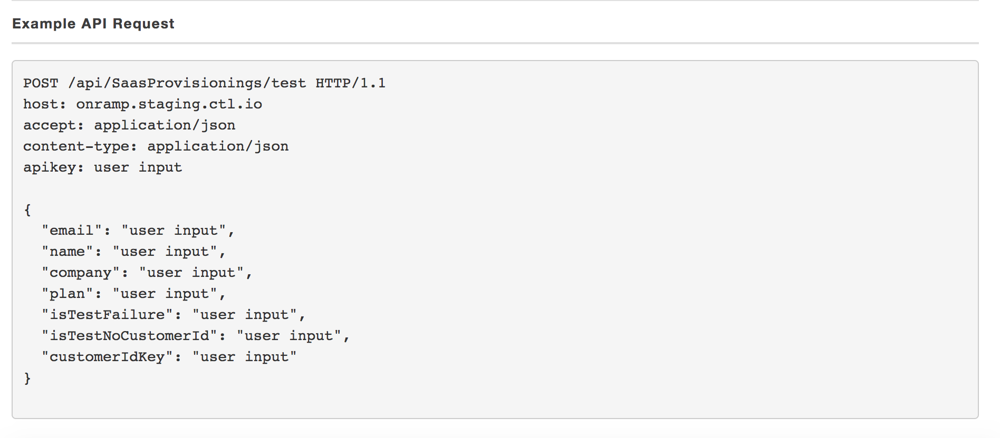
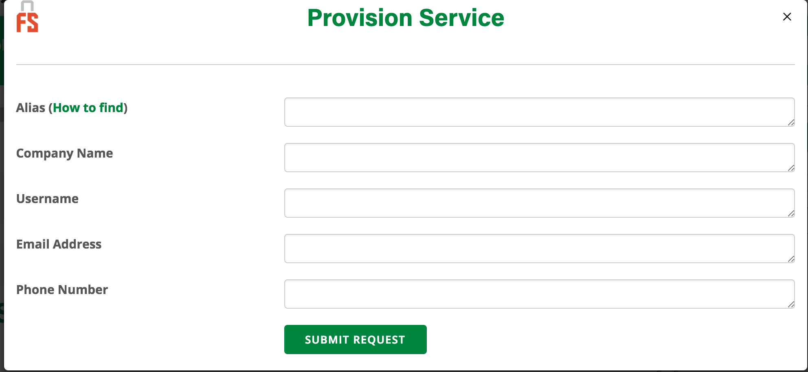

{{{
"title": "Software as a Service Product Provisioning",
"date": "01-01-2019",
"author": "Brandy Smith",
"attachments": [],
"contentIsHTML": false
}}}

### Overview

Software Providers that are classified as Software as a Service (SaaS) need to implement the steps outlined in the [API documentation](software-as-a-service-saas-api.md).  

The next step is to create the Product Provisioning within the Provider Portal for each respective product. This document will outline the steps that the software provider needs to complete in the Provider Portal to support the SaaS integration.

### Product Provisioning

1. Product creation and Provisioning is done in the staging environment of the Provider Portal to allow for testing. To create products you will log into the staging environment here: https://provider-portal.staging.ctl.io/#/login. You will login with your same CenturyLink Cloud credentials for both production and staging.

2. If a product tile has yet to be created, you can do so by following the steps outlined in the [Getting Started Guide](getting-started-guide-marketplace-ecosystem-provider-portal.md).

3. Once the product(s) has been created, the following will need to be completed for each product.

4. On the product home page, under the field **Product Type**: Check the SaaS box.

  

5. Checking the SaaS box in the **Product Type** field will populate the necessary fields under the SaaS tab on the left hand side. Click the SaaS tab to configure the SaaS provisioning form.  

  

6. The first field is **Provisioning URL**. This is the provider's API endpoint URL that will accept the user inputs during provisioning.

7. The **Pre-Provisioning Message** field is optional and supports markdown. Examples of content for this field would be any pre-requisites that the end user would need to know about prior to deploying the software, such as pricing for the various selections.

8. The **Provisioning Success Message** field is optional and supports markdown. Examples of content for this field would be "Congratulations you have successfully deployed XXX software." It could also be a call to action for the end user, such as check your email for next steps.  

9. The **API Headers & Inputs** field is where the software provider gets to create both the customer facing and hidden parameters that are needed to complete the transaction. The CenturyLink Cloud Marketplace will provide the user interface & collect the information that is required to provision an account on your platform. However, we do not collect Private Card Information (PCI) on your behalf.

  

10. Above is an example of the different parameters that you can create. Each field can be customized to be visible or hidden to the customer, and if the field is required to provision the software.

11. Once you have create the various **API Headers & Inputs**   you want for the product, the box below will be populated with an Example of what the API request will look like based off the Headers & Inputs that were created.

  

12. Below is an example of what the form looks like to the end user (customer), which is generated based off the fields that you created in steps 9 & 10.

  

12. The **Product SKU Conditions** field is optional.  By default, all Product SKUs associated with the product will generate billing immediately when the end user provisions the product.  Setting a condition allows you to choose which SKUs will be active, based on a user's selection.  Please note, setting a SKU condition is only available for **Selection** type inputs and if SKU will have delayed billing it must be set up that why by a CenturyLink Marketplace representative.  

13. Below the **Example API Request** box, there is the option to preview and save your work. Be sure to click **SAVE** before leaving the SaaS tab!

  

Please review the Marketplace [Billing KB](marketplace-supported-billing-models.md) for information on the Billing and SKU creation process.

For any questions, please contact us at [Marketplace@centurylink.com](mailto:Marketplace@centurylink.com).
