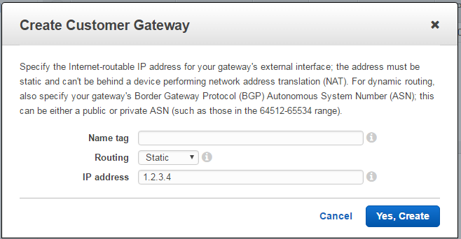
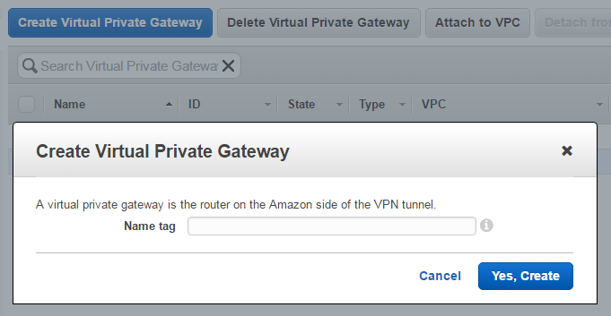
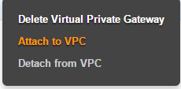

{{{
  "title": "AWS to CenturyLink Cloud VPN Guide",
  "date": "2-28-2017",
  "author": "Sayed Haider",
  "attachments": [],
  "contentIsHTML": false,
  "sticky": false
}}}

### Overview
You can connect your [Amazon AWS VPC](//aws.amazon.com) to [CenturyLink Cloud](//www.ctl.io) networks by using a VPN connection. The following steps guide you on how to use the AWS Management page to configure the AWS VPN.

### Steps
1. Login to the AWS Console and navigate to VPC service dashboard.

2. Start with creating the remote end of the IPsec VPN tunnel by clicking Customer Gateways, this will be where the CLC gateway is configured.

    

    In this step, you can choose to use static or dynamic routing with BGP over the VPN tunnel. Once the Gateway is created you should see it being attached to the VPC and subnets assigned.

3. Create a Virtual Private Gateway which will be the endpoint object in AWS once the VPN tunnels are up and running.

    

4. Right-click on the newly created VPG and choose “Attach to VPC”.

    

5. To generate the VPN connection choose the VPG to use with this connection, attached to your VPC, the customer gateway configured earlier, and which type of routing to use. When you’re finished with creating the VPN connection you can now download the configuration from the AWS Management console by right clicking on the newly created VPN connection please choose Juniper SRX as a platform and send this with your VPN request to CLC Service task team.

When the VPN connection has been created download the configuration from the AWS Management console by right clicking on the newly created VPN connection and selecting Juniper SRX as a platform. The configuration file will be downloaded directly as a text file with the name of the AWS VPN. Send this configuration file with the VPN request to CenturyLink Service task team at servicetasks@ctl.io.
