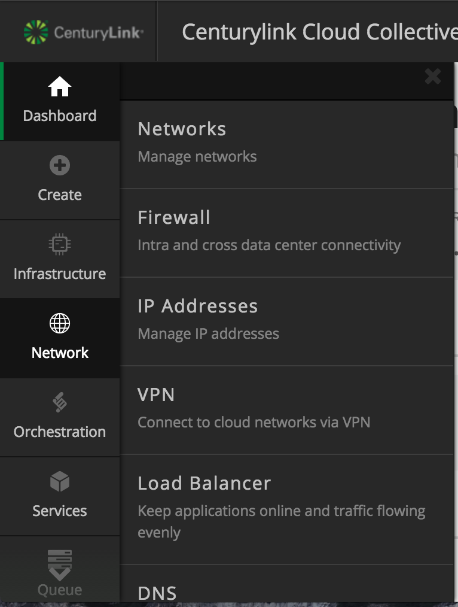
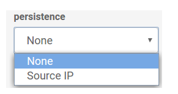

{{{
  "title": "Creating a Self-Service Load Balancing Configuration",
  "date": "12-2-2014",
  "author": "Richard Seroter",
  "attachments": [],
  "contentIsHTML": true
}}}

<h3>Description</h3>

In order to build highly available web applications, Lumen Cloud customers can use a load balancer. While customers are free to set up a dedicated load balancer with the help of support, customers can also use a shared load balancer that is managed
  through the Control Portal. In this KB article, we walk through the shared load balancer and how to configure pools of servers.

<h3>Audience</h3>
<ul>
  <li>Lumen Cloud customers (Application developers, system administrators)</li>
</ul>
<h3>Prerequisites</h3>
<ul>
  <li>Must have Account Administrator permissions on the platform</li>
</ul>
<h3>Detailed Steps</h3>

1. Log on to the [Control Portal](https://control.ctl.io/). Using the left side navigation bar, click on **Network** > **Load Balancer**.

  

2. Select the appropriate Data Center.

3. Click the button labeled <strong>Create load balancer group</strong>. A "group" is comprised of a VIP (virtual IP) and a set of servers grouped by pools (i.e. access ports). Provide a friendly name and description for your new group
  and select <strong>Create</strong>.

4. After clicking the "create" button the pool configuration dialog box will appear. <strong> TIP: &nbsp;The public VIP for this load balancer pool is present at the top next to the name you provided the configuration</strong>. Proceed
  to Configure your pools.

Choose the VIP port to load balancer for this pool. At this time, the choices are port 80 for standard HTTP traffic and port 443 for secure HTTP traffic.

Select a load balancing method. The choices include "round robin" or "least connection." For the round robin option, the load balancer cycles through a list of all the servers bound to it. It does not take into account server workload or latency and simply
  distributes traffic evenly across servers. The least connection option routes traffic to the server with the fewest active connections. An "active" connection is considered one where the HTTP request has not yet received a response. This is considered
  the best performing of the two algorithms.&nbsp;
   
   

Choose a load balancer persistence type. The choices include "none" or "Source Ip." The standard (none) option employs no persistence and is best for stateless web applications. If an application does require server-based state, then choose the Source Ip option.
  The Source Ip choice uses source IP + destination IP address-based persistence to tie users to the target server.

<strong>How do the load balancer method and persistence work together?&nbsp;</strong>If you choose round robin or least connection along with <strong>None</strong> persistence, then requests are routed without any concern for where the last user's
  request came from. If you choose round robin or least connection along with <strong>Source IP</strong> persistence, then the FIRST request will be routed based on either round robin or least connection, and each subsequent request from that source IP address
  will return to the server that responded to the initial request.
   
   

Add a line item for each server that is included in this load balancing pool. Include the server's&nbsp;<strong>private&nbsp;</strong><strong>IP</strong> address (visible from the server overview page) and the port that is serving the content. To add
  a server to the pool, but not have it respond to requests yet, set its "enabled" status to "off."
   
   

5. Click the "save" button to commit this configuration to the device. View the configuration overview that shows the VIP, name, description, and pool settings.

   6. Test the load balancer by deploying a web application on multiple servers and observing the configured behavior.

&nbsp;

<h3>FAQ's</h3>

Q: &nbsp;What algorithm does Source Ip use?

A: &nbsp;The Source IP option uses source IP + destination IP address-based persistence to tie users to the target server

Q: &nbsp;What is the Source IP time-out value?

A: &nbsp;The Time-out value is 2 minutes

Q: &nbsp;How many load balancer pools may I deploy?

A: &nbsp;5 be default.  More can be alloted by contacting help@ctl.io.

