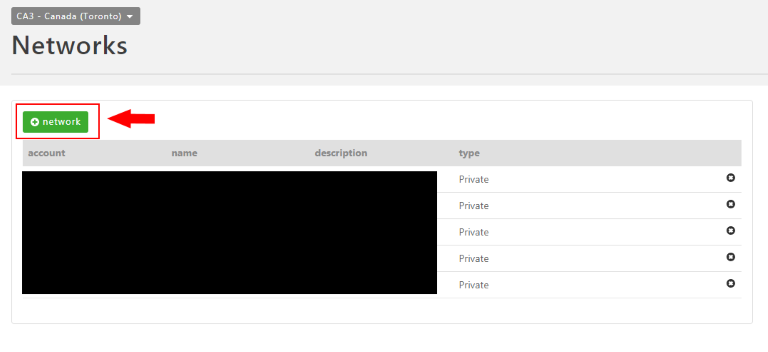
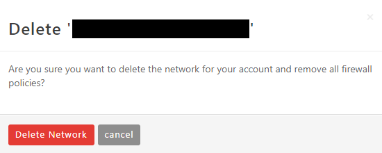
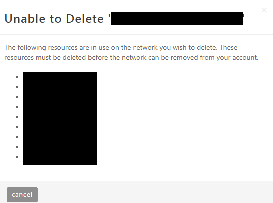

{{{
  "title": "Creating and Deleting VLANs",
  "date": "11-21-2017",
  "author": "",
  "attachments": [],
  "contentIsHTML": false
}}}

### Description
Lumen Cloud customers can create complex network topologies to securely segment application tiers or entire systems. Using the Control Portal, users can easily provision VLANs and delete unused ones. Each Lumen Cloud customer gets an initial private VLAN to use, and can add more VLANs (for a fee). In this KB article, we will show how to create and delete a VLAN.

### Prerequisites

* User must have an Account Administrator or Network Manager role.

### Add a VLAN

1. Log on to the [Control Portal](https://control.ctl.io/).

2. Using the left side navigation bar, click on **Network > Networks**.

3. Click the **+Network** button to add a new VLAN to the account. Note that each VLAN has 219 usable addresses as part of each subnets IP space is reserved for platform functions.

  

4. Once the process completes, the user can see the new network in the list. **TIP:** If the **+Network** button is greyed out you can [open a ticket](../../Support/how-do-i-report-a-support-issue.md) to request an increased number of vlans on your account.

### Delete a VLAN

1. Log on to the [Control Portal](https://control.ctl.io/).

2. Using the left side navigation bar, click on **Network > Networks**.

3. Click the **X** button on the row of the target VLAN. If there are no servers currently attached the VLAN, the user will see a prompt similar to the image below. This prompt notifies the user that deleting the VLAN will also remove all corresponding firewall policies.

      

    If there are servers currently part of the VLAN, then the user will see a prompt the below image. The listed servers must either be deleted from the vlan prior to removal of the network.

      
